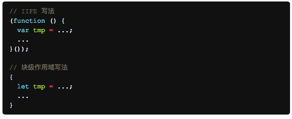

# Let和Const命令

## 块级作用域

* 什么是块级作用域

  我们可以认为在  {} 内就是一个块级作用域

* 为什么需要作用域

  ES5中只有全局作用域和函数作用域,没有块级作用域，就会出现下面的问题

  1：内层变量可能会覆盖外层变量

  2：用于计数的循环变量泄露为全局变量，如for循环的 i

* 优点： 就是解决ES5的缺点

  1：不存在变量提升

  2：不允许在相同的作用域内重复声明一个变量

    块作用域的父子嵌套作用域可以重复声明
    ```
    let i;
    for ( i = 0; i < 3; i++) {
      let i = 'abc';
      console.log(i);
    }
    输出3个abc


    {{{{
      let insane = 'Hello World';
      {let insane = 'Hello World'}
    }}}};
    ```

    3:块级作用域出现使得IIFE不再必要了。

    

## Let命令

  >在ES5中声明变量的方法只有var命令和function命令。而在ES6中有6种声明变量的方法：var 、function、let、const、import、class命令

  let 是块级作用域

  let声明的变量只在，let命令所在地代码块内有效

  典型的例子
  ```
  var a = [];
  for(let i=1;i<10;i++){
    a[i]=function () {
      console.log(i);
    }
  }

  a[6](); //结果为6

  var a = [];
  for(var i=1;i<10;i++){
    a[i]=function () {
      console.log(i);
    }
  }

  a[6](); //结果为10
  ```
  var 声明的变量全局有效，所以全局只有一个i.每一个循环，变量i值都会变化，而循环赋给数组a的函数内部的console.log(i),里面的i是全局的i，导致运行时输出的是最后一轮的i的值，也就是10.

  如果是let,声明的变量仅在块级别作用域内有效，循环时，当前的i只在本轮循环有效，所以每一个循环的i都是一个新的变量，所以最后输出为6


## Const命令
  Const 声明一个只读的常量。一旦声明，常量的值就不能改变。

  >注意点：const本质不是变量的值不能改变，而是指向的内存地址锁保持的数据不得改变。对于简单类型的数据（数值、字符串、布尔值），值就保存在变量指向的那个内存地址，因此等同于常量。但对于复合类型的数据（主要是对象和数组），变量指向的内存地址，保存的只是一个指向实际数据的指针，const只能保证这个指针是固定的（即总是指向另一个固定的地址），至于它指向的数据结构是不是可变的，就完全不能控制了。

  ```
  const foo = {};

  // 为 foo 添加一个属性，可以成功
  foo.prop = 123;
  foo.prop // 123

  // 将 foo 指向另一个对象，就会报错
  foo = {}; // TypeError: "foo" is read-only


  const a = [];
  a.push('Hello'); // 可执行
  a.length = 0;    // 可执行
  a = ['Dave'];    // 如果将另一个数组赋值给a，就会报错
  ```
