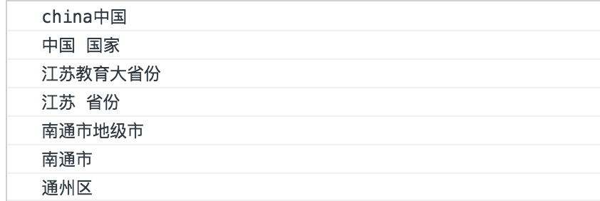
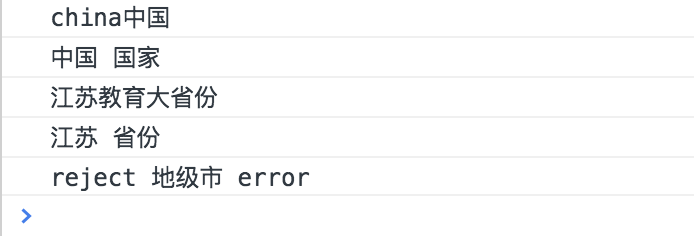
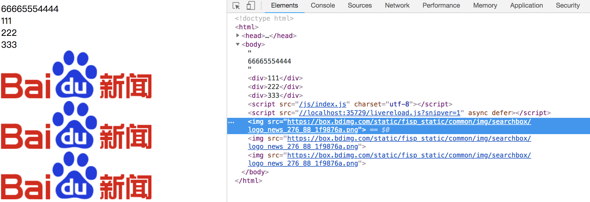
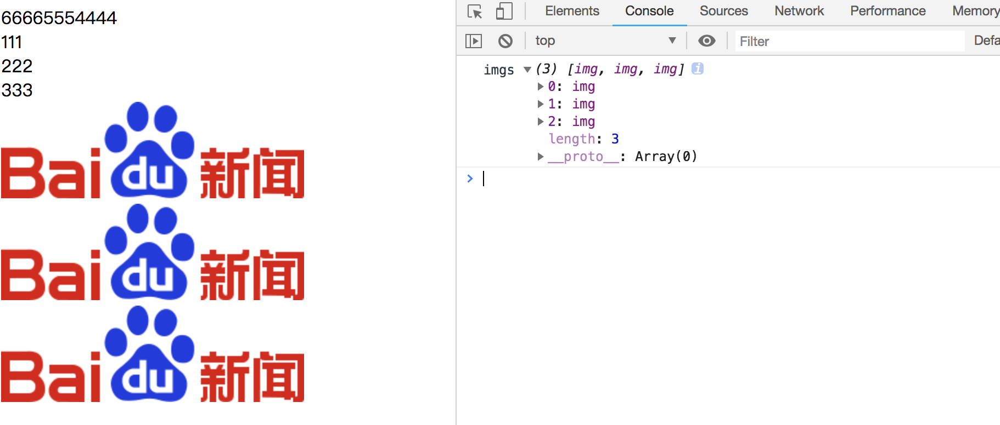
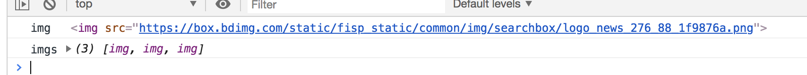

# Promise
* 什么是异步
* Promise的作用
* Promise的基本用法

Promise是异步编程的一种解决方案，比传统的解决方案--回调函数和事件--更强大。


## Promise 基本用法
Es6中，Promise对象是一个构造函数，用来生成Promise实例。

```
//ES5实现异步是通过回调函数
{
	let ajax = function (callback) {
		console.log('执行');
		setTimeout(function () {
			callback && callback.call();
		},1000)
	};

	ajax(function () {
		console.log('timeout1');
	})
}

//ES6的promise实现异步
{
	let ajax = function () {
		console.log('执行2');
		return new Promise(function (resolve,reject) {
			setTimeout(()=>{
				resolve();
			},1000)
		})
	}

	ajax().then(()=>{
		console.log('promise','timeout2');
	})
}
```


>promise链式操作.以国家、省份、县市三个方法来演示链式调用关系（采用setTimeout模拟异步操作）

```
{
	function china() {
		console.log('china中国');
		var p = new Promise(((resolve, reject) => {
			setTimeout(() => {
				console.log('中国 国家');
				resolve('教育大省份');
			},1000)
		}));

		return p;
	}

	function jiangshu(data) {
		console.log('江苏'+data);
		var p = new Promise((resolve,reject)=>{
			setTimeout(()=>{
				console.log('江苏 省份');
				resolve('地级市');
			},1000)
		})
		return p;
	}

	function xian(data) {
		console.log('南通市'+data);
		var p = new Promise((resolve,reject)=>{
			setTimeout(()=>{
				console.log('南通市');
				resolve('通州区');
			},3000);

		})
		return p;
	}

	/*china()
		.then((data)=>(jiangshu(data)))
		.then((data)=>(xian(data)))
		.then((data)=>console.log(data))*/

	//简写为下面：
	china().then(jiangshu).then(xian).then((data)=>{
		console.log(data)
	})
}
```

可以看出异步是有先后顺序的，因为jiangshu的异步时间要比xian长，但是xians是要等jiangsu返回resolve设置为完成状态，then才会执行回调。




>Promise 包含的两个参数：resove,reject
* Resove：将promise的状态设置为完成状态（resolved），此时then方法捕获变化，执行成功回调
* Reject：将promise的状态设置为无效（reject）,此时then方法执行失败回调

```
{
	function china() {
		console.log('china中国');
		var p = new Promise(((resolve, reject) => {
			setTimeout(() => {
				console.log('中国 国家');
				resolve('教育大省份');
			},1000)
		}));

		return p;
	}

	function jiangshu(data) {
		console.log('江苏'+data);
		var p = new Promise((resolve,reject)=>{
			setTimeout(()=>{
				console.log('江苏 省份');
				if(data !== '教育大省份'){
					resolve('地级市');
				}else{
					reject('地级市  error');
				}

			},3000)
		})
		return p;
	}

	function xian(data) {
		console.log('南通市'+data);
		var p = new Promise((resolve,reject)=>{
			setTimeout(()=>{
				console.log('南通市');
				resolve('通州区');
			},1000);

		})
		return p;
	}

	/*china()
		.then((data)=>(jiangshu(data)))
		.then((data)=>(xian(data)))
		.then((data)=>console.log(data))*/

	//简写为下面：
	china().then(jiangshu).then(xian).then((data)=>{
		console.log(data)
	}).catch((error)=>{
		console.log('reject',error);
	})

}
```




## Promise.all()
all()内部是多个promise实例，当所以的实例状态都是resolve完成后才会返回一个promise对象，才会去执行后面的then

```
{
	//所有图片都加载完，再显示图片
	function loadImg(src) {
		return new Promise((resolve, reject) => {
			let img = document.createElement('img');  //创建一个img标签
			img.src = src;

			img.onload = () => {		//图片加载完成
				resolve(img);
			}

			img.onerror = () => {		//图片加载失败
				reject(img);
			}
		})
	}

	function showImgs(imgs) {
		console.log('imgs',imgs);
		imgs.forEach(function (img) {
			document.body.appendChild(img);
		})
	}

	Promise.all([
		loadImg('https://box.bdimg.com/static/fisp_static/common/img/searchbox/logo_news_276_88_1f9876a.png'),
		loadImg('https://box.bdimg.com/static/fisp_static/common/img/searchbox/logo_news_276_88_1f9876a.png'),
		loadImg('https://box.bdimg.com/static/fisp_static/common/img/searchbox/logo_news_276_88_1f9876a.png')
	]).then(showImgs);

}
```




all最终将多个promise对象的参数放入到一个数组往下传递



## Promise.race() 一个实例完成就算完成

```
{
	//有一个图片都加载完，再显示图片
	function loadImg(src) {
		return new Promise((resolve, reject) => {
			let img = document.createElement('img');  //创建一个img标签
			img.src = src;

			img.onload = () => {		//图片加载完成
				resolve(img);
			}

			img.onerror = () => {		//图片加载失败
				reject(img);
			}
		})
	}

	function showImgs(img) {
		console.log('img',img);
		let p = document.createElement('p');
		p.appendChild(img);
		document.body.appendChild(p);
	}

	Promise.race([
		loadImg('https://box.bdimg.com/static/fisp_static/common/img/searchbox/logo_news_276_88_1f9876a.png'),
		loadImg('https://box.bdimg.com/static/fisp_static/common/img/searchbox/logo_news_276_88_1f9876a.png'),
		loadImg('https://box.bdimg.com/static/fisp_static/common/img/searchbox/logo_news_276_88_1f9876a.png')
	]).then(showImgs);

}
```


