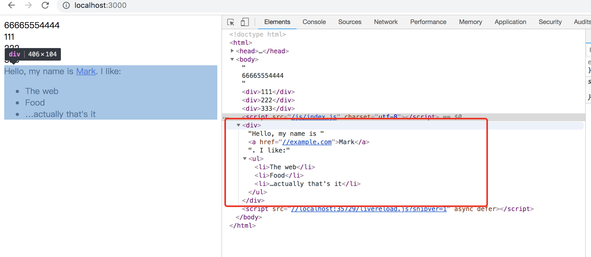

# Proxy和Reflect
> Proxy 和 Reflect 是ES6引入为了操作  对象  引入对API

* Porxy 可以对目标对象的读取、函数的调用等操作进行拦截，然后进行操作处理。它不直接操作对象，而是象代理模式，通过对象的代理对象进行操作，在进行这些操作时，可以添加一些需要的额外操作。

* Reflect可以用于获取目标对象的行为，它与Object类似，但是更易读，为操作对象提供一种更优雅的方式。它的方法与Proxy是对应的。ES6中将一些明显属于语言的内部的方法移植到了Reflect对象上（当前某些方法会同时存在于REflect和Object对象上），未来新方法只会部署到Reflect对象上。


## Proxy
生产Proxy实例的方法：Proxy构造函数
```
var proxy = new Proxy(target,handler)
```
target表示要拦截的对象，handler也是一个对象，用来定义拦截行为。

```
{
	//数据源
	let obj = {
		time: '2019-03-13',
		name: 'net',
		_r: 123
	};

	//代理商
	let monitor = new Proxy(obj, {
		//拦截对象属性的获取
		get(target, key, receiver) {
			console.log(target, '|' + key + '|', receiver)		//{time: "2019-03-13", name: "net", _r: 123}name: "net"time: "2019-03-13"_r: 123__proto__: Object "|time|" Proxy {time: "2019-03-13", name: "net", _r: 123}
			return target[key].replace('2019', '2020');
		},

		//拦截对象设置属性
		set(target, key, value, receiver) {
			if (key == 'name') {
				return target[key] = value;
			} else {
				return target[key]
			}
		},
		//拦截key in object 操作
		has(target, key) {
			if (key === 'name') {
				return target[key];
			} else {
				return false;
			}
		},
		//拦截delete
		deleteProperty(target, key) {
			if (key.indexOf('_') > -1) {
				delete target[key];
				return true;
			} else {
				return target[key];
			}
		},
		//拦截Object.keys,Object.getOwnPropertySymbols,Object.getOwnPropertyNames
		ownKeys(target) {
			return Object.keys(target).filter(item => item != 'time');
		}
	});

	console.log('get', monitor.time);		//get 2020-03-13      获取都系属性前被拦截替换了数据

	monitor.time = '2018';
	monitor.name = 'modify';
	console.log('set', monitor);				//Proxy {time: "2019-03-13", name: "modify", _r: 123}	在设置属性时辈拦截了 只有name才可修改

	console.log('has', 'name' in monitor, 'time' in monitor);		//has true false     time in monitor  被拦截器拦截调整了显示

	console.log(Object.keys(monitor));			// ["name", "_r"]			time被拦截器过滤掉了

	delete monitor.time;
	console.log('delete', monitor);				//delete Proxy {time: "2019-03-13", name: "modify", _r: 123}
	delete monitor._r;
	console.log('delete', monitor);				//delete Proxy {time: "2019-03-13", name: "modify"}
}
```


拦截操作一共是13种：
[手册](http://es6.ruanyifeng.com/#docs/proxy)

## Reflect
```
{
	let obj = {
		time: '2019-03-13',
		name: 'net',
		_r: 123
	};

	console.log('Reflect get', Reflect.get(obj, 'time'));			//Reflect get 2019-03-13

	Reflect.set(obj, 'name', 'reflect');
	console.log(obj);														//{time: "2019-03-13", name: "reflect", _r: 123}
	console.log('has', Reflect.has(obj, 'name'));					//has true

}
```


## 应用举例
* 数据验证   业务逻辑和对象分开了
```
{
	function validator(target, validator) {
		return new Proxy(target, {
			_validator: validator,
			set(target, key, value, proxy) {
				if (target.hasOwnProperty(key)) {
					let va = this._validator[key];
					if (!!va(value)) {		//!!一般用来将后面的表达式转换为布尔型的数据（boolean）
						return Reflect.set(target, key, value, proxy);
					} else {
						throw Error(`不能设置${key}到${value}`)
					}
				} else {
					throw Error(`${key}不存在`);
				}
			}
		})
	}


	const personValidators = {
		name(val) {
			return typeof val === 'string'
		},
		age(val) {
			return typeof val === 'number' && val > 18
		}
	}


	class Person {
		constructor(name, age) {
			this.name = name;
			this.age = age;
			return validator(this, personValidators);
		}
	}

	const person = new Person('lilei', 30);
	console.log(person);		//Proxy {name: "lilei", age: 30}

	// person.name = 48;	//Uncaught Error: 不能设置name到48
}
```


实现数组的读取负数的索引
```
{
	function createArray(...elements) {
		console.log(elements)		// ["a", "b", "c"]
		let handler = {
			get(target, propKey, receiver) {
				let index = Number(propKey);
				if (index < 0) {
					propKey = String(target.length + index);
				}
				return Reflect.get(target, propKey, receiver);
			}
		}
		let target = [];
		target.push(...elements);
		return new Proxy(target, handler);
	}

	let arr = createArray('a', 'b', 'c');
	//数组对象的key就是数组的下标
	console.log(arr[2]);			//c
	console.log(arr[-1]);			//c   数组的位置参数是-1，就会输出数组的倒数第一个成员
}
```


实现一个生成各种DOM节点的通用函数dom
```

{
	const dom = new Proxy({}, {
		get(target, property) {
			return function (attrs = {}, ...children) {
				const el = document.createElement(property);
				for (let prop of Object.keys(attrs)) {
					el.setAttribute(prop, attrs[prop]);
				}
				for (let child of children) {
					if (typeof child === 'string') {
						child = document.createTextNode(child);
					}
					el.appendChild(child);
				}
				return el;
			}
		}
	})

	const el = dom.div({},
		'Hello, my name is ',
		dom.a({href: '//example.com'}, 'Mark'),

		'. I like:',
		dom.ul({},
			dom.li({}, 'The web'),
			dom.li({}, 'Food'),
			dom.li({}, '…actually that\'s it')
		)
	);

	document.body.appendChild(el);
}
```




## this问题
在proxy代理对情况下，目标对象内部的this关键字指向Proxy代理

```

{
	const target = {
		m: function () {
			console.log(this === proxy);
		}
	}


	const handler = {};
	const proxy = new Proxy(target, handler);

	target.m();	//false
	proxy.m();	//true
}
```
