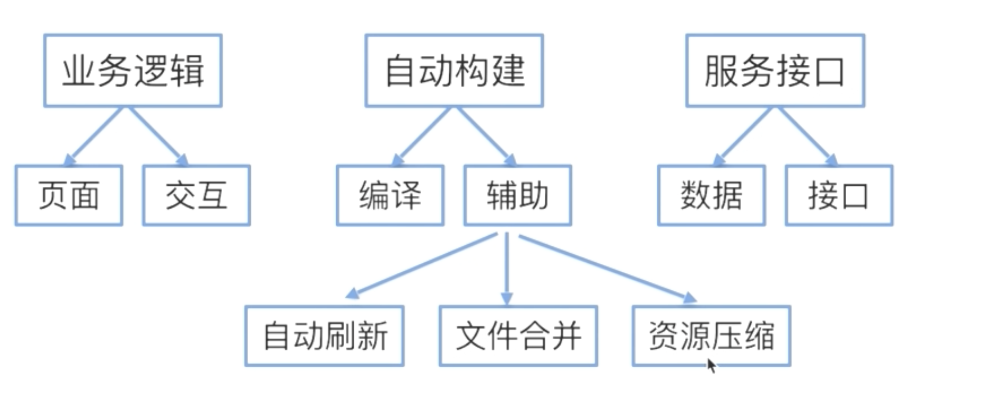
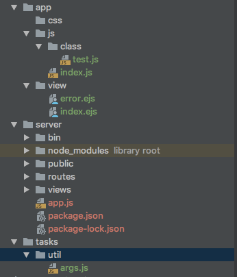

# 项目构建

* 基础架构
* 任务自动化
* 编译工具（babel、webpack）
* 代码实现


## 基础架构



## 任务自动化gulp
[gulp文档](https://www.gulpjs.com.cn/docs/)

gulp 是 grunt的下一代任务自动化工具

* grunt 运用配置的思想来写打包脚本，一切皆配置，所以会出现比较多的配置项，诸如option,src,dest等等。而且不同的插件可能会有自己扩展字段，导致认知成本的提高，运用的时候要搞懂各种插件的配置规则。
* gulp 是用代码方式来写打包脚本，并且代码采用流式的写法，只抽象出了gulp.src, gulp.pipe, gulp.dest, gulp.watch 接口,运用相当简单。经尝试，使用gulp的代码量能比grunt少一半左右。


* [webpack  gulp  grunt的区别](https://blog.csdn.net/qiuxi4057/article/details/80846595)
>Webpack与Gulp、Grunt没有什么可比性，它可以看作模块打包机，通过分析你的项目结构，找到JavaScript模块以及其它的一些浏览器不能直接运行的拓展语言（Scss，TypeScript等），并将其转换和打包为合适的格式供浏览器使用。Gulp/Grunt是一种能够优化前端的开发流程的工具，而WebPack是一种模块化的解决方案，不过Webpack的优点使得Webpack在很多场景下可以替代Gulp/Grunt类的工具

Grunt和Gulp的工作方式是：在一个配置文件中，指明对某些文件进行类似编译，组合，压缩等任务的具体步骤，工具之后可以自动替你完成这些任务。

Webpack的工作方式是：把你的项目当做一个整体，通过一个给定的主文件（如：index.js），Webpack将从这个文件开始找到你的项目的所有依赖文件，使用loaders处理它们，最后打包为一个（或多个）浏览器可识别的JavaScript文件。


## 编译工具（babel、webpack）
[babel文档](https://www.babeljs.cn/)

babel 是一个javascript编译器，比如ES6不能再浏览器上运行，需要编译为ES5，ES3等，这个编译的工具就是babel


# 构建项目实例

* 服务端 express
> express安装

```
yarn global add express
yarn global add express-generator
cd  server
express -e .     (-e表示使用ejs模板)

执行完上面根据提示执行下面
npm install /yarn add
```

* gulp相关安装

```
  gulp安装
  yarn global add gulp
  yarn  add gulp --dev

  cd 根目录
  npm install


  gulp --watch
  访问浏览器 ： 127.0.0.1:3000
```


* 目录介绍
    * 为源文件目录
    * server为服务端（express）
    * tasks 为所有都构建脚本文件
    * .babelrc 为babel编译配置文件，这里指定了ES6转为ES5
    * gulpfile.babel.js为gulp命令 执行的入口文件
    * gulpfile.babel.js 载入了tasks都所有任务文件。里面default.js为默认文件，否则gulp后面要 跟task的文件名
    * default.js 执行build.js 里面是指定各个任务的先后执行顺序
    * pages.js css.js scripts.js 分别是页面、css、js 指定具体的任务
    * server.js 为服务端的执行任务脚本
    * browsers.js文件为监听目录变化执行哪些task文件
    * clean.js为清空目录
    * build.js指定脚本执行的先后顺序


