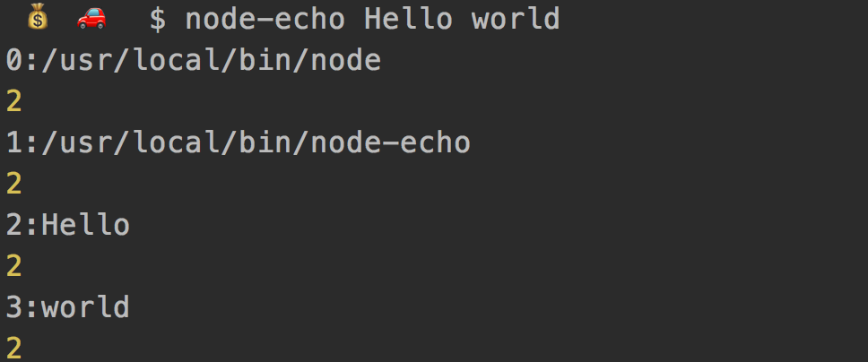

# 代码组织和部署

## 模块路径解析
我们已经知道，require函数支持斜杠（/）或盘符（C:）开头的绝对路径，也支持./开头的相对路径。但这两种路径在模块之间建立了强耦合关系，一旦某个模块文件的存放位置需要变更，使用该模块的其它模块的代码也需要跟着调整，变得牵一发动全身。因此，require函数支持第三种形式的路径，写法类似于foo/bar，并 依次 按照以下规则解析路径，直到找到模块位置。

* 1：内置模块

  如果传递给require函数的是NodeJS内置模块名称，不做路径解析，直接返回内部模块的导出对象，例如require('fs')。

* 2：node_modules目录

  NodeJS定义了一个特殊的node_modules目录用于存放模块。例如某个模块的绝对路径是/home/user/hello.js，在该模块中使用require('foo/bar')方式加载模块时，则NodeJS依次尝试使用以下路径。

  /home/user/node_modules/foo/bar
  /home/node_modules/foo/bar
  /node_modules/foo/bar

* NODE_PATH环境变量

  与PATH环境变量类似，NodeJS允许通过NODE_PATH环境变量来指定额外的模块搜索路径。NODE_PATH环境变量中包含一到多个目录路径，路径之间在Linux下使用:分隔，在Windows下使用;分隔。例如定义了以下NODE_PATH环境变量：

  NODE_PATH=/home/user/lib:/home/lib
  当使用require('foo/bar')的方式加载模块时，则NodeJS依次尝试以下路径。

  /home/user/lib/foo/bar
  /home/lib/foo/bar


  ## 包（package）
  包入口文件的两种写法：

  1 : index.js 在require时可以不写

  ```
  - /home/user/lib/
    - cat/
        head.js
        body.js
        index.js
  ```

  入口文件index.js
  ```
  var head = require('./head');
  var body = require('./body');

  exports.create = function (name) {
      return {
          name: name,
          head: head.create(),
          body: body.create()
      };
  };
  ```
加载包

```
var cat = require('/home/user/lib/cat');    //这里缺省了index.js
```


2:package.js
如果想自定义入口模块的文件名和存放位置，就需要在包目录下包含一个package.json文件，并在其中指定入口模块的路径。上例中的cat模块可以重构如下。

```
- /home/user/lib/
    - cat/
        + doc/
        - lib/
            head.js
            body.js
            main.js
        + tests/
        package.json
```

其中package.json内容如下

```
{
    "name": "cat",
    "main": "./lib/main.js"
}
```

如此一来，就同样可以使用require('/home/user/lib/cat')的方式加载模块。NodeJS会根据包目录下的package.json找到入口模块所在位置。

## 命令行程序
使用NodeJS编写的东西，要么是一个包，要么是一个命令行程序，而前者最终也会用于开发后者。因此我们在部署代码时需要一些技巧，让用户觉得自己是在使用一个命令行程序。


```
$ node /home/user/bin/node-echo.js Hello World

改造为
node-echo Hello World
```
改造步骤：

1:在shell脚本中，可以通过#!注释来指定当前脚本使用的解析器。

```
#! /usr/bin/env node
process.argv.forEach((val, index) => {
	console.log(`${index}:${val}`);
	console.log(2);
})
```

2：然后，我们使用以下命令赋予node-echo.js文件执行权限
```
chmod +x /home/user/bin/node-echo.js
```

3:最后，我们在PATH环境变量中指定的某个目录下，例如在/usr/local/bin下边创建一个软链文件，文件名与我们希望使用的终端命令同名，命令如下：
```
 sudo ln -s /home/user/bin/node-echo.js /usr/local/bin/node-echo
```

执行


