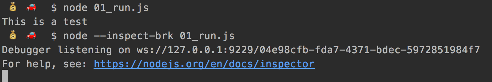
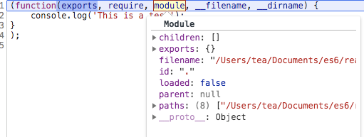
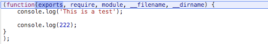
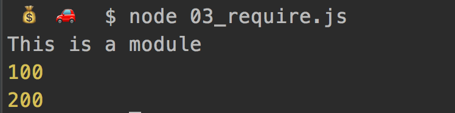
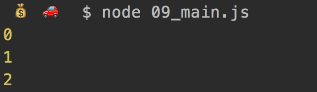
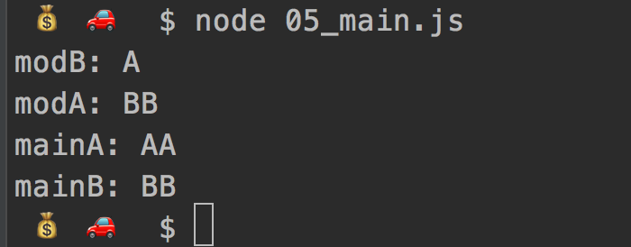
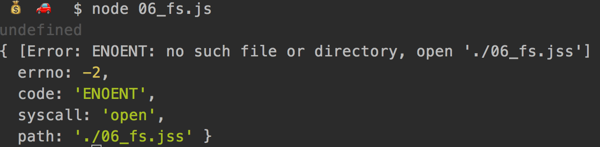
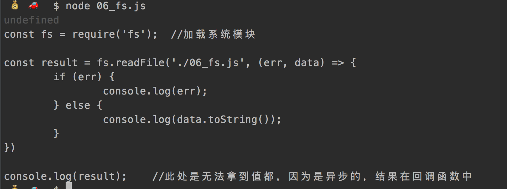
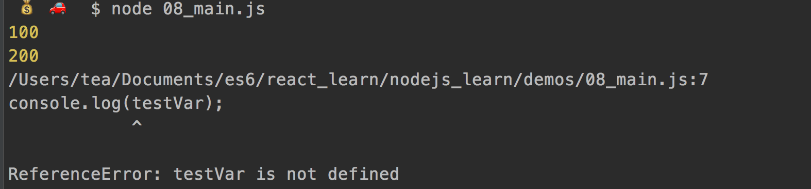

# nodejs的开发环境
## 权限问题
在linux系统下，使用Nodejs监听80，443端口提供HTTP(S)服务时需要root权限，有两种方法可以做到。
* ①：使用sudo命令运行nodejs。例如通过以下命令运行的server.js中有权限使用80和443端口。一般推荐这种方式，可以保证仅为有需要的JS脚本提供root权限。

```
sudo node server.js
```
* ②：另一种方式是使用chmod +s命令让NodeJS总是以root权限运行，具体做法如下。因为这种方式让任何JS脚本都有了root权限，不太安全，因此在需要很考虑安全的系统下不推荐使用。

```
sudo chown root /usr/local/bin/node
udo chmod +s /usr/local/bin/node
```


## 模块

NodeJS使用CMD模块系统（CommonJS）,在Nodejs中，一般将代码合理拆分到不同的JS文件中，每一个文件就是一个模块，而文件路径就是模块名，在编写每个模块时，都有require、exports、module三个预先定义好的变量可供使用。


* nodejs的模块管理的规范： CommonJS
* nodejs不像javascipt没有BOM,DOM，因为它是跑在服务器端点，它只有ECMASCRIPT等核心API，它没有windows全局对象了，只有global全局对象
* process 进程，它是global下面的

  ```
  //01_run.js
  console.log('This is a test');

  执行命令：
  node 01_run.js
  //输出 This is a test
  ```
调试输出  node --inspect-brk 01_run.js


  

  打开chrome浏览器：访问 chrome://inspect


点击如图inspect


这里可以看到 console.js 在nodejs中被转义为了什么，包裹函数是nodej自动生成的

```
(function(exports, require, module, __filename, __dirname) {
    console.log('This is a test');
}
);
```

* exports 是模块输出,对外提供一些属性、接口（exports 等同于 module.exports,只是对象赋值是exports不能直接赋值，否则会修改指针，可以通过属性添加）
* 是依赖别的模块的时候的调用的function
* module表示模块本身



```
children: []
exports: {}
filename: "/Users/tea/Documents/es6/react_learn/nodejs_learn/demos/01_run.js"
id: "."
loaded: false
parent: null
paths: (8) ["/Users/tea/Documents/es6/react_learn/nodejs_learn/demos/node_modules", "/Users/tea/Documents/es6/react_learn/nodejs_learn/node_modules", "/Users/tea/Documents/es6/react_learn/node_modules", "/Users/tea/Documents/es6/node_modules", "/Users/tea/Documents/node_modules", "/Users/tea/node_modules", "/Users/node_modules", "/node_modules"]
__proto__: Object
```
* __filename 就是文件的路径
* __dirname 是文件的目录


## CommonJS
* 1:每个文件是一个模块，有自己的作用域
因为一个模块文件内的语句是被函数包裹的，所以他们都作用域是独立的


* 2：在模块内部module变量代表模块本身


  从包裹函数可以看到 module 传入模块内部，表示模块本身

* 3：module.exports 属性代表模块对外接口

  自定义模块：02_cusmod.js

  ```
  console.log('This is a module');

  const  testVar = 100;

  function test() {
  	console.log(testVar);
  }

  module.exports.testVar = testVar;	//对外暴露属性
  exports.testFun = test;		//对外暴露函数     包裹函数中的exports 等同于module.exports
  ```

## Require规则
* /表示绝对路径,  ./表示相对于当前文件的
* 支持js、json、node拓展名，不写依次尝试
* 不写路径则认为build-in模块（nodejs默认的模块）或者各级node_modules内的第三方模块


  模块加载  03_require.js

  ```
  const mod =require('./02_cusmod');

  console.log(mod.testVar);

  mod.testFun();
  ```
执行结果：


This is a module 是加载的02_cusmod文件中的，符合require的特性，module文件在加载时执行

测试module加载缓存
```
require('./02_cusmod');
require('./02_cusmod');
```
执行结果：只在第一次加载module文件时，输出了console信息，第二次加载走的缓存从而没有去执行输出


>一个模块中的JS代码仅在模块第一次被使用时执行一次，并在执行过程中初始化模块的导出对象。之后，换成起来的导出对象被重复利用。

```
//09_counter.js
var i=0;

function count() {
	return i++;
}

exports.count = count;
```

```
//09_main.js
const count1 = require('./09_counter');
const count2 = require('./09_counter');

console.log(count1.count());
console.log(count2.count());
console.log(count2.count());
```

执行结果  可见var i=0  只在第一次被初始化了 ，后面都是服用的它，所以进行了累计




> Require特性
* module 被加载的时候执行（加载的文件内部的输出，也是会被在载入时执行），加载后缓存（加载一次，第二次就直接用放在内存中的结果拉，而不会重复加载了，比如上面的加载文件的输出之后在第一次加载才会输出，因为第二次去读了缓存）
* 一旦出现某个模块被循环加载，就会输出已经执行的部分，还未执行的部分不会输出。

05_modA.js
```
module.exports.test = 'A';

const modB = require('./05_modB');
console.log('modA:',modB.test);

module.exports.test = 'AA';
```

05_modB.js

```
module.exports.test = 'B';

const modA = require('./05_modA');
console.log('modB:',modA.test);

module.exports.test = 'BB';
```


05_main.js
```
const modA = require('./05_modA');

const modB = require('./05_modB');

console.log('mainA:',modA.test);
console.log('mainB:',modB.test);
```

node 05_main.js 执行结果



因为先执行的加载的modA.js，加载了部分后开始加载modB.js
modB中加载的A此时，只有上面加载了部分的代码，所以此时的modA.test 只是部分加载后端 A


## require 系统库

06_fs.js文件：加载系统模块 fs
```
const fs = require('fs');  //加载系统模块

const result = fs.readFile('./06_fs.jss', (err, data) => {
	if (err) {
		console.log(err);
	} else {
		console.log(data.toString());
	}
})

console.log(result);	//此处是无法拿到值都，因为是异步的，结果在回调函数中
```

错误输出：



成功输出： data为文件内容



## require 第三方库
例子：加载第三方库 chalk库
```
npm install chalk      //安装第三方库


//07_chalk.js
const chalk = require('chalk');
console.log(chalk.red('This is red!'));


node 07_chalk.js
```
执行结果：


## Global 全局变量
下面这些都是可以直接使用到，因为他们就是挂在global中
* CommonJS
* Buffer、process 、console
* timer相关

```
//09_global.js
const testVar = 100;

global
testVar2 = 200;   //定义的全局变量

module.exports.testVar = testVar;
```

```
//08_main.js
const mod = require('./08_global');

console.log(mod.testVar); //输出的变量是有自己的作用域的

console.log(testVar2);    //打印全局变量

console.log(testVar);   //非全局失败
```


