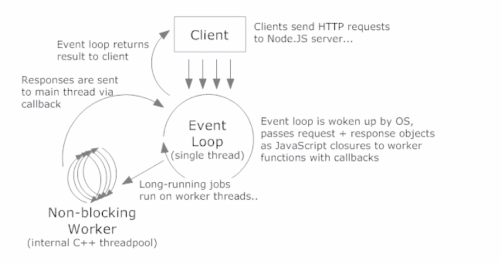

# NodeJs的概念

## Nodejs的定义
NodeJs 是一个基于Chrome V8的Javascript的运行环境。
>JS是脚本语言，脚本语言都需要一个解析器才能运行。写在HTML里面的js,浏览器充当了解析器的角色。而对于需要独立运行的JS，nodejs就是一个解析器。

NodeJS的用途就是操作磁盘文件或搭建HTTP服务。创建nodejs语言的目的就是实现高性能的web服务器

NodeJs使用了一个事件驱动、非阻塞式I/O的模型

* 阻塞I/O： I/O时进程休眠等待I/O完成后进行下一步
* 非阻塞I/O：I/O时函数立即返回，进程不等待I/O完成

* 事件驱动就是为了I/O等异步操作结束后端通知。
* 事件驱动的底册是观察者模式

## 为什么偏爱NodeJs
在处理高并发、I/O密集场景性能优势明显

>CPU密集和I/O密集
* CPU密集：大部分时间是在做计算、逻辑判断等CPU动作，比如：压缩、解压、加密、解密等
* I/O密集：文件操作、网络操作、数据库操作

>Web常见场景（web是典型的I/O密集）
* 静态资源读取
* 数据库操作
* 渲染页面

>高并发解决之道
* 增加机器数
* 增加每台机器的CPU数--多核

* NodeJs的工作模型

NodeJS是单线程的。单线程只针对主进程，I/O操作交给系统底层多线程调度。

一个CPU只开一个进程，8核就可开8个进程（cluster），一个进程路面只有一个线程。

* 线程：进程内一个相对独立的、可调度的执行单元，与同属一个进程的线程共享进程的资源

## 常用场景
* Web Server
* 本地代码构建 （比如webpack ,gulp 这些工具都是nodejs语言创建的）
* 使用工具开发 （比如：爬虫，只是适合前端而已，单不是最佳的，因为它不适合cpu密集）
