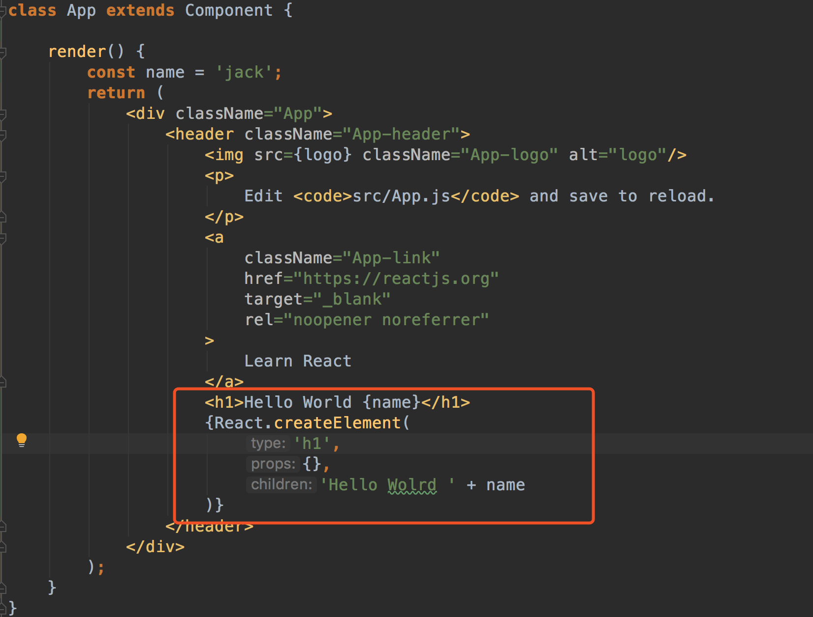
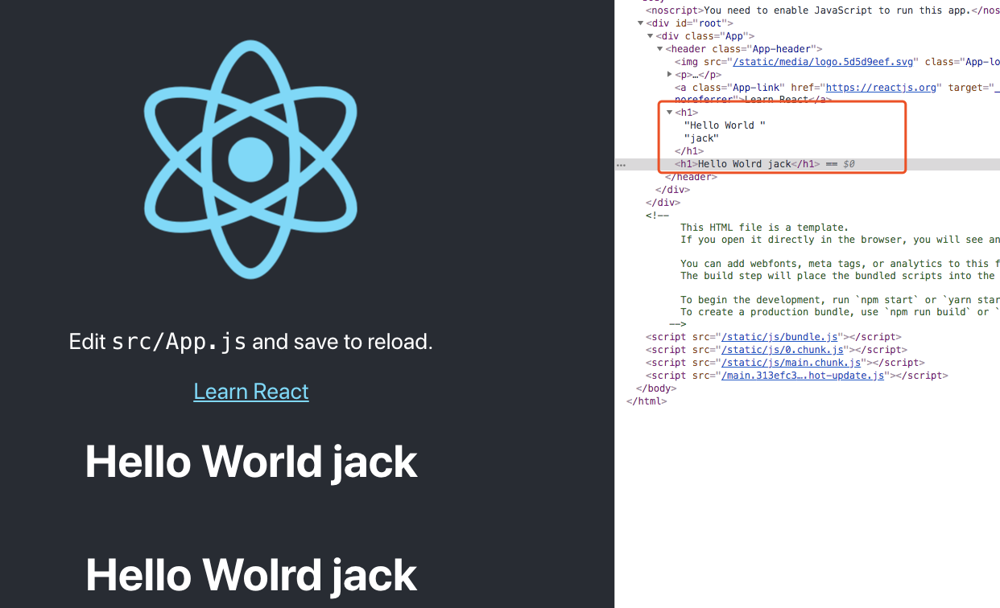

# JSX

## 什么是JSX语法
```
const element = <h1 color="blue">hello wolrd</h1>
```

类似于HTML标签的形式。JSX本质只是为React.creatElement(component,props,...children)方法提供的语法糖。

上面的语句编译如下：
```
React.creatElement(
  h1,
  {color:'blue'},
  'hello world'
)
```

可以看到使用函数是一样的






---

## JSX中使用表达式

表达式包括 变量，函数等。

JSX当中的表达式要包含在大括号{}里。在JSX代码的外面推荐括上一个小括号()

JSX本身就是一个表达式，所以可以赋值给一个变量，当作参数传递，作为返回值也可以


## JSX的属性

属性使用到时cameCase小驼峰法命名

```
const element = <div tabIndex="0"></div>

const element = 
```


## JSX语法注意点

当JSX的返回有多个元素时，需要在多个元素之外包裹一个元素

可以看到返回的元素最外面有个DIV包裹。

如果不想外层生成DIV标签，可以使用react库的 Fragment 占位符标签 来进行包裹，它是不会进行渲染成div元素的
```
class Welcome extends Component{
  render(){
    return (
      <div>
        <div><input/><button>提交</button></div>
        <ul>
          <li>1</li>
          <li>2</li>
        </ul>
      </div>
      )
  }
}

import {Fragment} form 'react'
class Welcome extends Component{
  render(){
    return (
      <Fragment>
        <div><input/><button>提交</button></div>
        <ul>
          <li>1</li>
          <li>2</li>
        </ul>
      </Fragment>
      )
  }
}
```
## JSX添加注释
{/*注释内容*/}

## 普通html页面引入react

[参考教程：https://react.docschina.org/docs/add-react-to-an-existing-app.html](https://react.docschina.org/docs/add-react-to-an-existing-app.html)
```
<!DOCTYPE html>
<html lang="en">
<head>
    <meta charset="UTF-8">
    <title>Title</title>
</head>
<body>
    <h1>join react in simple html</h1>
    <div id="like_button_container"></div>

</body>
<script src="https://unpkg.com/react@16/umd/react.development.js" crossorigin></script>
<script src="https://unpkg.com/react-dom@16/umd/react-dom.development.js" crossorigin></script>

<!-- Load our React component. -->
<script src="like_button.js"></script>
<script>
	const domContainer = document.querySelector('#like_button_container');
	ReactDOM.render(e(LikeButton), domContainer);

</script>
</html>
```
