# React 理念

## 第一步：把UI划分出组件层级

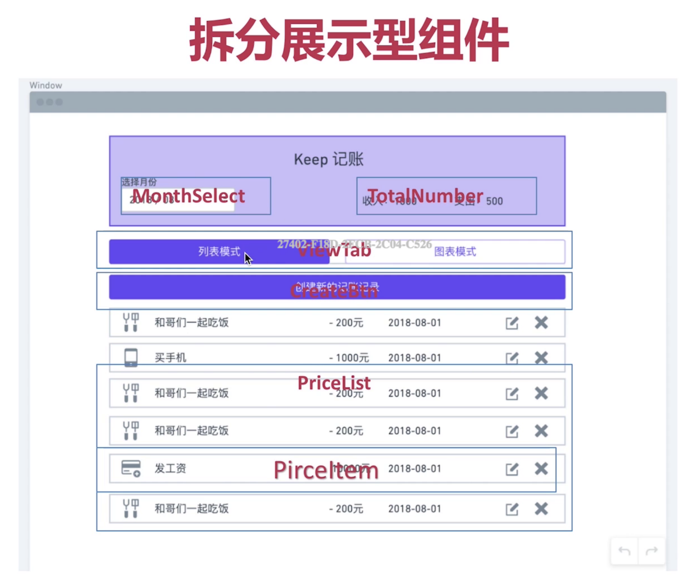

## 第二步：用React 创建静态版本页面    组件（UI组件、展示组件）

### 分析组件，创建展示组件：

①：价格条目列表UI组件的分析
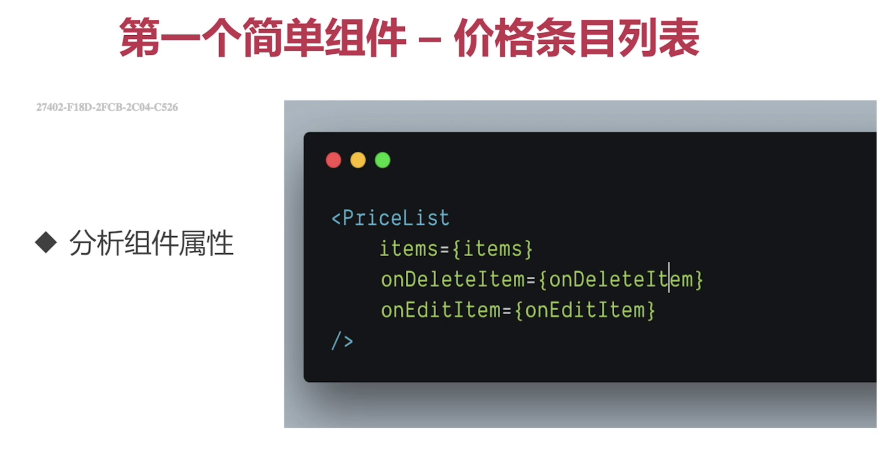

定义传入的数据都结构
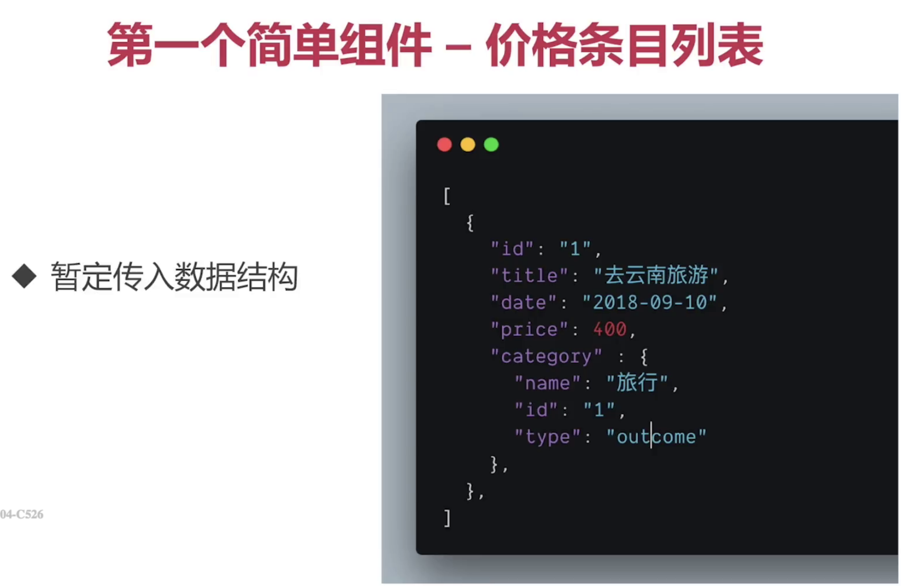

创建PriceList组件,静态展示组件

```
import React from 'react';
import Ionicon from 'react-ionicons';
import PropTypes from 'prop-types';


const PriceList = ({items, onModifyItem, onDeleteItem}) => {
	return (
		 <ul className="list-group list-group-flush">
			 {
			 	items.map((item)=>(
			 		 <li key={item.id} className="list-group-item  d-flex justify-content-between align-items-center">
						 <span className=" col-1">
							 <Ionicon
									className="rounded-circle"
									icon={item.category.iconName}
									fontSize="30px"
									color="#fff"
									style={{backgroundColor:'#007bff',"padding":'5px'}}
							 />
						 </span>
						 <span className="col-5">{item.title}</span>
						 <span className="col-2 font-weight-bold">
							 {(item.category.type==='outcome')?'-':'+'}
							 {item.price}元
						 </span>
						 <span className="col-2">{item.date}</span>
						 <a className="col-1" onClick={()=>onModifyItem(item)} href="">
							 <Ionicon
									className="rounded-circle"
									icon='ios-create-outline'
									fontSize="30px"
									color="#fff"
									style={{backgroundColor:'#28a745',"padding":'5px'}}
							 />
						 </a>
						 <a className="col-1" onClick={()=>onDeleteItem(item)} href="">
							 <Ionicon
								className="rounded-circle"
								icon='ios-close'
								fontSize="30px"
								color="#fff"
								style={{backgroundColor:'#dc3545',"padding":'5px'}}
						 />
						 </a>
					 </li>
				))
			 }
		 </ul>
	)
}

PriceList.proTypes = {
	item:PropTypes.array.isRequired,
	onModifyItem:PropTypes.func.isRequired,
	onDeleteItem:PropTypes.func.isRequired
}

export default PriceList;
```

//组件使用
```
const items = [
	{
		"id": 1,
		"title": "去云南旅游",
		"price": 200,
		"date": "2018-09-01",
		"category": {
			"id": 1,
			"name": "旅行",
			"type": "outcome",
			"iconName":"ios-plane"
		}

	},{
		"id": 2,
		"title": "去云南旅游",
		"price": 200,
		"date": "2018-09-03",
		"category": {
			"id": 1,
			"name": "旅行",
			"type": "outcome",
			"iconName":"ios-plane"
		}

	}
];

class App extends Component {
	render() {
		return (
			 <div className="App" >
				 <PriceList
						items={items}
						onModifyItem={(item)=>{alert(item.id)}}
						onDeleteItem={(item)=>{alert(item.id)}}
				 />
			 </div>
		);
	}
}


export default App;
```

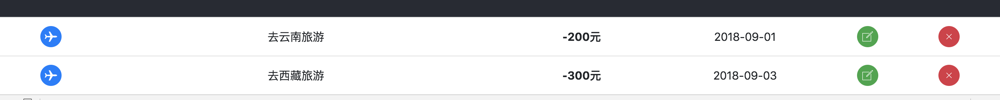

②：价格总和组件
分析组件定义规范
```
<TotalPrice
  income={600}
  outcome={500}
/>
```

```
import React from 'react';
import PropTypes from 'prop-types';

const TotalPrice = ({income, outcome}) => {
	return (
		 <div className="d-flex justify-content-between">
			 <div className="p-2 bd-highlight">收入：{income}</div>
			 <div className="p-2 bd-highlight">支出：{outcome}</div>
		 </div>
	)
}

TotalPrice.propTypes = {
	income: PropTypes.number.isRequired,
	outcome: PropTypes.number.isRequired
}

export default TotalPrice;
```

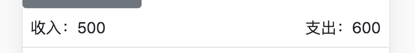


③：Tab切换组件
分析组件定义规范
```
<ViewTab
  activeTab='list'
  onTabChange={onTabChange}
/>
```

ViewTab组件

```
import React from 'react';
import Ionicon from 'react-ionicons';
import PropTypes from 'prop-types';
import {LIST_VIEW, CHART_VIEW} from '../utility';


const generateLinkClass = (current, view) => {
	return (current === view) ? 'nav-link active' : 'nav-link'
}


const ViewTab = ({activeTab, onTabChange}) => {
	return (
		 <ul className="nav nav-tabs">
			 <li className="nav-item">
				 <a
						className={generateLinkClass(activeTab, LIST_VIEW)}
						href="#"
						onClick={(e)=>{e.preventDefault();onTabChange(LIST_VIEW)}}
				 >
					 <Ionicon
							className="mr-2"
							icon='ios-paper'
							fontSize="25px"
							color="#007bff"

					 />
					 列表模式
				 </a>
			 </li>
			 <li className="nav-item">
				 <a
						className={generateLinkClass(activeTab, CHART_VIEW)}
						href="#"
						onClick={(event)=>{event.preventDefault();onTabChange(CHART_VIEW)}}
				 >
					 <Ionicon
							className="mr-2"
							icon='ios-pie'
							fontSize="25px"
							color="#007bff"
							onClick={()=>onTabChange(CHART_VIEW)}
					 />
					 图表模式
				 </a>
			 </li>

		 </ul>
	)
}

ViewTab.propTypes = {
	activeTab:PropTypes.string.isRequired,
	onTabChange:PropTypes.func.isRequired
}

export default ViewTab;
```

组件使用

```
<ViewTab
		activeTab={LIST_VIEW}
		onTabChange={(view)=>(console.log(view))}     //定义一个回调函数
 />
```

效果：

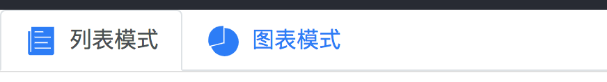

④：月份选择组件
要求：
* 按钮显示传入的年月，点击按钮可以打开和关闭下拉菜单
* 显示前后四年和01月到12月
* 传入的年和月 打开菜单以后应该是高亮
* 点击不同的年可以切换，点击月份应该触发回调

组件结构
```
<MonthPicker
  year={2018}
  month={8}
  onChange={onchange}
/>
```

```
import React, {Component} from 'react';
import PropTypes from 'prop-types';
import {range} from '../utility';


class MonthPicker extends Component {
	constructor(props) {
		super(props);
		this.state = {
			dropdown: false,
			selectYear: props.year
		}
	}

	handlerClick = (event) => {
		event.preventDefault();
		this.setState(prevState => ({dropdown: !prevState.dropdown}))
	}


	selectYear = (e, year) => {
		e.preventDefault();
		this.setState({selectYear: year})
	}

	selectMonth = (e, month) => {
		e.preventDefault();
		this.props.onChange(this.state.selectYear, month)
	}

	render() {
		const {dropdown, selectYear} = this.state;
		const {year, month} = this.props;
		const MonthRange = range(12, 1);
		const YearRange = range(8, -4).map(number => number + year)


		return (
			 <div className="dropdown">
				 <button onClick={this.handlerClick} className="btn btn-secondary dropdown-toggle" type="button"
								 id="dropdownMenu2" data-toggle="dropdown"
								 aria-haspopup="true" aria-expanded="false">
					 {`${year}年 ${month}月`}
				 </button>
				 {
					 dropdown &&
					 <div className="dropdown-menu" aria-labelledby="dropdownMenu2" style={{display: 'block', left: 0}}>
						 <div className="row">
							 <div className="col">
								 {
									 YearRange.map((year) =>
											<a
												 key={year}
												 className={(year === selectYear) ? 'active dropdown-item' : 'dropdown-item'}
												 href="#"
												 onClick={(e) => this.selectYear(e, year)}
											>
												{year}年
											</a>
									 )
								 }
							 </div>

							 <div className="col">
								 {
									 MonthRange.map(item =>
											<a
												 key={item}
												 className={(item === month) ? 'active dropdown-item' : 'dropdown-item'}
												 href="#"
												 onClick={(e) => this.selectMonth(e, item)}
											>{item}月</a>
									 )
								 }
							 </div>
						 </div>
					 </div>
				 }

			 </div>
		)
	}
}

MonthPicker.propTypes = {
	year : PropTypes.number.isRequired,
	month:PropTypes.number.isRequired,
	onChange:PropTypes.func.isRequired
}

export default MonthPicker;
```
结果
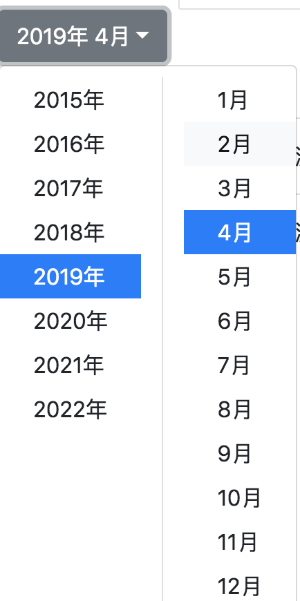


###  把展示型组件整合起来，完成一个静态版本

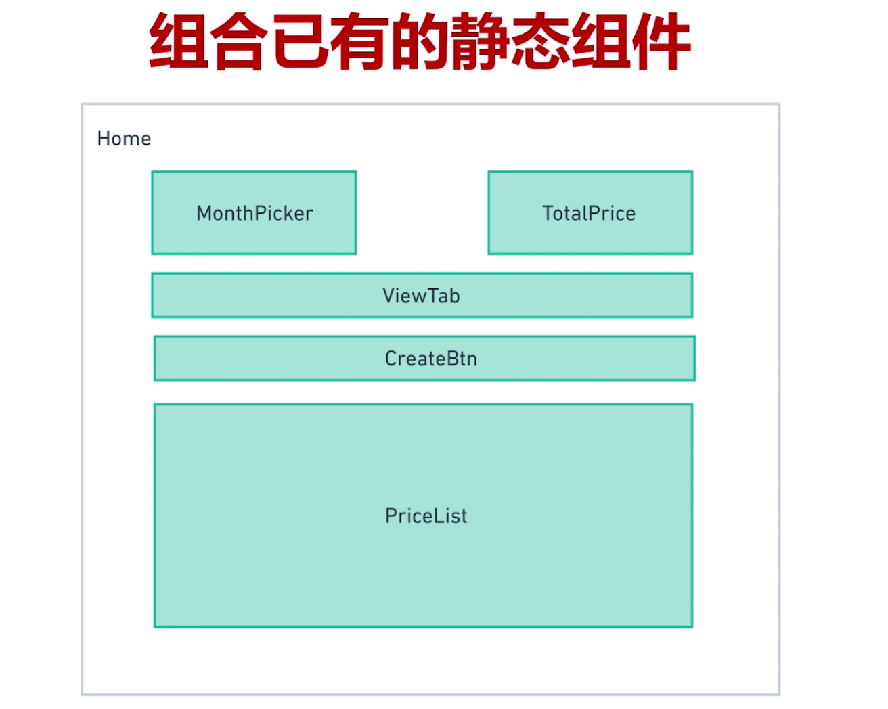

Home.js将是一个容器组件，它将控制数据从上往下传递到个展示型组件中，为下面的展示型组件，提供数据和回调函数

下面是一个静态的版本
```
import React from 'react';
import logo from '../logo.svg';
import PriceList from '../components/PriceList';
import ViewTab from '../components/ViewTab';
import TotalPrice from '../components/TotalPrice';
import MonthPicker from '../components/MonthPicker';
import CreateBtn from '../components/CreateBtn';
import {LIST_VIEW} from '../utility';

const items = [
	{
		"id": 1,
		"title": "去云南旅游",
		"price": 200,
		"date": "2018-09-01",
		"category": {
			"id": 1,
			"name": "旅行",
			"type": "outcome",
			"iconName": "ios-plane"
		}

	}, {
		"id": 2,
		"title": "去西藏旅游",
		"price": 300,
		"date": "2018-09-03",
		"category": {
			"id": 1,
			"name": "旅行",
			"type": "outcome",
			"iconName": "ios-plane"
		}

	}
];

class Home extends React.Component {
	render() {
		let totalIncome = 0,
			 totalOutcome = 0;


		return (
			 <React.Fragment>
				 <header className="App-header">
					 <div className="row mb-5 App-logo-contain">
						 
					 </div>
					 <div className="row">
						 <div className="col">
							 <MonthPicker
									year={2019}
									month={4}
									onChange={(year, month) => {
										console.log(year, month)
									}}
							 />
						 </div>
						 <div className="col">
							 <TotalPrice
									income={500}
									outcome={600}
							 />
						 </div>
					 </div>
				 </header>
				 <div className="py-3 px-3">
					 <ViewTab
							activeTab={LIST_VIEW}
							onTabChange={(view) => (console.log(view))}
					 />
					 <CreateBtn
							onCreateClick={()=>console.log('create')}
					 />
					 <PriceList
							items={items}
							onModifyItem={(item) => {
								console.log(item.id)
							}}
							onDeleteItem={(item) => {
								console.log(item.id)
							}}
					 />
				 </div>


			 </React.Fragment>
		)
	}
}

export default Home;
```

添加交互，state设计

state的最小化原则：

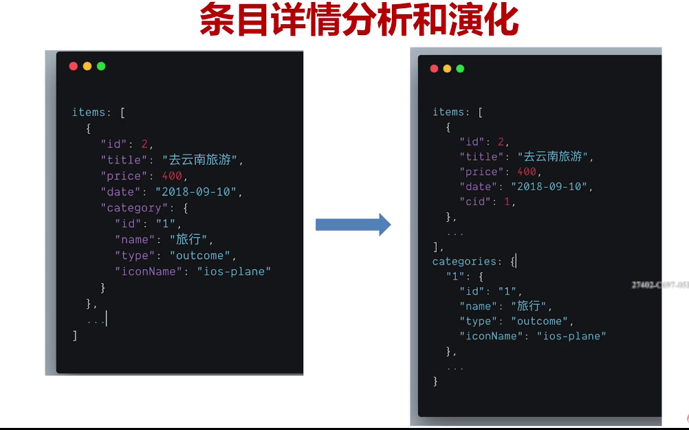

home.js 改进如下：添加state

```
import React from 'react';
import logo from '../logo.svg';
import PriceList from '../components/PriceList';
import ViewTab from '../components/ViewTab';
import TotalPrice from '../components/TotalPrice';
import MonthPicker from '../components/MonthPicker';
import CreateBtn from '../components/CreateBtn';
import {LIST_VIEW, parseToYearAndMonth} from '../utility';

const categorys = {
	"1" :{
		"id": 1,
		"name": "旅行",
		"type": "outcome",
		"iconName": "ios-plane"
	},
	"2":{
		"id": 2,
		"name": "理财收入",
		"type": "income",
		"iconName": "ios-apps"
	},

}


const items = [
	{
		"id": 1,
		"title": "去云南旅游",
		"price": 200,
		"date": "2018-09-01",
		"cid": 1

	}, {
		"id": 2,
		"title": "去西藏旅游",
		"price": 300,
		"date": "2018-09-03",
		"cid": 1
	}, {
		"id": 3,
		"title": "股票分红",
		"price": 1000,
		"date": "2019-01-03",
		"cid": 2
	}
];

class Home extends React.Component {
	constructor(props) {
		super(props);
		this.state = {
			items,
			currentDate: parseToYearAndMonth(),
			tabView: LIST_VIEW
		};
	}


	render() {
		const {items, currentDate, tabView} = this.state;
		const itemsWithCategory = items.map((item)=>{
				 item.category = categorys[item.cid];
				 return item;
			}
		)
		let totalIncome = 0,
			 totalOutcome = 0;

		itemsWithCategory.map((item) => {
				 if (item.category.type === 'outcome') {
					 totalOutcome += item.price;
				 } else {
					 totalIncome += item.price;
				 }
			 }
		)
		return (
			 <React.Fragment>
				 <header className="App-header">
					 <div className="row mb-5 App-logo-contain">
						 
					 </div>
					 <div className="row">
						 <div className="col">
							 <MonthPicker
									year={currentDate.year}
									month={currentDate.month}
									onChange={(year, month) => {
										console.log(year, month)
									}}
							 />
						 </div>
						 <div className="col">
							 <TotalPrice
									income={totalIncome}
									outcome={totalOutcome}
							 />
						 </div>
					 </div>
				 </header>
				 <div className="py-3 px-3">
					 <ViewTab
							activeTab={LIST_VIEW}
							onTabChange={(view) => (console.log(view))}
					 />
					 <CreateBtn
							onCreateClick={() => console.log('create')}
					 />
					 <PriceList
							items={itemsWithCategory}
							onModifyItem={(item) => {
								console.log(item.id)
							}}
							onDeleteItem={(item) => {
								console.log(item.id)
							}}
					 />
				 </div>
			 </React.Fragment>
		)
	}
}

export default Home;
```

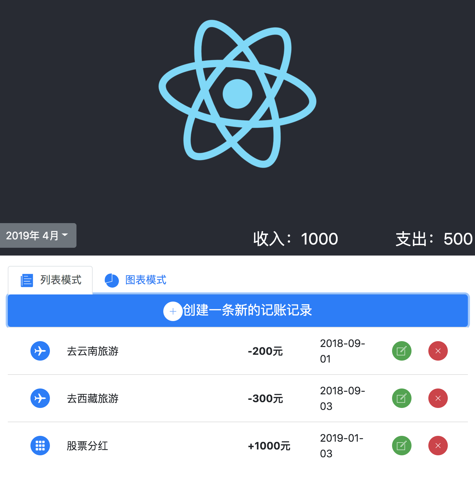

数据流交互

展示组件通过回调函数的方法将事件都暴露出去：
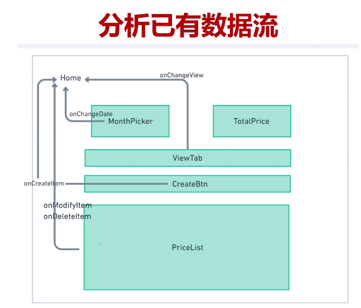

home将方法一一传递到展示型组件中，数据都交互是在容器组件中进行处理的
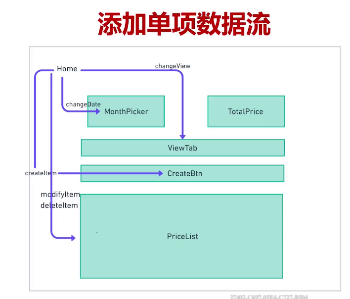

```
import React from 'react';
import logo from '../logo.svg';
import PriceList from '../components/PriceList';
import ViewTab from '../components/ViewTab';
import TotalPrice from '../components/TotalPrice';
import MonthPicker from '../components/MonthPicker';
import CreateBtn from '../components/CreateBtn';
import {LIST_VIEW, CHART_VIEW, parseToYearAndMonth,padLeft} from '../utility';

const categorys = {
	"1": {
		"id": 1,
		"name": "旅行",
		"type": "outcome",
		"iconName": "ios-plane"
	},
	"2": {
		"id": 2,
		"name": "理财收入",
		"type": "income",
		"iconName": "ios-apps"
	},

}

const newItem = {
	"id": 4,
	"title": "新添加的项目",
	"price": 200,
	"date": "2019-03-10",
	"cid": 2
}

const items = [
	{
		"id": 1,
		"title": "去云南旅游",
		"price": 200,
		"date": "2019-04-01",
		"cid": 1

	}, {
		"id": 2,
		"title": "去西藏旅游",
		"price": 300,
		"date": "2019-03-03",
		"cid": 1
	}, {
		"id": 3,
		"title": "股票分红",
		"price": 1000,
		"date": "2019-04-03",
		"cid": 2
	}
];

class Home extends React.Component {
	constructor(props) {
		super(props);
		this.state = {
			items,
			currentDate: parseToYearAndMonth(),
			tabView: LIST_VIEW
		};
	}

	//选择日期
	changeDate = (year, month) => {
		this.setState({
			currentDate: {year, month}
		})
	}

	//tab切换
	changeView = (view) => {
		this.setState({
			tabView: view
		})
	}

	//创建item
	createItem = () => {
		console.log(this.state.items)
		this.setState({
			items: [newItem, ...this.state.items]
		})
	}

	//修改item
	modifyItem = (modifyItem) => {
		console.log("修改item")
		const modifyItems = this.state.items.map(item => {
			if (item.id === modifyItem.id) {
				return {...item, title: '修改后的标题'}
			} else {
				return item;
			}
		})

		this.setState({
			items: modifyItems
		})
	}

	//删除item
	deleteItem = (deleteItem) => {
		console.log("deleteItem", deleteItem)
		const filterItems = this.state.items.filter((item) => item.id !== deleteItem.id)
		this.setState({
			items: filterItems
		})
	}

	render() {
		const {items, currentDate, tabView} = this.state;
		const itemsWithCategory = items.map((item) => {
				 item.category = categorys[item.cid];
				 return item;
			 }
		).filter(item=>{
			return item.date.includes(`${currentDate.year}-${padLeft(currentDate.month)}`)
		})
		console.log("itemsWithCategory", itemsWithCategory);
		let totalIncome = 0,
			 totalOutcome = 0;

		itemsWithCategory.map((item) => {
				 if (item.category.type === 'outcome') {
					 totalOutcome += item.price;
				 } else {
					 totalIncome += item.price;
				 }
			 }
		)
		return (
			 <React.Fragment>
				 <header className="App-header">
					 <div className="row mb-5 App-logo-contain">
						 
					 </div>
					 <div className="row">
						 <div className="col">
							 <MonthPicker
									year={currentDate.year}
									month={currentDate.month}
									onChange={this.changeDate}
							 />
						 </div>
						 <div className="col">
							 <TotalPrice
									income={totalIncome}
									outcome={totalOutcome}
							 />
						 </div>
					 </div>
				 </header>
				 <div className="py-3 px-3">
					 <ViewTab
							activeTab={tabView}
							onTabChange={this.changeView}
					 />
					 <CreateBtn
							onCreateClick={this.createItem}
					 />
					 {
						 tabView === LIST_VIEW &&
						 <PriceList
								items={itemsWithCategory}
								onModifyItem={this.modifyItem}
								onDeleteItem={this.deleteItem}
						 />
					 }

					 {
						 tabView === CHART_VIEW &&
						 <h1>图表内容</h1>
					 }

				 </div>
			 </React.Fragment>
		)
	}
}

export default Home;
```

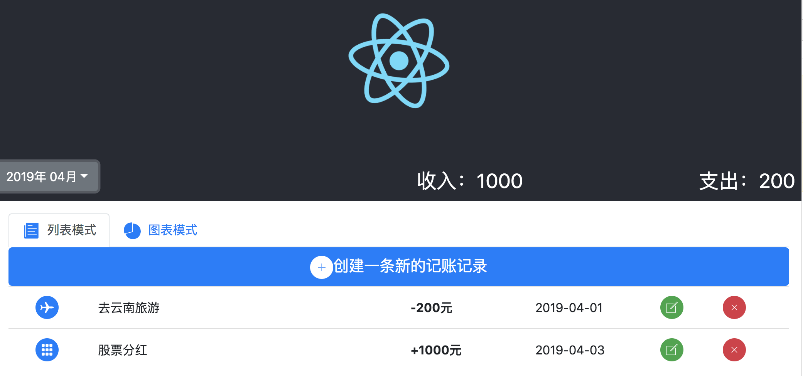

## 第三步：
