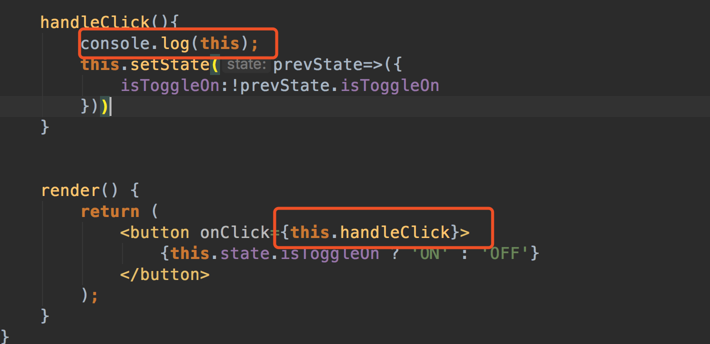
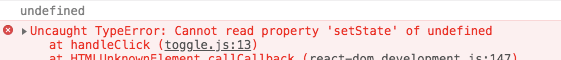
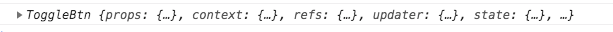

# 事件处理

React元素到事件处理和DOM元素到很相似。但是有一点语法上的不用：
* React 事件绑定属性的命名采用驼峰法，而不是小写。比如DOM中的onclick在react中写成onClick
* 如果采用JSX的语法你需要传入一个函数作为事件处理函数，而不是一个字符串（DOM元素到写法）
* 阻止默认行为差异，react中不能使用返回false的方式阻止默认行为，必须使用preventDefault

传统HTML
```
<a href="#" onclick="console.log('The link was clicked.'); return false">
  Click me
</a>
```

React页面

```
import React from 'react';

class RefComponent extends React.Component{

	handleClickDefault(e){     //在这里e说一个合成事件。不需要担心兼容性问题
		console.log(1);
		e.preventDefault();     //阻止了a标签的默认行为 跳转
		console.log(2);         //此处也会执行到
	}

	render() {
		return (
			<div>
				<a
					href="http://www.baidu.com"
					onClick={this.handleClickDefault.bind(this)}
				>跳转
				</a>
			</div>
		);
	}
}

export default RefComponent;
```

点击结果是:
1
2


## this问题
>在JSX中需要谨慎对待this,类的方法默认是不会绑定this的。


```
import React from 'react';

class ToggleBtn extends React.Component {
	constructor(props) {
		super(props);
		this.state={
			isToggleOn:true
		}
	}

	handleClick(){
		this.setState(prevState=>({
			isToggleOn:!prevState.isToggleOn
		}))
	}


	render() {
		return (
			<button onClick={this.handleClick.bind(this)}>
				{this.state.isToggleOn ? 'ON' : 'OFF'}
			</button>
		);
	}
}

export default ToggleBtn;
```
若未绑定this，当你调用这个函数的时候this的值会是undefined



结果 this是 undefined  ,后面的this下面的方法都将报错



解决方案：

①：在构造函数中绑定（推荐，因为只会渲染一次，性能较高）

this.handleClick = this.handleClick.bind(this);


```
import React from 'react';

class ToggleBtn extends React.Component {
	constructor(props) {
		super(props);
		this.state={
			isToggleOn:true
		}
		this.handleClick = this.handleClick.bind(this);
	}

	handleClick(){
		console.log(this);
		this.setState(prevState=>({
			isToggleOn:!prevState.isToggleOn
		}))
	}


	render() {
		return (
			<button onClick={this.handleClick}>
				{this.state.isToggleOn ? 'ON' : 'OFF'}
			</button>
		);
	}
}


export default ToggleBtn;
```

this 指向的是组件


②：属性中定义
onClick={this.handleClick.bind(this)}


```
import React from 'react';

class ToggleBtn extends React.Component {
	constructor(props) {
		super(props);
		this.state={
			isToggleOn:true
		}
	}

	handleClick(){
		this.setState(prevState=>({
			isToggleOn:!prevState.isToggleOn
		}))
	}


	render() {
		return (
			<button onClick={this.handleClick.bind(this)}>
				{this.state.isToggleOn ? 'ON' : 'OFF'}
			</button>
		);
	}
}

export default ToggleBtn;
```

③：箭头函数
箭头函数中是没有this的，直接指向外部。

使用这个语法有个问题就是每次 ToggleBtn组件 渲染的时候都会创建一个不同的回调函数。在大多数情况下，这没有问题。然而如果这个回调函数作为一个属性值传入低阶组件，这些组件可能会进行额外的重新渲染。我们通常建议在构造函数中绑定或使用属性初始化器语法来避免这类性能问题。

```
import React from 'react';

class ToggleBtn extends React.Component {
	constructor(props) {
		super(props);
		this.state={
			isToggleOn:true,
			name:'Hello world'
		}
	}


	handleClickArrow(name,e){
		e.preventDefault();
		console.log(this);
		console.log(name);
	}

	render() {
		return (
			<div>
				<a
					href="http://www.baidu.com"
					onClick={(e)=>this.handleClickArrow(this.state.name,e)}
				>
					Arrow handle
				</a>
			</div>

		);
	}
}


export default ToggleBtn;
```


## 向事件处理函数 传递参数
通常我们会为事件处理程序传递额外的参数。例如，若是 id 是你要删除那一行的 id，以下两种方式都可以向事件处理程序传递参数：

```
<button onClick={(e) => this.deleteRow(id, e)}>Delete Row</button>
<button onClick={this.deleteRow.bind(this, id)}>Delete Row</button>
```

bind 函数第一个参数是this，后面是传递的参数

上面两种都可以 推荐使用第二种，第一种效率低下些。

值得注意的是，通过 bind 方式向监听函数传参，在类组件中定义的监听函数，事件对象 e 要排在所传递参数的后面，例如


```
import React from 'react';

class ToggleBtn extends React.Component {
	constructor(props) {
		super(props);
		this.state={
			isToggleOn:true,
			name:'Hello world'
		}
	}

	handleClick(){
		console.log(this);
		this.setState(prevState=>({
			isToggleOn:!prevState.isToggleOn
		}))
	}

	handleClickPre(name,e){
		e.preventDefault();
		console.log(name);
	}

	handleClickArrow(name){
		console.log(this);
		console.log(name);
	}

	render() {
		return (
			<div>
				<button onClick={this.handleClick.bind(this,this.state.name)}>
					{this.state.isToggleOn ? 'ON' : 'OFF'}
				</button>

				<a
					href="http://www.baidu.com"
					onClick={this.handleClickPre.bind(this,this.state.name)}
				>跳转链接</a>

				<button onClick={()=>this.handleClickArrow(this.state.name)}>
					Arrow handle
				</button>
			</div>

		);
	}
}


export default ToggleBtn;
```


## 在组件上面添加事件


```
组件上面写事件处理
<LogoutButton onClick={this.handleLogoutClick.bind(this)}/>

组件内部写法，也要对应的事件处理
<button onClick={props.onClick}>
```


```
import React from 'react';
import Greeting from "./condition";

function LoginButton(props) {
	return (
		<button onClick={props.onClick}>
			Login
		</button>
	);
}


function LogoutButton(props) {
	return (
		<button onClick={props.onClick}>
			Logout
		</button>
	)
}


class LoginControl extends React.Component {
	constructor(props) {
		super(props);
		this.state = {
			isLoggedIn: false
		}
	}

	handleLogoutClick(){
		this.setState({isLoggedIn:false})
	}

	handleLoginClick(){
		this.setState({isLoggedIn:true})
	}

	render() {
		const isLoggedIn = this.state.isLoggedIn;

		let button = null;

		if(isLoggedIn){
			button=<LogoutButton onClick={this.handleLogoutClick.bind(this)}/>
		}else{
			button=<LoginButton onClick={this.handleLoginClick.bind(this)}/>
		}

		return (
			<div>
				<Greeting isLoggedIn={isLoggedIn}/>
				{button}
			</div>
		)
	}
}

export default LoginControl;
```
