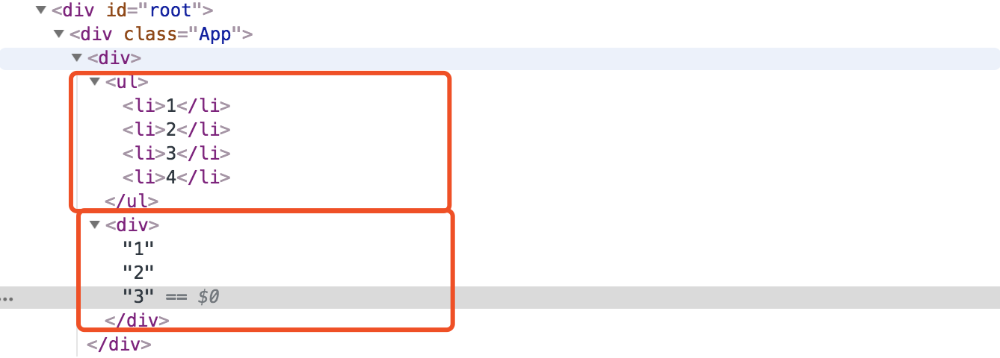

# 列表

>js中map 函数 返回一个原数组中的每个元素调用一个指定方法后的返回值组成的新数组。注意map是有返回值的，而foreach 仅仅是为每个数组元素执行回调函数。

```
var numlist = [1,2,3];
var doublearr = numlist.map((item)=>item*2)
```

React中JSX可以直接渲染数组，可以循环输出数组的值，如下的1，2，3


```
import React,{Component} from 'react';

class NumberList extends Component{
	render() {
		var numlist = [1,2,3];
		var doublearr = numlist.map((item)=>item*2)

		console.log(typeof doublearr);

		const number = this.props.numbers;
		const listItem = number.map((number,index)=>(
			<li key={index}>{number}</li>
		));
		console.log('元素集合',listItem);
		console.log('数组类型', listItem instanceof Array);

		return (
			<div>
				<ul>
					{listItem}
				</ul>
				<div>
					{numlist}
				</div>
			</div>

		)
	}
}

export default NumberList;
```
分别渲染了 元素数组和 一个普通数组



## 列表的key 是需要兄弟直接到 key是唯一的
列表引入key就是为了提高虚拟DOM的比对性能

可以使用循环的 index，非常不建议使用，这样不利于diff算法比对虚拟DOM。
```
const listItem = number.map((number,index)=>(
  <li key={index}>{number}</li>
));
```

或者从数据中唯一的id作为 key
```
const todoItems = todos.map((todo) =>
  <li key={todo.id}>
    {todo.text}
  </li>
);
```
