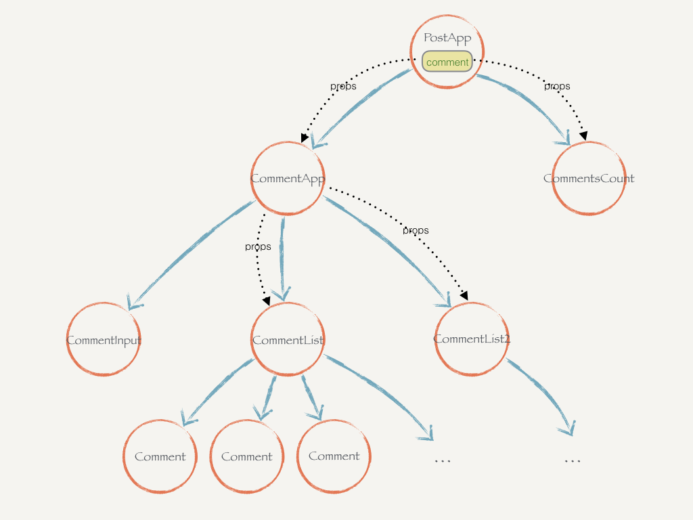

# 状态提升

在React应用中，对应任何可变数据理应只有一个单一“数据源”。通常，状态都是首先添加在需要渲染数据的组件中。然后，如果另一个组件也需要这些数据，你可以将数据提升至离它们最近的共同祖先中。你应该依赖 自上而下的数据流，而不是尝试在不同组件中同步状态.

注意下父组件和子组件 事件处理是如何同步的


子组件
```
class TemperatureInput extends React.Component {
  constructor(props) {
    super(props);
    this.handleChange = this.handleChange.bind(this);
  }

  handleChange(e) {
    this.props.onTemperatureChange(e.target.value);
  }

  render() {
    const temperature = this.props.temperature;
    const scale = this.props.scale;
    return (
      <fieldset>
        <legend>在{scaleNames[scale]}:中输入温度数值</legend>
        <input value={temperature}
               onChange={this.handleChange} />
      </fieldset>
    );
  }
}
```


父组件
```
class Calculator extends React.Component {
  constructor(props) {
    super(props);
    this.handleCelsiusChange = this.handleCelsiusChange.bind(this);
    this.handleFahrenheitChange = this.handleFahrenheitChange.bind(this);
    this.state = {temperature: '', scale: 'c'};
  }

  handleCelsiusChange(temperature) {
    this.setState({scale: 'c', temperature});
  }

  handleFahrenheitChange(temperature) {
    this.setState({scale: 'f', temperature});
  }

  render() {
    const scale = this.state.scale;
    const temperature = this.state.temperature;
    const celsius = scale === 'f' ? tryConvert(temperature, toCelsius) : temperature;
    const fahrenheit = scale === 'c' ? tryConvert(temperature, toFahrenheit) : temperature;

    return (
      <div>
        <TemperatureInput
          scale="c"
          temperature={celsius}
          onTemperatureChange={this.handleCelsiusChange} />

        <TemperatureInput
          scale="f"
          temperature={fahrenheit}
          onTemperatureChange={this.handleFahrenheitChange} />

        <BoilingVerdict
          celsius={parseFloat(celsius)} />

      </div>
    );
  }
}
```



