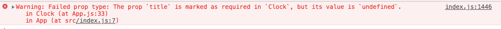
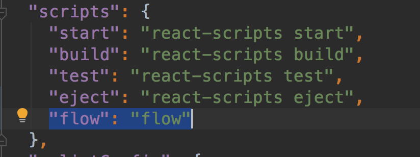

# 组件的属性props


## 组件的属性props
不要试图去修改组件的属性.props 可有认为是只读属性
```
var component = <Component />;
component.props.foo = x; // 不推荐
component.props.bar = y; // 不推荐
```
推荐做法：
```
var component = <Component foo={x} bar={y} />;

var props = {};
props.foo =x;
props.bar =y;
var compoment = <Component {...props}/>
```

## Props的只读性
无论是函数或是类来声明一个组件，它决不能修改它自己的props。

类似于下面的这种 " 纯函数 "，它没有改变自己的输入值，当传入的值相同，总会返回相同的结果

```
function sum(a,b){
  return a+b;
}
```

> 所以React组件都必须像存函数那样使用它们都props

## 组件的属性props的检查
React内置的类型检查功能，你需要检查组件的属性，你只需要给组件配置特殊的PropTypes属性即可

```
import PropTypes from 'prop-types';

class Clock extends Component {
  render(){
    ...
  }
}

//给组件添加属性
Clock.propTypes={
	title:PropTypes.string.isRequired
}
```

当你给属性传递了无效值时，JavsScript 控制台将会打印警告。出于性能原因，propTypes 只在开发模式下进行检查。

下面这种就是提示缺少 了 title


其他的验证器 [查看文档](https://react.docschina.org/docs/typechecking-with-proptypes.html)
```
mport PropTypes from 'prop-types';

MyComponent.propTypes = {
  // 你可以将属性声明为以下 JS 原生类型
  optionalArray: PropTypes.array,
  optionalBool: PropTypes.bool,
  optionalFunc: PropTypes.func,
  optionalNumber: PropTypes.number,
  optionalObject: PropTypes.object,
  optionalString: PropTypes.string,
  optionalSymbol: PropTypes.symbol,

  // 任何可被渲染的元素（包括数字、字符串、子元素或数组）。
  optionalNode: PropTypes.node,

  // 一个 React 元素
  optionalElement: PropTypes.element,

  // 你也可以声明属性为某个类的实例，这里使用 JS 的
  // instanceof 操作符实现。
  optionalMessage: PropTypes.instanceOf(Message),

  // 你也可以限制你的属性值是某个特定值之一
  optionalEnum: PropTypes.oneOf(['News', 'Photos']),

  // 限制它为列举类型之一的对象
  optionalUnion: PropTypes.oneOfType([
    PropTypes.string,
    PropTypes.number,
    PropTypes.instanceOf(Message)
  ]),

  // 一个指定元素类型的数组
  optionalArrayOf: PropTypes.arrayOf(PropTypes.number),

  // 一个指定类型的对象
  optionalObjectOf: PropTypes.objectOf(PropTypes.number),

  // 一个指定属性及其类型的对象
  optionalObjectWithShape: PropTypes.shape({
    color: PropTypes.string,
    fontSize: PropTypes.number
  }),

  // 你也可以在任何 PropTypes 属性后面加上 `isRequired`
  // 后缀，这样如果这个属性父组件没有提供时，会打印警告信息
  requiredFunc: PropTypes.func.isRequired,

  // 任意类型的数据
  requiredAny: PropTypes.any.isRequired,

  // 你也可以指定一个自定义验证器。它应该在验证失败时返回
  // 一个 Error 对象而不是 `console.warn` 或抛出异常。
  // 不过在 `oneOfType` 中它不起作用。
  customProp: function(props, propName, componentName) {
    if (!/matchme/.test(props[propName])) {
      return new Error(
        'Invalid prop `' + propName + '` supplied to' +
        ' `' + componentName + '`. Validation failed.'
      );
    }
  },

  // 不过你可以提供一个自定义的 `arrayOf` 或 `objectOf`
  // 验证器，它应该在验证失败时返回一个 Error 对象。 它被用
  // 于验证数组或对象的每个值。验证器前两个参数的第一个是数组
  // 或对象本身，第二个是它们对应的键。
  customArrayProp: PropTypes.arrayOf(function(propValue, key, componentName, location, propFullName) {
    if (!/matchme/.test(propValue[key])) {
      return new Error(
        'Invalid prop `' + propFullName + '` supplied to' +
        ' `' + componentName + '`. Validation failed.'
      );
    }
  })
};
```


## 给属性props定义默认值
方法1：可以通过defaultProps为props定义默认值

```
Clock.defaultProps={
	title:'bob'
}
```


方法2：在react组件类中声明defaultProps作为静态属性

```
class Clock extends Component {
  //作为静态属性
	static defaultProps={
		title:'bob'
	}

  render(){
    ...
  }
}
```


## 静态类型检查Flow 和Typescript代替PropTypes

像Flow和TypeScript这样的静态类型检测器可以在运行代码之前识别某些类型的问题。他们可以通过添加自动完成功能来完善开发人员的工作流程。出于这个原因，建议在更大的代码库中使用Flow 活着TypeScript来代替PropTypes作为类型检查

>FLow 是一个针对javascript 代码都静态类型检查器。她可以让你使用特殊的类型语法注释变量、函数和组件，来尽早的发现错误。

使用Flow
* ①：在项目中添加FLow
安装flow 和创建flow 配置文件
```
yarn add --dev flow-bin
yarn run flow init
```

最后将flow 添加到package.json中的script部分：



* ②：从编译过的代码中剥离Flow语法

Flow 通过使用特殊的语法为类型注释扩展了 JavaScript 语言。 然而，浏览器并不知道这个语法，所以我们需要确保它不会在发送到浏览器的已编译的 JavaScript 包中结束。

确切的做法取决于你用来编译 JavaScript 的工具。

Create React App

如果你的项目是使用 Create React App 建立的，恭喜！ Flow 此时已经被默认剥离，所以在这一步你不需要做任何事情。

Babel  [参考文档：](https://react.docschina.org/docs/static-type-checking.html)


* ③：运行FLow
yarn flow


>TypeScript  是一门由微软开发的编程语言。 它是 JavaScript 的一个类型超集，包含它自己的编译器。 作为一种类型化语言，Typescript 可以早在您的应用程序上线之前在构建时发现错误。 你可以在这里了解更多关于在 React 中使用 TypeScript 的知识。


Typescript [快速入门](http://www.runoob.com/w3cnote/getting-started-with-typescript.html)


文件扩展名：

在 React 中，你最有可能在 .js 文件中编写你的组件。在 TypeScript 中我们有两个文件扩展名：

.ts 是默认的文件扩展名， .tsx 是一个为包含 JSX 代码使用的特殊扩展名。
