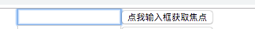
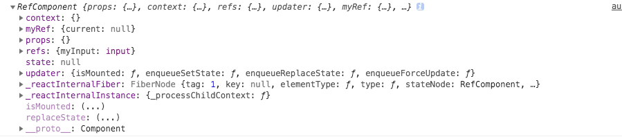

# 组件ref属性

>ref属性在开发中使用到频率很高，使用它你可以获取到任何你想要获取到组件的对象，有了这个对象你就可以灵活地做很多事情，比如：读写对象的变量，甚至调用对象的函数


* 用途：从组件中获取真实的DOM节点或React元素
* 何时使用refs
  * 处理焦点、文本选中或者媒体控制
  * 触发强制动画
  * 集成第三方DOM库


## 创建Refs，访问refs
* ①：直接填写名称

```
创建
<input type="text" ref="myInput"/>

使用
handleClick(){
		//使用原生的DOM API获取焦点
		this.refs.myInput.focus();
    console.log(this.refs.myInput.value); //获取Input DOM元素到值
	}

```

完整代码

```
import React from 'react';

class RefComponent extends React.Component{

	handleClick(){
		//使用原生的DOM API获取焦点
		this.refs.myInput.focus();
		console.log(this.refs.myInput.current)
	}

	render() {
		return (
			<div>
				<input type="text" ref="myInput"/>
				<input
					type="button"
					value="点我输入框获取焦点"
					onClick={this.handleClick.bind(this)}
				/>
			</div>
		);
	}
}

export default RefComponent;
```


* ②使用React.createRef() API
使用ref中的current属性对节点引用 进行访问

```
constructor(props){
		super(props);
		this.myRef=React.createRef();
	}

  <input type="text" ref={this.myRef}/>

  handleClick(){
  		this.myRef.current.focus();
  	}

```

完整代码

```
import React from 'react';

class RefComponent extends React.Component{

	constructor(props){
		super(props);
		this.myRef=React.createRef();
	}

	handleClick(){
	  this.myRef.current.focus();
		console.log(this.myRef.current)
	}

	render() {
		return (
			<div>
				<input type="text" ref={this.myRef}/>
				<input
					type="button"
					value="点我输入框获取焦点"
					onClick={this.handleClick.bind(this)}
				/>
			</div>
		);
	}
}

export default RefComponent;
```

* ③直接使用函数进行赋值


（）内的myInput 和 this.myInput  都是可以为任意的变量名。表示input DOM 赋值给了 this.myInput

```
<input type="text" ref={(myInput)=>{this.myInput=myInput}}/>


handleClick(){
		this.myInput.focus();
		console.log(this.myRef.current)
	}
```

完整代码

```
import React from 'react';

class RefComponent extends React.Component{

	handleClick(){
		this.myInput.focus();
		console.log(this.myRef.current)
	}

	render() {
		return (
			<div>
				<input type="text" ref={(myInput)=>{this.myInput=myInput}}/>
				<input
					type="button"
					value="点我输入框获取焦点"
					onClick={this.handleClick.bind(this)}
				/>
			</div>
		);
	}
}

export default RefComponent;
```




若不使用ref 我们可以使用 事件的event参数

```
import React from 'react';

class RefComponent extends React.Component{

	handleClick(e){
    e.target //表示DOM
		console.log(e.target.value);
	}

	render() {
		return (
			<div>
				<input type="text" ref={(myInput)=>{this.myInput=myInput}}/>
				<input
					type="button"
					value="点我输入框获取焦点"
					onClick={this.handleClick.bind(this)}
				/>
			</div>
		);
	}
}

export default RefComponent;
```


## 为 组件添加  ref(引用)属性  ，这种组件要求是类方式定义的

如果我们想包装上面的RefComponent 组件，来模拟挂载之后立即被点击的效果的话，我们可以利用 ref 引用来访问类的自定义输入方法

这种给子组件添加ref属性，只能获取组件实例而不是DOM节点，并且在函数式组件上无效。


我们再组件身上添加到了 ref 获取到底是一个RefComponent类

console.log(this.textInput.current);





```
import React from 'react';
import RefComponent from './refComponent';

class Autoref extends React.Component{
	constructor(props){
		super(props);
		this.textInput = React.createRef();
	}


	componentDidMount() {
		console.log(this.textInput.current);
		this.textInput.current.handleClick(); //调用组件类的方法，从而实现挂载完组件就获取到焦点
	}


	render() {
		return (
			<RefComponent ref={this.textInput}/>
		);
	}
}

export  default Autoref;
```

## 更好的向父组件暴露DOM节点的解决方案  ref转发
高阶组件中使用(待处理)


## Ref的注意点
>在react中操作DOM要小心，有些函数是异步的，可能我们在结算DOM单时候可能不是我们想象的结果，比如 this.setState()就是一个异步函数，我们应该在它的回凋函数中进行一些与之相关的DOM计算
