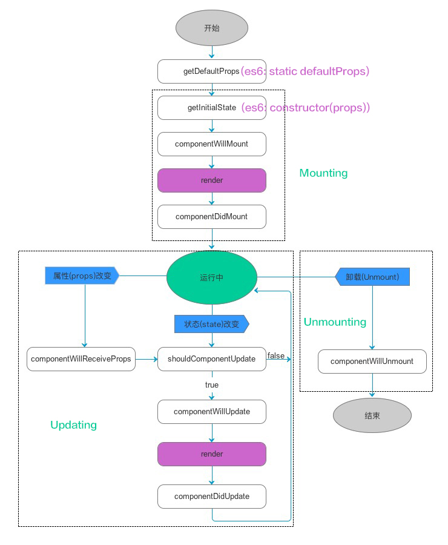
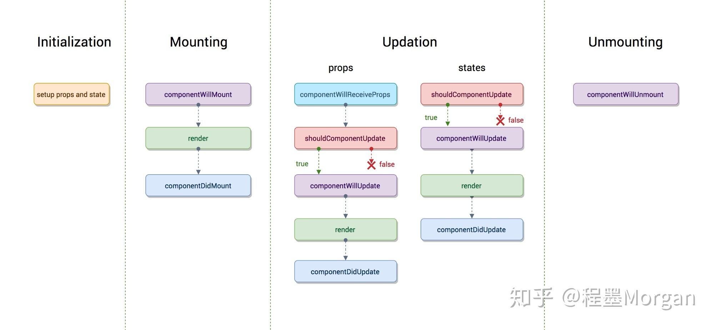

# 组件的生命周期

生命周期函数是指在某一时刻组件会自动调用执行的函数

* Initialization:初始化，setup props and state (construct函数就是初始化)
* Mounting:挂载阶段
* Updating:组件更新阶段，加载到页面后，state或props发生变更
* Unmounting:卸载 （组件卸载就跟DOM中移除节点一个意思，比如你移除某个组件,一般关闭某个页面的时候会把这个页面的所有子组件全部移除）



---
第一阶段：组件初始化(Initialization)

代码中的类的构造函数，construct()就是用来初始化组件的


第二阶段：组件挂载（Mounting）

* componentWillMount

  在组件即将被挂载到页面的时刻自动执行。在组件挂载到DOM之前，且只会被调用一次，在这边调用this.setState不会引起组件的重新渲染。
* render

  根据组件的props和state（无两者的重传递和重赋值，论值是否有变化，都可以引起组件重新render） ，return 一个React元素（描述组件，即UI），不负责组件实际渲染工作，之后由React自身根据此元素去渲染出页面DOM。render是纯函数（Pure function：函数的返回结果只依赖于它的参数；函数执行过程里面没有副作用），不能在里面执行this.setState，会有改变组件状态的副作用。


* componetDidMount    组件挂载到DOM后调用，且只会被调用一次

第三阶段：组件的更新阶段（Updating）

  组件的更新机制：setState引起的state更新或父组件重新render引起的props更新，更新后端state和props和之前的值相比无论是否有变化，都将引起自组件的重新render.(shouldComponentUpdate可优化子组件是否render)

  * componentWillReceiveProps(nextProps)

  执行时间：一个组件要从父组件接受了参数，如果这个组件第一次存在于父组件，不会执行（因为这里算是子组件的初始化阶段），如果这个组件之前已经存在于父组件，父组件render时，这是子组件的这个函数会被执行。

  此方法只调用props引起的组件更新过程中，参数nextProps是父组件传给当前组件的新props。但父组件render方法的调用不能保证重新传给当前组件的props是有变化都，所以在此方法中根据nextProps和this.props来查明重传递props是否改变，以及如果改变了要执行啥，比如根据新的props调用setState来触发当前组件的重新render.
  >该函数中调用setState将不会引起第二次渲染。

  ```
  class Child extends Component {
      constructor(props) {
          super(props);
          this.state = {
              someThings: props.someThings
          };
      }
      componentWillReceiveProps(nextProps) { // 父组件重传props时就会调用这个方法
          this.setState({someThings: nextProps.someThings});
      }
      render() {
          return <div>{this.state.someThings}</div>
      }
  }

  ```

  * shouldComponentUpdate(nextProps, nextState)

  该函数返回一个bool值，来控制是否需要进行render()更新;

  此方法通过比较nextProps，nextState及当前组件的this.props，this.state，返回true时当前组件将继续执行更新过程，返回false则当前组件更新停止，以此可用来减少组件的不必要渲染，优化组件性能。

  * componentWillUpdate(nextProps, nextState)

  此方法在调用render方法前执行，在这边可执行一些组件更新发生前的工作，一般较少用。

  * render 渲染
  * componentDidUpdate(prevProps, prevState)

  此方法在组件更新后被调用，可以操作组件更新后的DOM，prevProps和prevState这两个参数指的是组件更新前的props和state


第四阶段：组件移除阶段（Unmounting）

  * componentWillUnmount

  此方法在组件被卸载前调用，可以在这里执行一些清理工作，比如清除组件中使用的定时器，清除componentDidMount手动创建的DOM元素等，以避免引起内存泄露





应用：

componentDidMount: ajax请求放在这里,而不建议放在componentWillMount

shouldComponentUpdate:优化是否因为父组件render 而子组件判断才进行render
