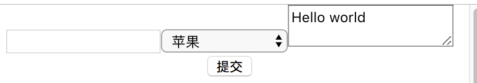
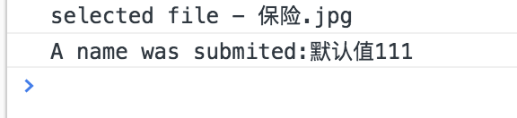

# 表单

## 受控组件和非受控组件
* 受控组件

  假设我们现在有一个表单，表单中有一个input标签，input的value值必须是我们设置在constructor构造函数的state中的值，然后通过onChange触发事件来修改state中的值，这样形成一个循环的回路影响。也可以说是React负责渲染表单的组件仍然控制用户后续输入时所发生的变化。

```
import React, {Component} from 'react';


class ControlComponent extends Component {
	constructor(props) {
		super(props);
		this.state = {
			textName: '',
			selectName: 1,
			textareaName: 'Hello world'
		};
		this.handInputChange = this.handInputChange.bind(this);
		this.handSubmit = this.handSubmit.bind(this);
	}


	handInputChange(event) {
		const target = event.target;
		const value = target.type === 'checkbox' ? target.checked : target.value;
		const name = target.name;

		this.setState({
			[name]: value
		})
	}


	handSubmit(e) {
		e.preventDefault();
		console.log("input value", this.state.textValue)
	}

	render() {
		return (
			<form action="">
				<input name="textName" type="text" value={this.state.textName} onChange={this.handInputChange}/>
				<select name="selectName" id="" value={this.state.selectName} onChange={this.handInputChange}>
					<option value="">请选择一个水果</option>
					<option value="1">苹果</option>
					<option value="2">菠萝</option>
					<option value="3">橘子</option>
					<option value="4">香蕉</option>
				</select>

				<textarea name="textareaName" value={this.state.textareaName} onChange={this.handInputChange}/>


				<input type="submit" value="提交" onClick={this.handSubmit}/>
			</form>
		);
	}
}

export default ControlComponent;
```





* 非受控组件

  非受控也就意味着我可以不需要设置它的state属性，而通过ref来操作真实的DOM

  ```
  import React , { Component } from 'react';

class UncontrolComponent extends Component{
	constructor(props){
		super(props);
		this.handSubmit = this.handSubmit.bind(this);
	}

	handSubmit(e){
		e.preventDefault();
		console.log(`selected file - ${this.fileInput.files[0].name}`)
		console.log(`A name was submited:${this.inputtext.value}`)
	}

	render() {
		return (
			<form action="" onSubmit={this.handSubmit}>
				<input type="text" defaultValue="默认值" ref={(input)=>this.inputtext=input}/>

				Upload file
				<input
					type="file"
					ref={input=>{this.fileInput = input}}
				/>
				<input type="submit" value="提交"/>

			</form>
		);
	}
}


export  default UncontrolComponent;
  ```

提交结果：
  


  注意非受控组件的默认值：

  在 React 的生命周期中，表单元素上的 value 属性将会覆盖 DOM 中的值。使用非受控组件时，通常你希望 React 可以为其指定初始值，但不再控制后续更新。要解决这个问题，你可以指定一个 defaultValue 属性而不是 value。

```
  同样，<input type="checkbox"> 和 <input type="radio"> 支持 defaultChecked，<select> 和 <textarea> 支持 defaultValue.
```
