# React-Native 布局

[教程](http://www.devio.org/2016/08/01/Reac-Native%E5%B8%83%E5%B1%80%E8%AF%A6%E7%BB%86%E6%8C%87%E5%8D%97/)

在ReactNative 中使用flexbox布局来规定某个组件的 子元素  的布局。Flexbox可以在不同的屏幕上提供一致的布局结构。

主要三大属性：
* flexDirection
* alignlItem
* justifyContent

### 像素问题
在ReactNative中尺寸是没有单位的，它代表了设备独立像素
```
<View style={ {width:100,height:100,margin:40,backgroundColor:'gray'}}>
        <Text style={ {fontSize:16,margin:20}}>尺寸</Text>
</View>
```
在上诉代码中，运行在Android上时，View的长和宽 被解释成：100dp 100dp单位上dp,字体被解释为16sp,单位上sp.运行在ios上时，尺寸单位被解释为pt,这些单位确保了布局在任何不同的dpi的手机上面显示不会发生改变。

### React Native 中的 Flexbox 与 web中的差异

React Native 中的 Flexbox 的工作原理和 web 上的 CSS 基本一致，当然也存在少许差异。
* flexDirection: React Native中默认为flexDirection:'column'，在Web CSS中默认为flex-direction:'row'
* alignItems: React Native中默认为alignItems:'stretch'，在Web CSS中默认align-items:'flex-start'
* flex: 相比Web CSS的flex接受多参数，如:flex: 2 2 10%;，但在 React Native中flex只接受一个参数
* 不支持属性：align-content，flex-basis，order，flex-basis，flex-flow，flex-grow，flex-shrink

以上是React Native中的FlexBox 和Web CSSS上FlexBox的不同之处，记住这几点，你可以像在Web CSSS上使用FlexBox一样，在React Native中使用FlexBox。


## 父元素容器（flex-container）属性
决定子元素的布局方式
* flexDirection   enum(‘row’, ‘column’,’row-reverse’,’column-reverse’) 子元素方向
* flexWrap        enum(‘wrap’, ‘nowrap’)  是否换行
* justifyContent  enum(‘flex-start’, ‘flex-end’, ‘center’, ‘space-between’, ‘space-around’)  子元素在主轴上面如何与空白分配
* alignItems      enum(‘flex-start’, ‘flex-end’, ‘center’, ‘stretch’)  子元素与侧轴上面空白直接分配

 主轴和侧轴
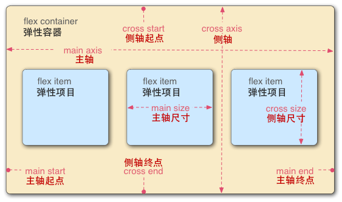

#### flexDirection
属性定义了父视图的<font color="#660000">**子元素**</font>沿横轴或侧轴方片的排列方式
* row: 从左向右依次排列
* row-reverse: 从右向左依次排列
* column(default): 默认的排列方式，从上向下排列
* column-reverse: 从下向上排列

```
import React, { Component } from 'react';
import { View } from 'react-native';

export default class FlexDirectionBasics  extends Component{
    render() {
        return (
            <View style={{marginTop:50}}>
                <View style={{width: 50, height: 50, backgroundColor: 'powderblue'}} />
                <View style={{width: 50, height: 50, backgroundColor: 'skyblue'}} />
                <View style={{width: 50, height: 50, backgroundColor: 'steelblue'}} />
            </View>
        );
    }
};
```
默认子元素方向：从上往下排列

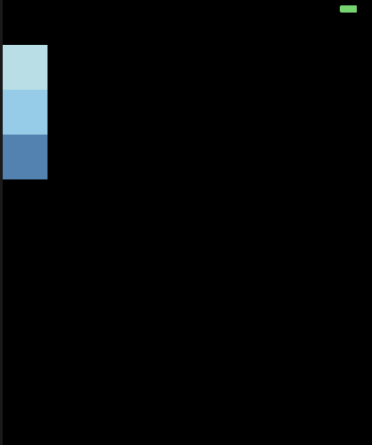


```
  <View style={{marginTop:50,flexDirection: 'row'}}>
      <View style={{width: 50, height: 50, backgroundColor: 'powderblue'}} />
      <View style={{width: 50, height: 50, backgroundColor: 'skyblue'}} />
      <View style={{width: 50, height: 50, backgroundColor: 'steelblue'}} />
  </View>
```
flexDirection 设置为row则 子元素按照列顺序，从左往右排列了
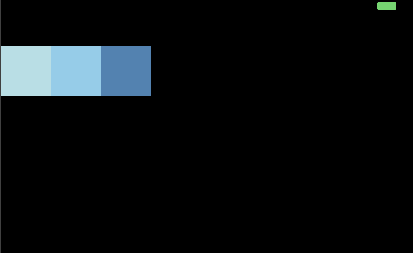

然后flexDirection的row-reverse 和cloumn-reverse就是分别方向相反

#### flexWrap
flexWrap设置<font color="#660000">**子元素**</font>在父视图内是否允许多行排列，默认为nowrap。

* nowrap flex 的元素只排列在一行上，可能导致溢出。
* wrap flex 的元素在一行排列不下时，就进行多行排列

默认不换行
```
  <View style={{marginTop:50,flexDirection: 'row'}}>
        <View style={{width: 150, height: 50, backgroundColor: 'powderblue'}} />
        <View style={{width: 150, height: 50, backgroundColor: 'skyblue'}} />
        <View style={{width: 150, height: 50, backgroundColor: 'steelblue'}} />
    </View>
```
可以看到第三个已经溢出了。

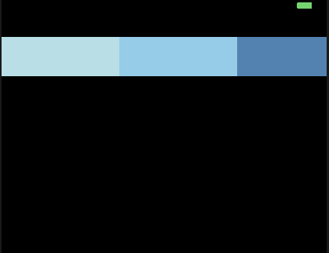


设置换行
```
<View style={{marginTop:50,flexDirection: 'row',flexWrap:'wrap'}}>
    <View style={{width: 150, height: 50, backgroundColor: 'powderblue'}} />
    <View style={{width: 150, height: 50, backgroundColor: 'skyblue'}} />
    <View style={{width: 150, height: 50, backgroundColor: 'steelblue'}} />
</View>
```

最后一个元素因为溢出问题，自动进入了下一行

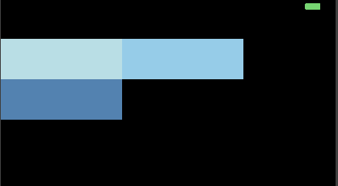


### justifyContent
justifyContent 属性定义了浏览器如何分配顺着父容器<font color="#660000">**主轴**</font>的弹性（flex）元素之间及其周围的空间，默认为flex-start;

* flex-start (default)从首行开始排列。每行第一个弹性元素与行首对齐，同时所有后续的弹性元素与前一个对齐。
* flex-end 从行尾开始排列。每行最后一个弹性元素与行尾对齐，其他元素与后一个对齐。
* center 伸缩元素向每行中点排列。每行第一个元素到行首距离将与每行最后一个元素到行尾的元素距离相同。
* space-between 在每行上均匀分配弹性元素。相邻元素间距离相同。每行第一个元素与行首对齐，每行最后一个元素与行尾对齐。
* space-around 在每行上均匀分配弹性元素。相邻元素距离相同。每行第一个元素到行首的距离和每行最后一个元素到行尾的距离将会是相邻元素之间的距离的一半。


>flex-start (default)从首行开始排列。每行第一个弹性元素与行首对齐，同时所有后续的弹性元素与前一个对齐。

```
    <View style={{marginTop:50,flexDirection: 'row',flexWrap:'wrap',}}>
        <View style={{width: 50, height: 50, backgroundColor: 'powderblue'}} >
            <Text style={ {fontSize:16}}>1</Text>
        </View>
        <View style={{width: 50, height: 50, backgroundColor: 'skyblue'}} >
            <Text style={ {fontSize:16}}>2</Text>
        </View>
        <View style={{width: 50, height: 50, backgroundColor: 'steelblue'}} >
            <Text style={ {fontSize:16}}>3</Text>
        </View>
    </View>
```

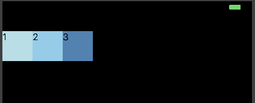


>flex-end 从行尾开始排列。每行最后一个弹性元素与行尾对齐，其他元素与后一个对齐。

```
    <View style={{marginTop:50,flexDirection: 'row',flexWrap:'wrap',justifyContent:'flex-end'}}>
        <View style={{width: 50, height: 50, backgroundColor: 'powderblue'}} >
            <Text style={ {fontSize:16}}>1</Text>
        </View>
        <View style={{width: 50, height: 50, backgroundColor: 'skyblue'}} >
            <Text style={ {fontSize:16}}>2</Text>
        </View>
        <View style={{width: 50, height: 50, backgroundColor: 'steelblue'}} >
            <Text style={ {fontSize:16}}>3</Text>
        </View>
    </View>
```

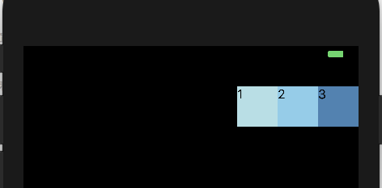

>center 伸缩元素向每行中点排列。每行第一个元素到行首距离将与每行最后一个元素到行尾的元素距离相同。


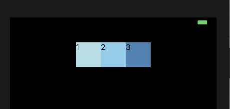

>space-between 在每行上均匀分配弹性元素。相邻元素间距离相同。每行第一个元素与行首对齐，每行最后一个元素与行尾对齐。

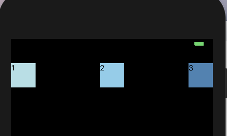

>space-around 在每行上均匀分配弹性元素。相邻元素距离相同。每行第一个元素到行首的距离和每行最后一个元素到行尾的距离将会是相邻元素之间的距离的一半。


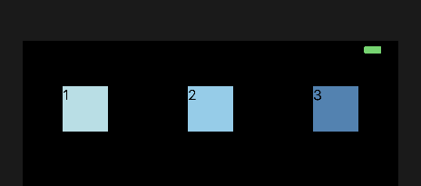

### alignItems
alignItems属性以与justfy-content相同的方式在侧轴方向上将当前行上的弹性元素对齐，默认为stretch.

* flex-start 元素向侧轴起点方向对齐
* flex-end 元素向侧轴终点对齐
* center元素在侧轴居中。如果元素在侧轴上的高度高于其容器，那么在两个方向上溢出的距离相同
* stretch 弹性元素在侧轴方向被拉伸到与容器相同的高度或宽度。


>flex-start 元素向侧轴起点方向对齐

此时横轴居中，侧轴（纵轴）在起始位置。
注意这里的父元素 我设置了 flex为1，那么这时的父元素是高度为满屏的。

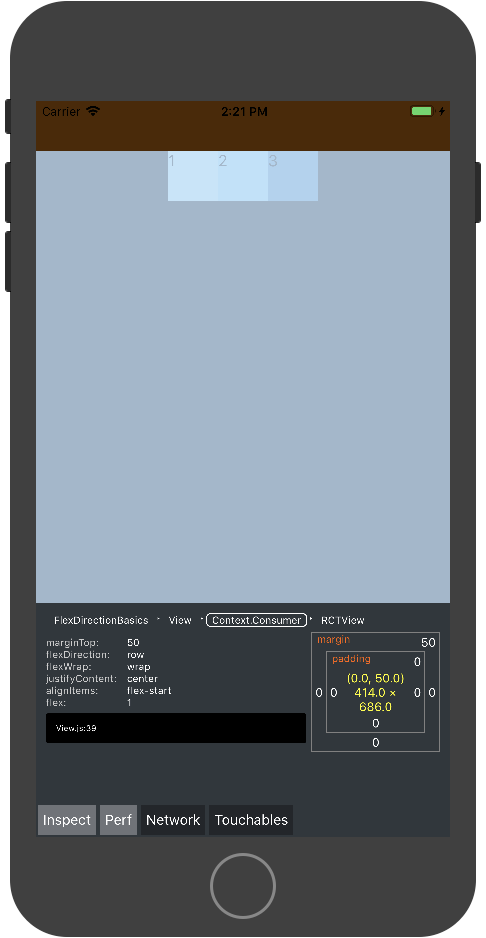

```
<View style={{marginTop:50,flexDirection: 'row',flexWrap:'wrap',justifyContent:'center',alignItems:'flex-start',flex:1}}>
    <View style={{width: 50, height: 50, backgroundColor: 'powderblue'}} >
        <Text style={ {fontSize:16}}>1</Text>
    </View>
    <View style={{width: 50, height: 50,backgroundColor: 'skyblue'}} >
        <Text style={ {fontSize:16}}>2</Text>
    </View>
    <View style={{width: 50,height: 50,  backgroundColor: 'steelblue'}} >
        <Text style={ {fontSize:16}}>3</Text>
    </View>
</View>
```

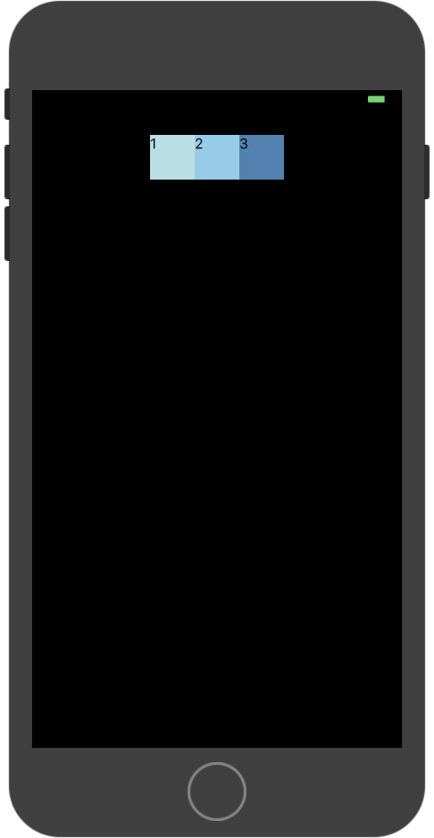

>flex-end 元素向侧轴终点对齐

```
<View style={{marginTop:50,flexDirection: 'row',flexWrap:'wrap',justifyContent:'center',alignItems:'flex-end',flex:1}}>
```

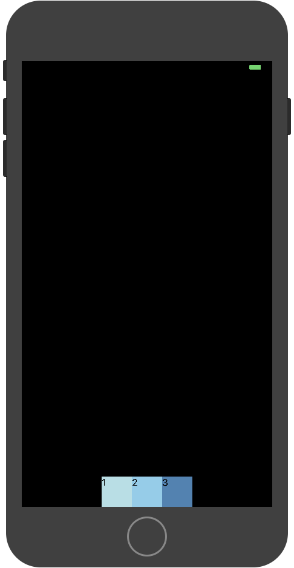


>flex-center 元素在侧轴居中。如果元素在侧轴上的高度高于其容器，那么在两个方向上溢出的距离相同

```
<View style={{marginTop:50,flexDirection: 'row',flexWrap:'wrap',justifyContent:'center',alignItems:'flex-end',flex:1}}>
```

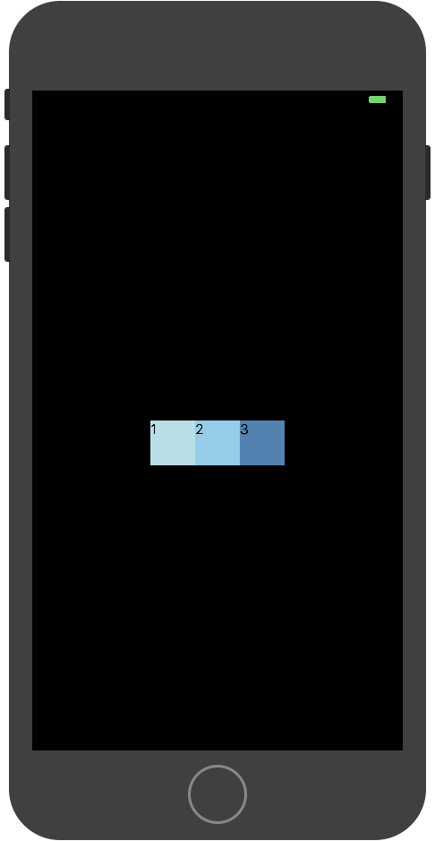

>stretch 弹性元素在侧轴方向被拉伸到与容器相同的高度或宽度。

```
<View style={{marginTop:50,flexDirection: 'row',flexWrap:'wrap',justifyContent:'center',alignItems:'stretch',flex:1}}>
    <View style={{width: 50, height: 50, backgroundColor: 'powderblue'}} >
        <Text style={ {fontSize:16}}>1</Text>
    </View>
    <View style={{width: 50,backgroundColor: 'skyblue'}} >
        <Text style={ {fontSize:16}}>2</Text>
    </View>
    <View style={{width: 50,height: 50,  backgroundColor: 'steelblue'}} >
        <Text style={ {fontSize:16}}>3</Text>
    </View>
</View>
```

中间子元素我将高度设置为自动，那么他就拉升到父元素到高度
stretch 为默认值，不写alignItems就是目前这个效果

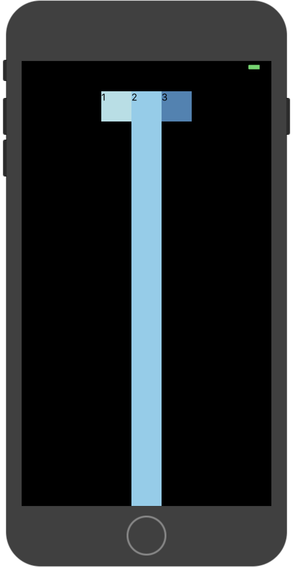


## 子元素属性

* alignSelf enum(‘auto’, ‘flex-start’, ‘flex-end’, ‘center’, ‘stretch’)
* flex number

### alignSelf

alignSelf属性以属性定义了flex容器内被选中项目的侧轴对齐方式，同上面的alignItems效果，但是呢因为alignItems是父容器定义了，下面的所有子元素共有的属性，这里的alignSelf是单单定义属性的子元素才有的，且它是可以复写父元素到alignItems属性的。

* auto(default) 元素继承了它的父容器的 align-items 属性。如果没有父容器则为 “stretch”。
* stretch	元素被拉伸以适应容器。
* center	元素位于容器的中心。
* flex-start	元素位于容器的开头。
* flex-end	元素位于容器的结尾。

```
<View style={{marginTop:50,flexDirection: 'row',flexWrap:'wrap',justifyContent:'center',alignItems:'flex-start',flex:1}}>
    <View style={{width: 50, height: 50, backgroundColor: 'powderblue'}} >
        <Text style={ {fontSize:16}}>1</Text>
    </View>
    <View style={{width: 50,height: 50, backgroundColor: 'skyblue',alignSelf:'center'}} >
        <Text style={ {fontSize:16}}>2</Text>
    </View>
    <View style={{width: 50,height: 50,  backgroundColor: 'steelblue'}} >
        <Text style={ {fontSize:16}}>3</Text>
    </View>
</View>
```

父元素定义了子元素在纵轴是在顶部位置，这里我们定义了第二个元素到 alignSelf来复写了父元素到alignItems 属性，设置为居中。

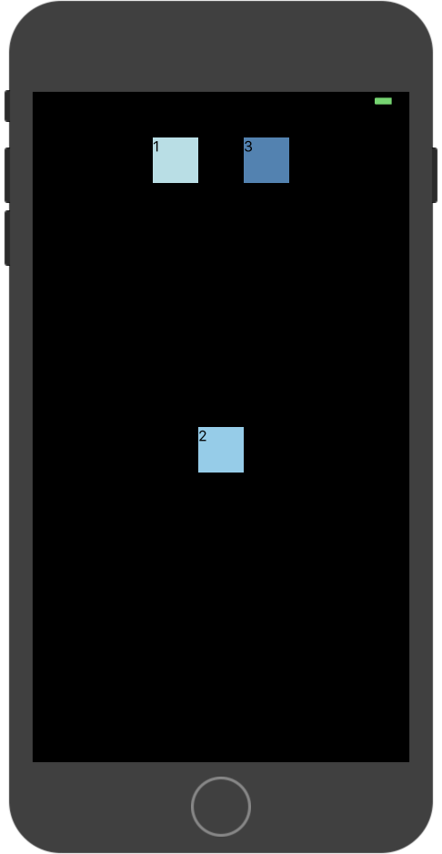


### flex

是将多个元素在父容器<font color="#660000">主轴</font>方向的分配权重比

将上面的例子的元素在主轴方向上面分配大小。填满主轴。

```
<View style={{marginTop:50,flexDirection: 'row',flexWrap:'wrap',justifyContent:'center',alignItems:'flex-start',flex:1}}>
    <View style={{width: 50, height: 50, backgroundColor: 'powderblue',flex:1}} >
        <Text style={ {fontSize:16}}>1</Text>
    </View>
    <View style={{width: 50,height: 50, backgroundColor: 'skyblue',alignSelf:'center',flex:2}} >
        <Text style={ {fontSize:16}}>2</Text>
    </View>
    <View style={{width: 50,height: 50,  backgroundColor: 'steelblue',flex:3}} >
        <Text style={ {fontSize:16}}>3</Text>
    </View>
</View>
```

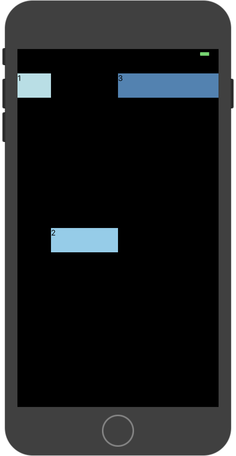


## 弹性（Flex）宽高
在组件样式中使用flex可以使其在可利用的空间中动态地扩张或收缩。一般而言我们会使用flex:1来指定某个组件扩张以撑满<font color="#660000">所有剩余</font>的空间。如果有多个并列的子组件使用了flex:1，则这些子组件会平分父容器中剩余的空间。如果这些并列的子组件的flex值不一样，则谁的值更大，谁占据剩余空间的比例就更大（即占据剩余空间的比等于并列组件间flex值的比）。

>组件能够撑满剩余空间的前提是其父容器的尺寸不为零。如果父容器既没有固定的width和height，也没有设定flex，则父容器的尺寸为零。其子组件如果使用了flex，也是无法显示的。

```
import React, { Component } from 'react';
import { AppRegistry, View } from 'react-native';

export default class FlexDimensionsBasics extends Component {
  render() {
    return (
      // 试试去掉父View中的`flex: 1`。
      // 则父View不再具有尺寸，因此子组件也无法再撑开。
      // 然后再用`height: 300`来代替父View的`flex: 1`试试看？
      <View style={{flex: 1}}>
        <View style={{flex: 1, backgroundColor: 'powderblue'}} />
        <View style={{flex: 2, backgroundColor: 'skyblue'}} />
        <View style={{flex: 3, backgroundColor: 'steelblue'}} />
      </View>
    );
  }
}
```

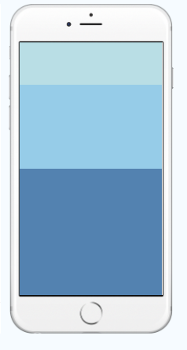
