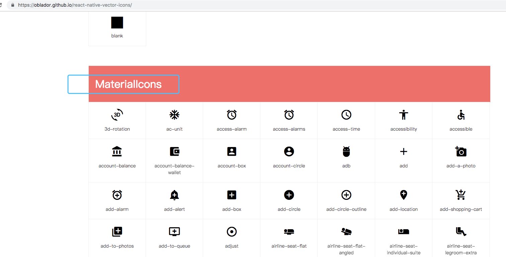

# ReactNative 第三方库

# React Native 学习资源精选仓库
https://juejin.im/entry/59dd786cf265da431d3ba6e3

## 导航库 react-navigation
官网[https://reactnavigation.org/docs/zh-Hans/getting-started.html](https://reactnavigation.org/docs/zh-Hans/getting-started.html)


## 矢量图标

* [文档地址](https://github.com/oblador/react-native-vector-icons)
* [库查询地址](https://oblador.github.io/react-native-vector-icons/)

基本使用

```
yarn add react-native-vector-icons
react-native link react-native-vector-icons
```

引入不同类型的Icon库
```
import Ionicons from 'react-native-vector-icons/Ionicons';
import  MaterialIcons from 'react-native-vector-icons/MaterialIcons'

使用不通的Icon
<Ionicons
					name={'ios-home'}
					size={26}
					style={{color:tintColor}}
					/>

<MaterialIcons
					name={'drafts'}
					size={24}
					style={{color:tintColor}}
			/>

```


