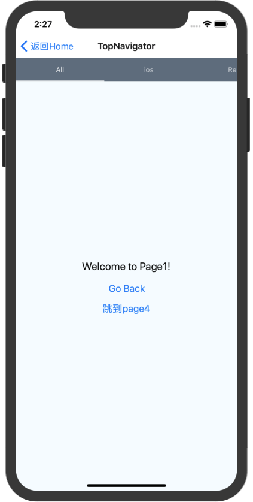

# React Navigation 导航器

[官方文档](https://reactnavigation.org/docs/zh-Hans/getting-started.html)

[API文档](https://reactnavigation.org/docs/zh-Hans/api-reference.html)

[简介](http://www.devio.org/2018/05/15/navigator-to-react-navigation/)

* [createStackNavigator学习指南](http://www.devio.org/2018/12/24/createStackNavigator/)
* [createDrawerNavigator学习指南](http://www.devio.org/2019/01/20/createDrawerNavigator/)
* [createMaterialTopTabNavigator学习指南](http://www.devio.org/2019/01/03/createMaterialTopTabNavigator/)
* [createBottomTabNavigator学习指南](http://www.devio.org/2018/12/30/createBottomNavigator/)

## 安装React Navigation

### 在项目中安装react-navigation 包

>yarn add react-navigation

然后安装第三方扩展 react-native-gusture-handler.处理顶部tab切换手势
>yarn add react-native-gesture-handler

Link所有都原生依赖，因为react-native-gesture-handler关联到了原生应用

>react-native link react-native-gesture-handler


>当使用到原生的时候，还需要配置些，查看官方手册说明


## React Navigation 的导航器分类

* stack navigator 为应用提供了一种在屏幕之间切换并管理导航历史记录的方式。 web浏览器和React Navigation 工作原理的一个主要区别是：React Navigation 的stack navigator 提供了再Android和Ios设备上，在堆栈中的路由之间导航时你期望的手势和动画。

* tab navigation 在手机APP中最常用的导航可能就是基于Tab的导航，这可以是页面底部或者标题下方顶部的标签（甚至不要标题）
* Drawer navigation
* Switch Navigator  用途是一次只显示一个页面。默认情况下，它是不处理返回操作，并在你切换时将路由重置为默认状态,比如应用场景的跳转。

## 项目引入导航
navigation 无法直接被使用到页面，需要使用createAppContainer，这里输出了处理完的导航器。
App.js
```
import {AppStackNavigator} from './navigators/AppNavigators'
import {createAppContainer} from 'react-navigation'
export default createAppContainer(AppStackNavigator);
```

index.js  App组件挂载刀根DOM上面
```
AppRegistry.registerComponent(appName, () => App);
```

## statck Navigation 的demo

```
export const AppStackNavigator = createStackNavigator({
    HomePage: {
        screen: Homepage,       //screen表示使用到时哪个页面组件
    },
    Page1: {
        screen: Page1,
        navigationOptions:({navigation})=>({
            title:`${navigation.state.params.name}页面名`  //动态配置navigationOption
        })
    },
    Page2:{
        screen: Page2,
        navigationOptions:{
            title:"This is Page2"
        }
    },
    Page3:{
        screen: Page3,
        navigationOptions:(props) => {
            const {navigation}=props;
            const {state,setParams}=navigation;
            const {params}=state;
            return {
                title:params.title?params.title:"This is Page3",
                headerRight:(
                    <Button
                        title={params.mode==='edit'?'保存':'编辑'}
                        onPress={()=>setParams({mode:params.mode==='edit'?'':'edit'})}
                    />
                )
            }
        }
    },
    Page4:{
        screen: Page4,
        navigationOptions:{
            title:"This is Page4"
        }
    },
		Bottom:{
    	screen:AppBottomNavigator,
			navigationOptions: {
    		title: 'BottomNavigator'
			}
		},
		Top:{
			screen:AppTopNavigator,
			navigationOptions: {
				title: 'TopNavigator'
			},

		},DrawerNav:{
			screen:DrawerNav,
			navigationOptions:{
				title:'DrawerNav'
			}
		}
	},
	{
    initialRouteName: 'HomePage', // 设置 stack navigator 的默认页面， 必须是路由配置中的某一个
	}
);
```
---


---

Homepage  页面
[ Navigation的prop的使用](https://reactnavigation.org/docs/zh-Hans/navigation-prop.html)

在内部定义navigationOptions 可以覆盖再创建stackNavigation中当前页面的navigationOptions配置

```
import React from 'react';
import {View, Text, Button} from 'react-native';

export default class HomePage extends React.Component {

	//覆盖AppNavigators中的配置
	static navigationOptions = {
		title: 'Home Page',
		headerBackTitle: '返回Home'   //设置返回此页的返回按钮的文案，有长度限制
	}

	render() {
		const {navigation} = this.props;
		return (
			<View style={{flex: 1, alignItems: 'center', justifyContent: 'center'}}>
				<Text>Home Screen1</Text>
				<Button title={'Go to Page1'} onPress={() => {
					navigation.navigate('Page1', {name: '动态的'})
				}}/>
				<Button title={'Go to Page2'} onPress={() => {
					navigation.navigate('Page2')
				}}/>
				<Button title={'Go to Page3'} onPress={() => {
					navigation.navigate('Page3', {name: 'Davie'})
				}}/>
				<Button title={'Go to Bottom Navigator'} onPress={() => {
					navigation.navigate('Bottom')
				}}/>
				<Button title={'Go to Top Navigator'} onPress={() => {
					navigation.navigate('Top')
				}}/>
				<Button title={'Go to Top DrawerNav'} onPress={() => {
					navigation.navigate('DrawerNav')
				}}/>
			</View>
		);
	}
}
```


---
Page1

```
import React, {Component} from 'react';
import {Button, Platform, StyleSheet, Text, View} from 'react-native';

export default class Page1 extends Component {
    render() {
        const {navigation} = this.props;
        return (
            <View style={styles.container}>
                <Text style={styles.welcome}>Welcome to Page1!</Text>
                <Button
                    title={'Go Back'}
                    onPress={()=>{
                        navigation.goBack()
                    }}
                />
                <Button
                    title={'跳到page4'}
                    onPress={()=>{
                        navigation.navigate('Page4')
                    }}
                />
            </View>
        );
    }
}

const styles = StyleSheet.create({
    container: {
        flex: 1,
        justifyContent: 'center',
        alignItems: 'center',
        backgroundColor: '#F5FCFF',
    },
    welcome: {
        fontSize: 20,
        textAlign: 'center',
        margin: 10,
    }
});

```


---
Page2
```

import React, {Component} from 'react';
import {Platform, StyleSheet, Text, View} from 'react-native';

export default class Page2 extends Component {
    render() {
        return (
            <View style={styles.container}>
                <Text style={styles.welcome}>Welcome to Page2!</Text>
            </View>
        );
    }
}

const styles = StyleSheet.create({
    container: {
        flex: 1,
        justifyContent: 'center',
        alignItems: 'center',
        backgroundColor: '#F5FCFF',
    },
    welcome: {
        fontSize: 20,
        textAlign: 'center',
        margin: 10,
    }
});

```


---

Page3


```
import React, {Component} from 'react';
import {Platform, StyleSheet, Text, View, TextInput} from 'react-native';

export default class Page3 extends Component {
	render() {
		const {navigation} = this.props;
		const {state, setParams} = navigation;
		const {params} = state;
		const showText = params && params.mode == 'edit' ? '正在编辑' : '编辑完成';

		return (
			<View style={styles.container}>
				<Text style={styles.text}>Welcome to Page3!</Text>
				<Text style={styles.showText}>{showText}</Text>
				<TextInput
					style={styles.input}
					onChangeText={text => {
						setParams({title: text})
					}}
				/>
			</View>
		);
	}
}

const styles = StyleSheet.create({
	container: {
		flex: 1,
		backgroundColor: '#F5FCFF',
		alignItems: 'center'
	},
	text: {
		fontSize: 20,
		color: 'black'
	},
	showText: {
		marginTop: 30,
		fontSize: 20,
		color: 'blue'
	},
	input: {
		height: 50,
		marginTop: 10,
		borderColor: 'black',
		borderWidth: 1
	}
});
```


---
Page4
使用了 navigater 的prop中的navigation的方法
```
import React, {Component} from 'react';
import {Platform, StyleSheet, Text, View, Button} from 'react-native';

export default class Page4 extends Component {
    render() {
    	const {navigation} = this.props;
        return (
            <View style={styles.container}>
                <Text style={styles.welcome}>Welcome to Page4!</Text>
								<Button title={'Open Drawer'} onPress={()=>navigation.openDrawer()}/>
								<Button title={'Close Drawer'} onPress={()=>navigation.closeDrawer()}/>
								<Button title={'Toggle Drawer'} onPress={()=>navigation.toggleDrawer()}/>
            </View>
        );
    }
}

const styles = StyleSheet.create({
    container: {
        flex: 1,
        justifyContent: 'center',
        alignItems: 'center',
        backgroundColor: '#F5FCFF',
    },
    welcome: {
        fontSize: 20,
        textAlign: 'center',
        margin: 10,
    }
});

```


---

page5

```
import React, {Component} from 'react';
import {Platform, StyleSheet, Text, View} from 'react-native';

export default class Page5 extends Component{
    render() {
        return (
            <View style={styles.container}>
                <Text style={styles.welcome}>Welcome to Page5!</Text>
            </View>
        );
    }
}

const styles = StyleSheet.create({
    container: {
        flex: 1,
        justifyContent: 'center',
        alignItems: 'center',
        backgroundColor: '#F5FCFF',
    },
    welcome: {
        fontSize: 20,
        textAlign: 'center',
        margin: 10,
    }
});
```

---
### topTabNavigator

顶部tab切换
```
const AppTopNavigator = createMaterialTopTabNavigator({
	Page1 : {
		screen: Page1,
		navigationOptions: {
			tabBarLabel: 'All'
		}
	},
	Page2 : {
		screen: Page2,
		navigationOptions: {
			tabBarLabel: 'ios'
		}
	},
	Page3:{
		screen: Page3,
		navigationOptions:{
			tabBarLabel: 'React'
		}
	},
	Page4:{
		screen: Page4,
		navigationOptions:{
			tabBarLabel: 'React Native'
		}
	},
	Page5:{
		screen: Page5,
		navigationOptions:{
			tabBarLabel: 'devio'
		}
	}
},{
	tabBarOptions:{
		tabStyle:{mindWidth:50},
		upperCaseLabel:false,	//是否使用标签大写，默认为true
		scrollEnabled:true, //是否支持 选项卡滚动，默认为false
		style:{
			backgroundColor:'#678'	//Tab的背景色
		},
		indicatorStyle:{
			height:2,
			backgroundColor: 'white'
		},//标签指示器样式
		labelStyle:{
			fontSize:13,
			marginTop: 6,
			marginBottom: 6
		}//文字的样式
	}
});
```




---
### bottomTabNavigator
底部导航
```
const AppBottomNavigator = createBottomTabNavigator({
	Page1 : {
		screen: Page1,
		navigationOptions: {
			tabBarLabel: '最热',
			tabBarIcon: ({tintColor,focused})=>(
				<Ionicons
					name={'ios-home'}
					size={26}
					style={{color:tintColor}}
					/>
			)
		}
	},
	Page2 : {
		screen: Page2,
		navigationOptions: {
			tabBarLabel: '趋势',
			tabBarIcon: ({tintColor,focused})=>(
				<Ionicons
					name={'ios-people'}
					size={26}
					style={{color:tintColor}}
				/>
			)
		}
	},
	Page3:{
		screen: Page3,
		navigationOptions:{
			tabBarLabel: '收藏',
			tabBarIcon: ({tintColor,focused})=>(
				<Ionicons
					name={'ios-chatboxes'}
					size={26}
					style={{color:tintColor}}
				/>
			)
		}
	},
	Page4:{
		screen: Page4,
		navigationOptions:{
			tabBarLabel: '我的',
			tabBarIcon: ({tintColor,focused})=>(
				<Ionicons
					name={'ios-aperture'}
					size={26}
					style={{color:tintColor}}
				/>
			)
		}
	}
},{
	tabBarOptions:{
		activeTintColor : Platform.OS === 'ios' ? '#e91e63' : '#fff'
	}
})
```


### DrawerNav 抽屉导航

```
const DrawerNav=createDrawerNavigator({
	Page4: {
		screen: Page4,
		navigationOptions: {
			drawerLabel: 'Page4',
			drawerIcon:({tintColor}) => {
				return <MaterialIcons
									name={'drafts'}
									size={24}
									style={{color:tintColor}}
							/>
			}
		}
	},
	Page5: {
		screen: Page5,
		navigationOptions: {
			drawerLabel: 'Page5',
			drawerIcon:({tintColor}) => {
				return <MaterialIcons
					name={'move-to-inbox'}
					size={24}
					style={{color:tintColor}}
				/>
			}
		}
	}
},{
	initialRouteName: 'Page4',
	contentOptions:{
		activeTintColor: '#e91e63'
	},
	contentComponent:(props)=>(
		<ScrollView
			style={{backgroundColor:'#789',flex:1}}
		>
			<SafeAreaView
				forceInset={{top:'always',horizontal:'never'}}
			>
				<DrawerItems {...props} />
			</SafeAreaView>

		</ScrollView>
	)
})

```


### switch navigator

```
const AuthStack = createStackNavigator({
	Login: {
		screen: Login
	}
},{
	navigationOptions:{
		//header: null,//可以通过将header设为null来禁用StackNavigator的Navigation Bar
	}
});


//新入口
  export default createSwitchNavigator(
	{
		Auth:AuthStack,         //为一次性页面
		App:AppStackNavigator   //为上面demo的公共入库
	},
	{
		initialRouteName: 'Auth',
	}
)
```

Login页面
```
import React, {Component} from 'react';
import {Button, Platform, StyleSheet, Text, View} from 'react-native';

export default class Login extends Component{
    render() {
        const {navigation} = this.props;
        return (
            <View style={styles.container}>
                <Text style={styles.welcome}>登录页!</Text>
                <Button
                    title={'Login'}
                    onPress={()=>{
                        navigation.navigate('App')
                    }}
                />
            </View>
        );
    }
}

const styles = StyleSheet.create({
    container: {
        flex: 1,
        justifyContent: 'center',
        alignItems: 'center',
        backgroundColor: '#F5FCFF',
    },
    welcome: {
        fontSize: 20,
        textAlign: 'center',
        margin: 10,
    }
});
```


## 常见问题

* 导航器嵌套，无法跳转到外层导航器的解决方案
  比如：我们在home导航器定义了很多路由，但是在首页我们新增了一个底部Tab导航器，导航到Tab对应的页面。那么这些Tab对应的页面就是嵌套的导航器Tab导航器创建的，当在tab页面想调整到，最外层home导航器导航到页面时，使用this.props获取到navigation则是 tab导航器的是，而不是外层导航器的。

  这里提供一个解决方案，在创建Tab导航器之前我们将当时的this.props.navigation 存储起来，下次需要调home导航器的页面则可以使用他来跳转

```
export default class HomePage extends Component<Props> {

	_tabNavigator() {
		return createAppContainer(createBottomTabNavigator({
			PopularPage: {
				screen: PopularPage,
				navigationOptions: {
					tabBarLabel: '最热',
					tabBarIcon: ({tintColor, focused}) => (
						<MaterialIcons
							name={'whatshot'}
							size={26}
							style={{color: tintColor}}
						/>
					)
				}
			},
			TrendingPage: {
				screen: TrendingPage,
				navigationOptions: {
					tabBarLabel: '趋势',
					tabBarIcon: ({tintColor, focused}) => (
						<Ionicons
							name={'md-trending-up'}
							size={26}
							style={{color: tintColor}}
						/>
					)
				}
			},
			FavoritePage: {
				screen: FavoritePage,
				navigationOptions: {
					tabBarLabel: '收藏',
					tabBarIcon: ({tintColor, focused}) => (
						<MaterialIcons
							name={'favorite'}
							size={26}
							style={{color: tintColor}}
						/>
					)
				}
			},
			MyPage: {
				screen: MyPage,
				navigationOptions: {
					tabBarLabel: '我的',
					tabBarIcon: ({tintColor, focused}) => (
						<Entypo
							name={'user'}
							size={26}
							style={{color: tintColor}}
						/>
					)
				}
			}
		}));
	}

	render() {

		NavigationUtil.navigation = this.props.navigation;			//再创建下面的Tabnavigator之前将之前的navigation保存起来。这样避免在tabNavigation导航的页面无法调整之前的navigation.跳转之前的就使用存储在NavigationUtil内的

		const Tab = this._tabNavigator();

		return <Tab/>
	}
}
```


## 高级用法
### 创建动态底部导航器，及可配置的导航器

底部导航的属性tabBarComponent  来重写组件的样式，
需要引入import {BottomTabBar} from 'react-navigation-tabs'。注意他就是react-navigation 继承的底部组件。


```
import React, {Component} from 'react';
import {Platform, StyleSheet, Text, View} from 'react-native';
import {createBottomTabNavigator, createAppContainer} from 'react-navigation';
import PopularPage from '../page/PopularPage';
import FavoritePage from '../page/FavoritePage';
import TrendingPage from '../page/TrendingPage';
import MyPage from '../page/MyPage';
import MaterialIcons from 'react-native-vector-icons/MaterialIcons';
import Ionicons from 'react-native-vector-icons/Ionicons';
import Entypo from 'react-native-vector-icons/Entypo';
import NavigationUtil from "../navigator/NavigationUtil";
import {BottomTabBar} from 'react-navigation-tabs';

type Props = {};

const TABS = {
	PopularPage: {
		screen: PopularPage,
		navigationOptions: {
			tabBarLabel: '最热',
			tabBarIcon: ({tintColor, focused}) => (
				<MaterialIcons
					name={'whatshot'}
					size={26}
					style={{color: tintColor}}
				/>
			)
		}
	},
	TrendingPage: {
		screen: TrendingPage,
		navigationOptions: {
			tabBarLabel: '趋势',
			tabBarIcon: ({tintColor, focused}) => (
				<Ionicons
					name={'md-trending-up'}
					size={26}
					style={{color: tintColor}}
				/>
			)
		}
	},
	FavoritePage: {
		screen: FavoritePage,
		navigationOptions: {
			tabBarLabel: '收藏',
			tabBarIcon: ({tintColor, focused}) => (
				<MaterialIcons
					name={'favorite'}
					size={26}
					style={{color: tintColor}}
				/>
			)
		}
	},
	MyPage: {
		screen: MyPage,
		navigationOptions: {
			tabBarLabel: '我的',
			tabBarIcon: ({tintColor, focused}) => (
				<Entypo
					name={'user'}
					size={26}
					style={{color: tintColor}}
				/>
			)
		}
	}
}


export default class DynamicTabNavigator extends Component<Props> {
	constructor(props) {
		super(props);
		console.disableYellowBox = true;
	}


	_tabNavigator() {
		const {PopularPage, TrendingPage, FavoritePage, MyPage} = TABS;
		const tabs = {PopularPage, TrendingPage, FavoritePage, MyPage}	//根据需要定制显示的tab
		PopularPage.navigationOptions.tabBarLabel = '最新';		//动态修改tab的名称
		return createAppContainer(createBottomTabNavigator(tabs, {
			tabBarComponent: TabBarComponent
		}));
	}

	render() {

		NavigationUtil.navigation = this.props.navigation;			//再创建下面的Tabnavigator之前将之前的navigation保存起来。这样避免在tabNavigation导航的页面无法调整之前的navigation.跳转之前的就使用存储在NavigationUtil内的

		const Tab = this._tabNavigator();

		return <Tab/>
	}
}


//自定义底部组件 BottomTabBar 为reactNavigation 底层的底部tab组件
class TabBarComponent extends React.Component {
	constructor(props) {
		super(props);
		this.theme = {
			tintColor: props.activateTintColor,
			updateTime: new Date().getTime()
		}
	}

	render() {
		const {routes, index} = this.props.navigation.state;
		if (routes[index].params) {
			const {theme} = routes[index].params;
			if (theme && theme.updateTime > this.theme.updateTime) {
				this.theme = theme;
			}
		}
		return <BottomTabBar
			{...this.props}
			activeTintColor={this.theme.tintColor || this.props.activeTintColor}
		/>
	}

}

const styles = StyleSheet.create({
	container: {
		flex: 1,
		justifyContent: 'center',
		alignItems: 'center',
		backgroundColor: '#F5FCFF',
	},
	welcome: {
		fontSize: 20,
		textAlign: 'center',
		margin: 10,
	},
});

```

设置颜色页面
```
import React, {Component} from 'react';
import {Platform, StyleSheet, Text, View, Button} from 'react-native';

type Props = {};
export default class TrendingPage extends Component<Props> {
	render() {
		const {navigation} =this.props;
		return (
			<View style={styles.container}>
				<Text style={styles.welcome}>TrendingPage</Text>
				<Button title="改变主题色" onPress={
					()=>{
						navigation.setParams({
							theme:{
								tintColor: 'red',
								updateTime: new Date().getTime()
							}
						})
					}
				}/>
			</View>
		);
	}
}

const styles = StyleSheet.create({
	container: {
		flex: 1,
		justifyContent: 'center',
		alignItems: 'center',
		backgroundColor: '#F5FCFF',
	},
	welcome: {
		fontSize: 20,
		textAlign: 'center',
		margin: 10,
	},
});

```


### 动态配置顶部tab

原理就是 动态构建RouteConfigs 参数

注意下这里动态给页面传递参数的技巧

```
import React, {Component} from 'react';
import {Platform, StyleSheet, Text, View, Button} from 'react-native';
import {
	createMaterialTopTabNavigator,
	createAppContainer
} from 'react-navigation'
import NavigationUtil from '../navigator/NavigationUtil';

type Props = {};
export default class PopularPage extends Component<Props> {

	constructor(props) {
		super(props);
		this.tabNames = ['Java', 'Android', 'ios', 'React', 'React Native', 'php'];
	}

	_genTabs() {
		const tabs = {};
		this.tabNames.forEach((item, index) => {
			tabs[`tab${index}`] = {
				// screen: PopularTab,
				screen: props => <PopularTab {...props} tableLabel={item}/>,		//实现初始化时传参
				navigationOptions: {
					title: item
				}
			}
		})
		return tabs;
	}

	render() {
		const TabNavigator = createAppContainer(createMaterialTopTabNavigator(this._genTabs(), {
			tabBarOptions: {
				tabStyle: styles.tabStyles,
				upperCaseLabel: false,	//是否使用标签大写，默认为true
				scrollEnabled: true,		//是否支持选项卡滚动，默认为false
				style:{
					backgroundColor: '#678'
				},
				indicatorStyle:styles.indicatorStyle,	//标签指示器的样式
				labelStyle:styles.labelStyle,	//文字的样式
			}
		}));


		return <View style={{flex: 1, marginTop: 30}}>
			<TabNavigator/>
		</View>

	}
}

class PopularTab extends Component<Props> {
	render() {
		const {tableLabel} = this.props;
		return (
			<View style={styles.container}>
				<Text style={styles.welcome}>{tableLabel}</Text>
				<Text onPress={() => {
					NavigationUtil.goPage({
						navigation: this.props.navigation
					}, "DetailPage")
				}}>跳转到详情页</Text>
			</View>
		);
	}
}


const styles = StyleSheet.create({
	container: {
		flex: 1,
		justifyContent: 'center',
		alignItems: 'center',
		backgroundColor: '#F5FCFF',
	},
	welcome: {
		fontSize: 20,
		textAlign: 'center',
		margin: 10,
	},
	tabStyles: {
		minWidth: 50
	},
	indicatorStyle:{
		height: 2,
		backgroundColor:"white"
	},
	labelStyle:{
		fontSize: 13,
		marginTop: 16,
		marginBottom:6
	}
});

```


## 定制导航栏NavigationBar
#### 什么是NavigationBar
NavigationBar 分为最上面的状态栏和接下来的导航栏


### 为什么要自定义NavigationBar
* 我们需要一款灵活点，可扩展，易于使用，可定制程度高的NavigationBar
* 虽然react-navigation带有导航栏的功能，但可以定制化程度低，使用不方便，扩展也不方便

### 导航栏的构成


导航栏最主要的几部分构成分别是：
* 以返回按钮为代表的左侧区域
* 以标题为代表的中间区域
* 以分享为代表的右侧区域

### 实现NavigationBar
为了满足不同点使用场景我们需要让NavigationBar包含状态栏，根据场景不同来决定是否包含状态栏

>相关高度参数：要实现NavigationBar之前我们需要实现考虑的是相关组件的高度

```
const NAV_BAR_HEIGHT_IOS = 44;//导航栏在IOS对高度是44
const NAV_BAR_HEIGHT_ANDROID = 50；//导航栏在Android中的高度
const STATUS_BAR_HEIGHT = 20; //状态栏的高度
```
通常来讲导航栏的高度在Android和ios上是不同的，我们也可以根据实际需要设置不同点高度

>状态栏 RN提供了StatusBar组件以方便我们来控制状态栏


NavigationBarz组件

```
import React, {Component} from 'react';
import PropTypes from 'prop-types';
import {StatusBar, View, ViewPropTypes, Platform, DeviceInfo,StyleSheet,Text} from "react-native";

const NAV_BAR_HEIGHT_IOS = 44;//导航条在ios中的高度
const NAV_BAR_HEIGHT_ANDROID = 50;//导航条在Android中高度
const STATUS_BAR_HEIGHT = DeviceInfo.isIPhoneX_deprecated ? 20 : 20;//状态栏高度
const StatusBarShape = {//设置状态栏所接受的属性
	barStyle: PropTypes.oneOf(['light-content', 'default']),
	hidden: PropTypes.bool,
	backgroundColor: PropTypes.string
}

export default class NavigationBar extends Component {
	//提供类型属性检查
	static propTypes = {
		style: ViewPropTypes.style,
		title: PropTypes.string,
		titleView: PropTypes.element,			//一个React元素
		titleLayoutStyle: ViewPropTypes.style,
		hide: PropTypes.bool,
		statusBar: PropTypes.shape(StatusBarShape),	//为一个对象，且指定了属性和其类型
		rightButton: PropTypes.element,
		leftButton: PropTypes.element
	}
	//设置默认属性
	static defaultProps = {
		statusBar: {
			barStyle: 'light-content',
			hidden: false
		}
	}

	render() {
		let statusBar = !this.props.statusBar.hidden ?
			 <View style={styles.statusBar}>
				 <StatusBar  {...this.props.statusBar}/>
			 </View> : null;

		let titleView = this.props.titleView ? this.props.titleView :
			 <Text ellipsizeMode="head" numberOfLines={1} style={styles.title}  >{this.props.title}</Text>

		let content = this.props.hide ? null :
			 <View style={styles.navBar}>
				 {this.getButtonElement(this.props.leftButton)}
				 <View style={[styles.navBarTitleContainer, this.props.titleLayoutStyle]}>
					 {titleView}
				 </View>
				 {this.getButtonElement(this.props.rightButton)}
			 </View>
		return (
			 <View style={[styles.container, this.props.style]}>
				 {statusBar}
				 {content}
			 </View>
		)
	}
	getButtonElement(data) {
		return (
			 <View style={styles.navBarButton}>
				 {data ? data : null}
			 </View>
		)
	}

}


const styles = StyleSheet.create({
	container: {
		backgroundColor: '#2196f3'
	},
	navBarButton: {
		alignItems: 'center'
	},
	navBar: {
		flexDirection: 'row',
		alignItems: 'center',
		justifyContent: 'space-between',
		height: Platform.OS === 'ios' ? NAV_BAR_HEIGHT_IOS : NAV_BAR_HEIGHT_ANDROID,
	},
	navBarTitleContainer: {
		alignItems: 'center',
		justifyContent: 'center',
		position: 'absolute',
		left: 40,
		right: 40,
		top: 0,
		bottom: 0
	},
	title: {
		fontSize: 20,
		color: 'white',
	},
	statusBar: {
		height: Platform.OS === 'ios' ? STATUS_BAR_HEIGHT : 0,
	}
});
```

//组件的使用
```
import React, {Component} from 'react';
import {StyleSheet, Text, View} from 'react-native';

type Props = {};
 export default class MyPage extends Component<Props> {
	render() {

		let statusBar = {
			backgroundColor:'#678',
			barStyle:'default',
			// hidden:true,
		}

		let navigationBar = <NavigationBar
			 title={'我的页面'}
			 statusBar={statusBar}
			 style={{backgroundColor:'#678'}}
		/>
		return (
			<View style={styles.container}>
				{navigationBar}
				<Text>内容</Tetx>
			</View>
		);
	}
}

const styles = StyleSheet.create({
	container: {
		flex: 1,
	},
});

```
