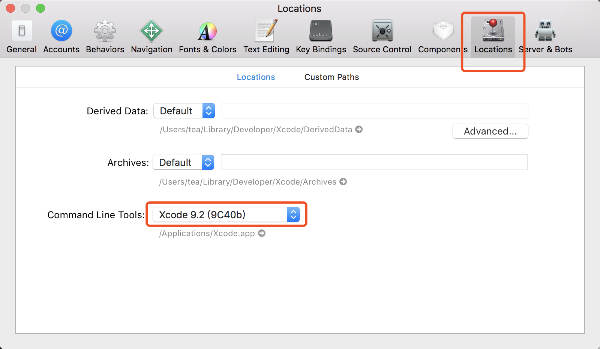
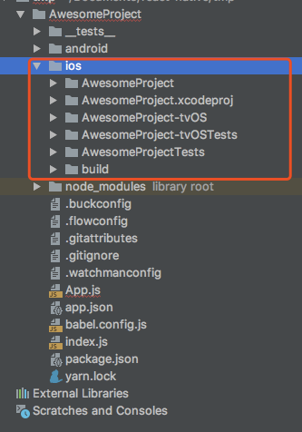
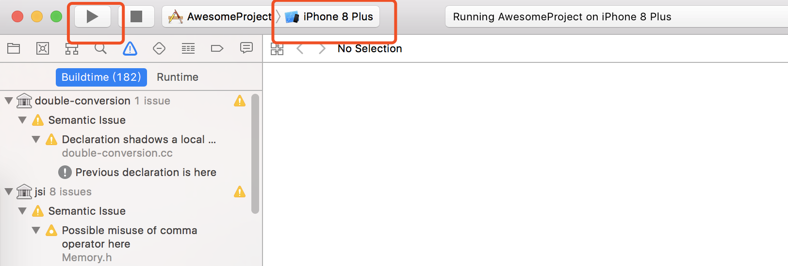
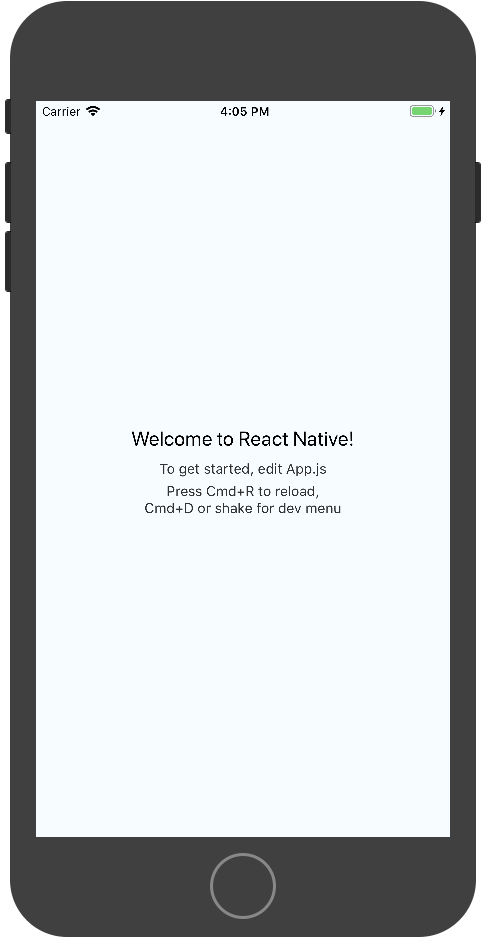
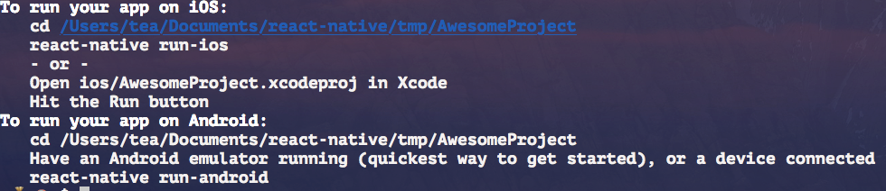

# 开发环境搭建
----
## 安装依赖
**环境分类**
* 沙盒模式（不推荐） [Expo](https://docs.expo.io/)可以在没有原生开发平台的情况下，进行存js的开发ReactNative
* 完整原生模式（推荐)区分mac系统和windows系统

**依赖**
* Node
```
  brew install node
```

* npm/yarn

 npm 为加速可以设置淘宝镜像源
<table><tr><td bgcolor=#FF4500>注意不要使用cnpm,它安装的模块路径比较奇怪，packager无法识别</td></tr></table>
设置npm的源
```
npm config set registry https://registry.npm.taobao.org --global
npm config set disturl https://npm.taobao.org/dist --global
```
yarn的安装
```
npm install -g yarn
设置镜像源
yarn config set registry https://registry.npm.taobao.org --global
yarn config set disturl https://npm.taobao.org/dist --global
```
安装完yarn，则yarn可以来代替npm
yarn 代替npm install的安装，yarn add 第三方  代替 npm install 第三方


* Watachman 监视文件变化的
```
  brew install watchman
```

* ReactNative命令行工具

  用于执行 创建、初始化、更新项目、打包服务（packager）等
```
sudo npm install -g react-natice-cli
react-native -v
```

**开发工具**
* webstrom/Nuclide/VsCode
* Xcode

* [AndroidStudio](https://developer.android.google.cn/studio/)

---
**IOS开发环境**
* Xcode 工具
App store中进行下载，目前需要的版本是9.4，或者更高的版本

* Xcode命令行工具

 Xcode | Preferences | Locations菜单中检查一下是否装有某个版本的Command Line Tools
 

---
 **Android开发环境**
 * [AndroidStudio下载安装](https://developer.android.google.cn/studio/)

 [教程](https://www.jianshu.com/p/24f45a411c80)


---
**模拟器**
* ios模拟器

  1. react-native-cli 执行命令：
```
react-native run-ios
```
进入默认的模拟器
  2. 使用xcode工具

    打开xcode，加载ios部分代码

    

    选择模拟器，点击开运行

    

    运行效果：

    

```
    Cmd + R      reload

    Cmd + D      调起开发目录
```
* android模拟器

  使用第三方模拟器Genymotion
[  genymotion下载地址](https://www.genymotion.com/download/)


**真机运行**
* ios真机
* Android真机


## 创建新项目

使用react-native-cli工具初始化项目
```
react-native init AwesomeProject
react-native init AwesomeProject --version 0.44.3   指定版本
```
创建成功提示：

