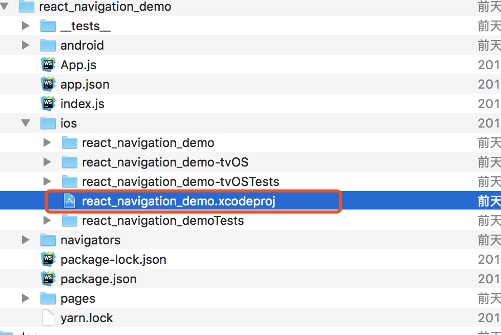
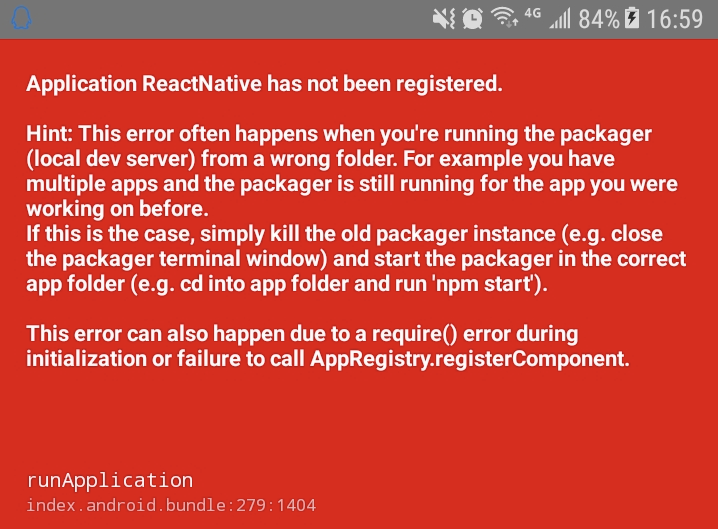

# 开发遇到的问题

## Xcode如何打开项目

在react-native 项目下面的ios目录 找到里面的 .xcodeproj文件，打开就会启动xcode项目，因为他是xcode的项目文件。




## React Native出错：Application XXX has not been registered解决方案




原因是之前打开了其他的react Native项目占用了端口

解决办法是：关闭之前的项目，然后重新启动即可


## 处理android中的物理返回键
[文档出处：](https://github.com/react-navigation/redux-helpers)

```
componentDidMount() {
		BackHandler.addEventListener("hardwareBackPress", this.onBackPress);
	}

	componentWillUnmount() {
		BackHandler.removeEventListener("hardwareBackPress", this.onBackPress);
	}

	onBackPress = () => {
		const { dispatch, nav } = this.props;
		// alert(nav.routes[1].index)
		if (nav.routes[1].index === 0) {  //没有上一层路由没了
			return false;
		}
		dispatch(NavigationActions.back());
		return true;
	};
```
