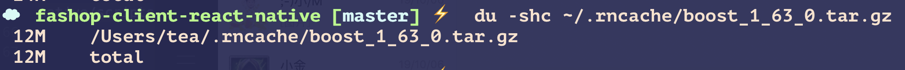
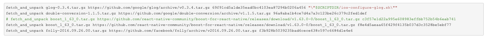

# 开发遇到的问题

## 1：Xcode如何打开项目

在react-native 项目下面的ios目录 找到里面的 .xcodeproj文件，打开就会启动xcode项目，因为他是xcode的项目文件。


## React Native出错：Application XXX has not been registered解决方案


原因是之前打开了其他的react Native项目占用了端口

解决办法是：关闭之前的项目，然后重新启动即可


## 2：处理android中的物理返回键
[文档出处：](https://github.com/react-navigation/redux-helpers)

```
componentDidMount() {
		BackHandler.addEventListener("hardwareBackPress", this.onBackPress);
	}

	componentWillUnmount() {
		BackHandler.removeEventListener("hardwareBackPress", this.onBackPress);
	}

	onBackPress = () => {
		const { dispatch, nav } = this.props;
		// alert(nav.routes[1].index)
		if (nav.routes[1].index === 0) {  //没有上一层路由没了
			return false;
		}
		dispatch(NavigationActions.back());
		return true;
	};
```

## 3：不降版本正确解决ReactNative初始化遇到的“Print: Entry, ":CFBundleIdentifier", Does Not Exist”

[地址](https://www.cnblogs.com/erniu/p/8670590.html)

* 错误信息：

```
Failed to install the requested application
An application bundle was not found at the provided path.
Provide a valid path to the desired application bundle.
Print: Entry, ":CFBundleIdentifier", Does Not Exist

Command failed: /usr/libexec/PlistBuddy -c Print:CFBundleIdentifier build/Build/Products/Debug-iphonesimulator/toilet.app/Info.plist
Print: Entry, ":CFBundleIdentifier", Does Not Exist
```

* 错误原因

在项目的issues中查看了很多信息，究其原因，无非就是官方提供的boost_1_63_0.tar.gz有问题，通过yarn或npm下载到的包才12MB左右，而正常的包大小有93MB左右。

网上能找到大部分都是直接下载正确的boost_1_63_0.tar.gz覆盖~/.rncache/boost_1_63_0.tar.gz，然后再react-native run-ios。

我可以很负责任的告诉大家，这样根本不！好！使！为什么呢，因为react-native的第三方库的安装脚本中有对这些包做hash校验，具体的可以看看这里的内容：node_modules/react-native/scripts/ios-install-third-party.sh

本地的才12M


* 终极解决方案

我们的原则是不降版本，就用最新版本！

第一步：下载正确的boost_1_63_0.tar.gz覆盖~/.rncache/boost_1_63_0.tar.gz，下载地址在这里[boost_1_63_0.tar.gz](https://ayera.dl.sourceforge.net/project/boost/boost/1.63.0/boost_1_63_0.tar.gz)

第二步：使用shasum跑出~/.rncache/boost_1_63_0.tar.gz的hash字符串备用
```
~ shasum ~/.rncache/boost_1_63_0.tar.gz
f8e4d5aeaa65f429f4135b037d3c3528be5ebf77  /Users/erniu/.rncache/boost_1_63_0.tar.gz
```

第三步：打开项目中的node_modules/react-native/scripts/ios-install-third-party.sh，替换boost_1_63_0.tar.gz的hash串为你第二步中得到的hash串

```
fetch_and_unpack glog-0.3.4.tar.gz https://github.com/google/glog/archive/v0.3.4.tar.gz 69f91cd5a1de35ead0bc4103ea87294b0206a456 "\"$SCRIPTDIR/ios-configure-glog.sh\""
fetch_and_unpack double-conversion-1.1.5.tar.gz https://github.com/google/double-conversion/archive/v1.1.5.tar.gz 96a8aba1b4ce7d4a7a3c123be26c379c2fed1def
# fetch_and_unpack boost_1_63_0.tar.gz https://github.com/react-native-community/boost-for-react-native/releases/download/v1.63.0-0/boost_1_63_0.tar.gz c3f57e1d22a995e608983effbb752b54b6eab741
fetch_and_unpack boost_1_63_0.tar.gz https://github.com/react-native-community/boost-for-react-native/releases/download/v1.63.0-0/boost_1_63_0.tar.gz f8e4d5aeaa65f429f4135b037d3c3528be5ebf77
fetch_and_unpack folly-2016.09.26.00.tar.gz https://github.com/facebook/folly/archive/v2016.09.26.00.tar.gz f3b928b5039235bad6cece638c597c6684d1e4e6
```




第四步：好了，这时候重新再编译一次，不出意外就正常跑起来了。
```
react-native run-ios
```

方法2：react-native upgrade
这个项目下面执行有破坏性。但是有效果
