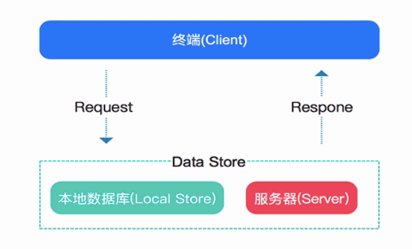

# 离线缓存设计
RN官方推荐在RN中用AsyncStorage进行数据存储

##什么是AsyncStorage?
* 简单的、异步的、持久化的key-value存储结构
* AsyncStorage也是ReactNative官方推荐的数据存储方式，旨在代替LocalStorage

推荐在 AsyncStorage 的基础上做一层抽象封装，而不是直接使用 AsyncStorage。

在 iOS 上，AsyncStorage在原生端的实现是把较小值存放在序列化的字典中，而把较大值写入单独的文件。在 Android 上，AsyncStorage会尝试使用RocksDB，或退而选择 SQLite。

[官方文档](https://reactnative.cn/docs/asyncstorage/)

## 如何使用AsyncStorage
首先导入AsyncStorage作为RN一个标准的组件使用之前需要先导入：
```
import {AsyncStorage} from 'react-native'
```

存储数据

```
/**
*存储数据
* @return {Promise.<void>}
*/

async doSave(){
  //用法一
  AsyncStorage.setItem(KEY,this.value,error=>{
    error && console.log(error.toString());
  });

  //用法二 利用promise的catch来捕获存储异常
  AsyncStorage.setItem(KEY,this.value)
              .catch(error=>{
                error && console.log(error.toString());
              })
  //用法三 使用ES7的 async 和await
  try{
    await AsyncStorage.setItem(KEY,this.value)
  }catch(error){
    error && console.log(error.toString())
  }
}
```

读取数据
```
async getData(){
  //用法一
  AsyncStorage.getItem(KEY,(error,value)=>{
      this.setState({
          showText:value
      });
      error && console.log(error.toString());
  })

  //用法二
  AsyncStorage.getItem(KEY)
    .then(value => {
        this.setState({
          showText:value
        })
    })
    .catch(error=>{
       console.log(error.toString());
    })

  //用法三
  try{
    const value = await AsyncStorage.getItem(KEY);
    this.setState({
        showText:value
    })
  }catch(error){
    error && console.log(error.toString());
  }
}
```


删除数据

```
/**
*删除数据
* @return {Promise.<void>}
*/
async doRemove(){
  //用法一
  AsyncStorage.removeItem(KEY,error=>{
      error && console.log(error.toString())
  })

  //用法二
  AsyncStorage.removeItem(KEY)
    .catch(error=>{
      error && console.log(error.toString())
    })

  //用法三
  try{
    await AsyncStorage.removeItem(KEY);
  }catch(error){
    error && console.log(error.toString())
  }
}
```


其余一些API方法查看 [官方文档](https://reactnative.cn/docs/asyncstorage/)

## 离线缓存策略


* a:优先从本地获取数据，如果数据过时或不存则从服务器获取数据，数据返回后同时将数据同步到本地数据库；
* b:优先从服务器获取数据，数据返回后同时将数据同步到本地数据库，如果网络故障则从本地获取数据
* c:同时从本地和服务器获取数据，如果本地数据库返回数据则先展示本地数据，等网络数据回来后在展示网络数据同时将数据同步到本地数据库


## 实现离线缓存a策略：优先从本地获取数据，如果数据过时或不存则从服务器获取数据
* 优先获取本地数据
* 如果数据存在且在有效期内，我们将数据返回
* 否则我们获取网络数据


```
import {AsyncStorage} from "react-native";

export default class DataStore {
	/**
	 * 存储数据
	 * @param url
	 * @param data
	 * @param clallback
	 */
	saveData(url, data, clallback) {
		if (!data || !url) return;
		AsyncStorage.setItem(url, JSON.stringify())				//JSON.stringify是将一个javascript值（对象或者数组）转为js字符串
	}

	/**
	 * 获取数据，优先获取本地数据，如果本地数据或本地数据过期则获取网络数据
	 * @param url
	 * @returns {Promise<any> | Promise<*>}
	 */
	fetchData(url) {
		return new Promise((resolve, reject) => {
			this.fetchLocalData(url).then(wrapData => {
				if (wrapData && DataStore.checkTimestampValid(wrapData.timestamp)) {
					resolve(wrapData);
				} else {
					this.fetchNetData(url).then(data => {
						resolve(this._wrapData((data)));
					}).catch(error => {
						reject(error)
					})
				}
			}).catch(error => {
				this.fetchNetData(url).then(data => {
					resolve(this._wrapData(data));
				}).catch(error => {
					reject(error);
				})
			})
		})
	}

	/**
	 * 获取本地数据
	 * @param url
	 * @returns {Promise<any> | Promise<*>}
	 */
	fetchLocalData(url) {
		return new Promise((resolve, reject) => {
			AsyncStorage.getItem(url)
				 .then(result => {
					 try {
						 resolve(JSON.parse(result))
					 } catch (e) {
						 reject(e);
					 }

				 })
				 .catch(error => {
					 reject(error);
					 console.error(error)
				 })
		})
	}

	/**
	 * 获取网络数据
	 * @param url
	 * @returns {Promise<any> | Promise<*>}
	 */
	fetchNetData(url) {
		return new Promise((resolve, reject) => {
			fetch(url)
				 .then((response) => {
					 if (response.ok) {
						 return response.json();
					 }
					 throw new error('Network response was not ok');
				 })
				 .then(responseData => {
					 this.saveData(url, responseData)
					 resolve(responseData)
				 })
				 .catch(error => {
					 reject(error);
				 })
		})
	}

	/**
	 * 数据包裹时间戳
	 * @param data
	 * @returns {{data: *, timestamp: number}}
	 * @private
	 */
	_wrapData(data) {
		return {
			data,
			timestamp: new Date().getTime()					//注意这里只能获取到客户端的时间，客户端的时间是不可靠的，有条件应该获取服务端的时间
		}
	}

	/**
	 * 检查timestamp是否在有效期内
	 * @param timestamp 项目更新时间
	 * @returns {boolean} true 不需要更新，false需要更新
	 */
	static checkTimestampValid(timestamp) {
		const currentDate = new Date();
		const targetDate = new Date();
		targetDate.setTime(timestamp);
		if (currentDate.getMonth() !== targetDate.getMonth()) return false;
		if (currentDate.getDate() !== targetDate.getDate()) return false;
		if (currentDate.getHours() - targetDate.getHours() > 4) return false;	//有效期未4小时
		return true;
	}

}
```
