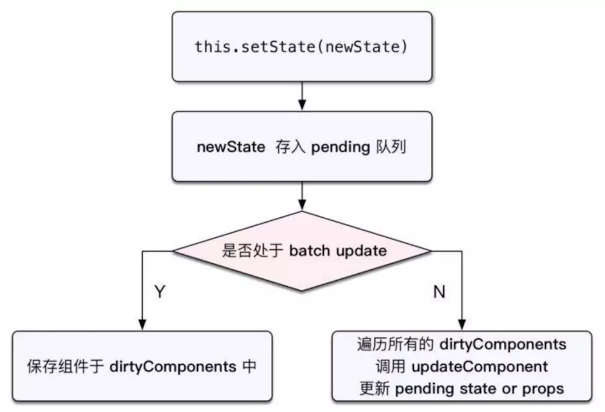

# 网络编程Fetch

## 什么是Fetch
React Native 提供了和 web 标准一致的Fetch API，用于满足开发者访问网络的需求。它还提供了一个全局fetch()方法，而无需额外的导入，来直接使用
Fetch 可以与XMLHttpRequest相媲美，并且比XMLHttpRequest提供了更强大以及灵活点特性。

* XMLHttpRequest的缺点：javascript通过XMLHttpRequest(XHR)来执行异步请求，在设计上不符合职责分离原则，将输入、输出和用事件来跟踪的都状态混杂在一个对象里。而且，基于这种事件的模型，与最近的Javascript流行的Promise，以及基于生成器的异步编程模型不太搭。

* 使用其他的网络库：ReactNative中已经内置了XMLHttpRequest API(也就是俗称的ajax).一些基于XMLHttpRequest封装的第三方库也可以使用，例如frisbee或是axios等。但是注意不能使用jquery.因为jquery中使用了很多浏览器有而RN中没有的东西。

  ```
  var request = new XMLHttpRequest();
  request.onreadystatechange = (e) => {
    if (request.readyState !== 4) {
      return;
    }

    if (request.status === 200) {
      console.log('success', request.responseText);
    } else {
      console.warn('error');
    }
  };

  request.open('GET', 'https://mywebsite.com/endpoint/');
  request.send();
  ```

>注意点：fetch规范与JQuery.ajax()主要有两种方式的不同：
* 当接收到一个代表错误的HTTP状态码时，从fetch返回的Promise不会标记为reject,即使该HTTP响应的状态码时404或是500.相反，它会将Promise状态标记为resolve(但是会将resolve的返回值的ok属性设置为false),仅当网络故障或者请求被阻止时，才会标记为reject.
* 默认情况性爱，fetch不会从服务端发送或者接受任何cookies,如果站点依赖于用户session,则会导致未经认证的请求（要发送cookies，必须设置credentials选项）


fetch 的API [文档](https://developer.mozilla.org/en-US/docs/Web/API/Request)

## fetch支持的请求参数
  Promise fetch(input,int)
### 参数
  * input:定义要获取到资源，这里可能是
    - 一个String字符串，包含要获取资源的URL
    - 一个Request对象
  * init[可选]：一个配置对象，包含所有都请求的设置。可选的参数有：
    - method:请求使用到方法，如GET、POST、PUT、DELETE等
    - headers:请求的头信息，形式为Header的对象和包含BytesString值的对象字面量。
    - body：请求的body信息：可能是一个Blob、BufferSource、FormData、URLSearchParams或者是String对象。注意GET或HEADE方法的请求不能包含body信息
    - mode：请求的模式：如cors、no-cors或者same-origin
    - credentials：请求的credentials，如omit、same-origin或者include。为了在当前域名内自动发生cookie,必须提供这个选项
    - cache：请求的cache模式：default、no-store、reload、no-cache、force-cache或者only-if-cached
    - redirect：可用的redirect模式：follow（自动重定向）、error（如果产生重定向将字段终止并抛出一个错误），或者manual(手动处理重定向)
    - referrer:一个USVString看也是no-referrer、client或者一个URL。默认是client
    - referrerPolicy:指定referr HTTP header的值。可选值[no-referrer、no-referr-when-downgrade、origin、origin、origin-when-cross-origin、unsade-url]
    - integrity:包含请求的subresource integrity值


```
fetch('https://mywebsite.com/endpoint/', {
  method: 'POST',
  headers: {
    Accept: 'application/json',
    'Content-Type': 'application/json',
  },
  body: JSON.stringify({
    firstParam: 'yourValue',
    secondParam: 'yourOtherValue',
  }),
});
```


## 请求错误和异常处理
根据上面的注意点：
当接收到一个代表错误的HTTP状态码时，从fetch返回的Promise不会标记为reject,即使该HTTP响应的状态码时404或是500.相反，它会将Promise状态标记为resolve(但是会将resolve的返回值的ok属性设置为false),仅当网络故障或者请求被阻止时，才会标记为reject.

如果遇到网络故障，fetch()promise将会掉用reject，带上一个TypeError对象

>需要注意的是：一次请求没有调用reject并不代表请求就一定成功了，通常情况我们需要在resolved对情况，再判断Response.ok是不是未true

```
let url = 'https://api.github.com/search/repositories?q=${this.searchKey}';

fetch(url)
  .then(response=>{
    if(!response.ok){
      return response.tetx()
    }
    throw new Error('Network response was not ok');
  })
  .then(responseText=>{
    console.log(responseText)
    })
  .cache(e=>{ //捕获异常
      console.log(e.toString())
    })
```

## demo
```
import React, {Component} from 'react';
import {TextInput, Button, View, Text} from "react-native";

const GITHUB_URL = 'https://api.github.com/search/repositories?q=';

type Props = {};

class FetchPage extends Component<Props> {
	constructor(props) {
		super(props);
		this.state = {
			showText: ''
		}
	}

	onPressLearnMore() {
		let url = GITHUB_URL + this.searchKey;
		fetch(url)
			 .then((response) => {
				 if (response.ok) { //根据response.ok来进行判断
					 return response.text()
				 }
				 throw new Error('Network response was not ok')
			 })
			 .then((responseText) => {
				 this.setState({
					 showText: responseText
				 })
				 console.log(responseText)

			 })
			 .catch((error) => {
				 this.setState({
					 showText: '错误信息' + error.toString()
				 })
				 console.error(error.toString());
			 });
	}

	render() {
		return (
			 <View>
				 <TextInput
						style={{height: 40, borderColor: 'gray', borderWidth: 1}}
						onChangeText={(key) => this.searchKey = key}
				 />
				 <Button
						onPress={() => this.onPressLearnMore()}
						title="搜索"
						color="#841584"
				 />
				 <View>
					 <Text>{this.state.showText}</Text>
				 </View>
			 </View>
		)
	}
}

export default FetchPage;
```

>this.searchKey 注意这里inputText的值，直接赋给了对象的一个属性，而不是state的值，而结果却是赋值给this.state.showText。是因为state在react的生命周期内，当页面渲染完后，state发生变化时，会重新调用render()方法渲染页面，这里使用state就是为了重新渲染结果到页面。如果我们将结果赋值给对象的一个属性，没有进行任何state的修改的话，那么页面是不会重新渲染的





