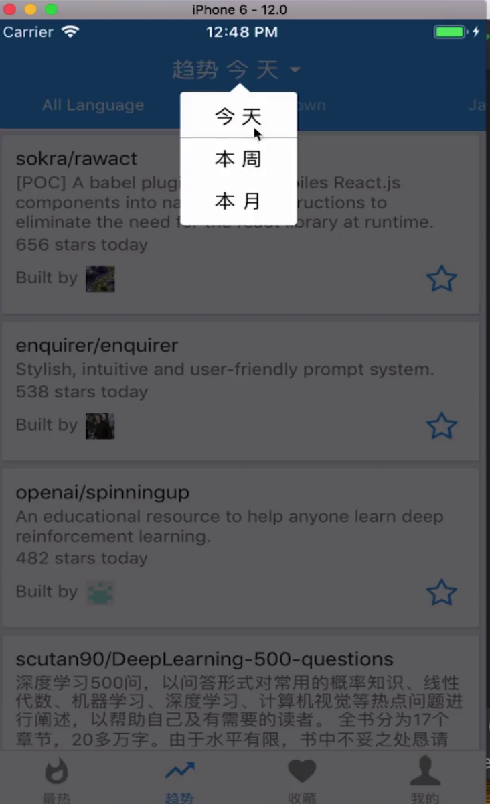

[Modal组件](https://reactnative.cn/docs/modal/)

```
import React, {Component} from 'react';
import {Modal, Text, View, TouchableOpacity, StyleSheet} from "react-native";
import TimeSpan from '../model/TimeSpan';
import MaterialIcons from 'react-native-vector-icons/MaterialIcons';

export const TimeSpans = [
	new TimeSpan('今 天', 'since=daily'),
	new TimeSpan('本 周', 'since=weekly'),
	new TimeSpan('本 月', 'since=monthly'),
]

export default class TrendingDialog extends Component {
	state = {
		visible: false,
	}

	show() {
		this.setState({
			visible: true
		})
	}

	dismiss() {
		this.setState({
			visible: false
		})

	}

	render() {
		const {onClose, onSelect} = this.props;
		return (
			 <Modal
					visible={this.state.visible}     //是否可见
					transparent={true}               //背景是否透明
					onRequestClose={() => onClose}   //用户按下后退键触发
			 >
				 <TouchableOpacity
						style={styles.container}
						onPress={() => this.dismiss()}
				 >
					 <MaterialIcons
							name={'arrow-drop-up'}
							size={36}
							style={styles.arrow}
					 />
					 <View style={styles.content}>
						 {TimeSpans.map((result, i, arr) => {
							 return <TouchableOpacity
									key={i}
									onPress={() => onSelect(arr[i])}
									underlayColor='transparent'
							 >
								 <View style={styles.text_container}>
									 <Text style={styles.text}>
										 {arr[i].showText}
									 </Text>
								 </View>
								 {
									 i !== TimeSpans.length - 1 ? <View
												 style={styles.line}
											/>
											: null
								 }
							 </TouchableOpacity>

						 })}
					 </View>
				 </TouchableOpacity>
			 </Modal>
		)
	}


}

const styles = StyleSheet.create({
	container: {
		backgroundColor: 'rgba(0,0,0,0.6)',
		flex: 1,
		alignItems: 'center',
		padding: 30
	},
	arrow: {
		marginTop: 40,
		color: 'white',
		padding: 0,
		margin: -15
	},
	content: {
		backgroundColor: 'white',
		borderRadius: 3,
		paddingTop: 3,
		paddingBottom: 3,
		marginRight: 3
	},
	text_container: {
		alignItems: 'center',
		flexDirection: 'row'
	},
	text: {
		fontSize: 16,
		color: 'black',
		fontWeight: '400',
		padding: 8,
		paddingLeft: 26,
		paddingRight: 26
	},
	line: {
		height: 0.3,
		backgroundColor: 'darkgray'
	}
})
```

timeSpan.js
```
export default function TimeSpan(showText, searchText) {
	this.showText = showText;
	this.searchText = searchText;
}
```

使用组件
```
onSelectTimeSpan(tab) {
		this.dialog.dismiss();
		this.setState({
			timeSpan: tab
		})
		DeviceEventEmitter.emit(EVENT_TYPE_TIME_SPAN_CHANGE, tab);
	}

	renderTrendingDialog() {
		return <TrendingDialog
			 ref={dialog => this.dialog = dialog}
			 onSelect={tab => this.onSelectTimeSpan(tab)}
		/>
	}
```
