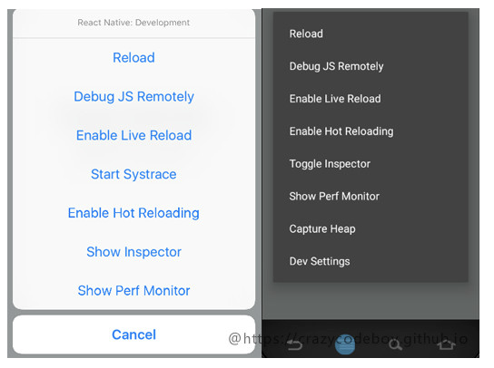
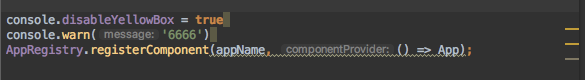
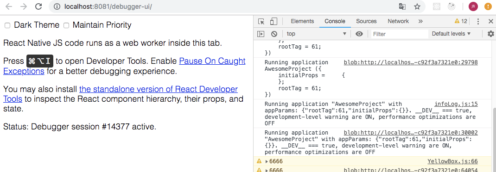
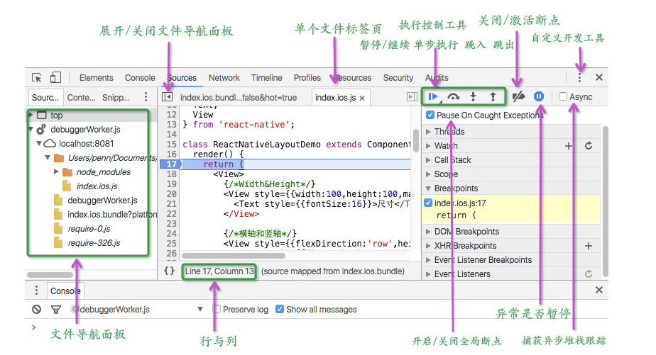

# ReactNative 开发调试

## Developer Menu
为开发者提供的调试ReactNative的调试工具

### 开启Developer Menu

**在模拟器上开启Developer Menu**
* Android 模拟器上  Command + M
* Ios 模拟器上 Command + D

**在真机上开启Developer Menu:**

  在真机上通过摇动手机开启

  预览图

  

  功能介绍：
  * Reload   在只修改了js代码的情况下，执行reload可以预览修改结果
  >修改原生的代码执行reload无效的,看不到修改的结果

  >当然这个功能ios和android都有各自的快捷键

  * Debug JS Remotely 开启debug模式
  * 自动加载,当js代码修改后，不需要执行上面的 Relaod 按钮而可以自动进行更新
    - Enable Live reload  缺点：每次都要返回到启动页
    - Enable Hot Reloading  优点：会保持当前的状态，在当前页面进行更新
  * show Inspector: 显示督察，实时在下面显示当前UI等 属性（和在网页调试差不多）
  * show Perf Monitor 显示性能监视器

### 异常处理 - RedBox 和 YellowBox
**红屏错误**

应用内的报错以红屏显示，属于报错。可以通过console.error()来手动触发红屏错误。


**黄屏警告**

应用内的警告会以黄色显示在应用中。点击警告可以查看详情或是忽略掉。可以通过console.warn()来手动触发黄屏警告。

在开发模式中默认启用了黄色警告，可以通过下面的代码来关闭警告
```
console.disableYellowBox = true;
console.warn('YellowBox is disabled.'); //此时警告将忽略
```
加在index.js文件中，放在AppRegistry.registerComponent('App', () => App)之前。



## Chrome Developer Tools
通过Chrome调试React Native的步骤

**第一步：启动远程调试**
在Developer Menu下单击"Debug JS Remotely" 启动JS远程调试功能。此时Chrome会被打开，同时会创建一个“http://localhost:8081/debugger-ui.” Tab页。


**第二步：打开Chrome开发者工具**
在“http://localhost:8081/debugger-ui.” Tab页，打开 开发者工具



[断点调试V8面板介绍等，详情这里](https://github.com/crazycodeboy/RNStudyNotes/blob/master/React%20Native%E8%B0%83%E8%AF%95%E6%8A%80%E5%B7%A7%E4%B8%8E%E5%BF%83%E5%BE%97/React%20Native%E8%B0%83%E8%AF%95%E6%8A%80%E5%B7%A7%E4%B8%8E%E5%BF%83%E5%BE%97.md)




* 继续(Continue): 继续执行代码直到遇到下一个断点。
* 单步执行(Step over): 步进代码以查看每一行代码对变量作出的操作，当代码调用另一个函数时不会进入这个函数，使你可以专注于当前的函数。
* 跳入(Step into): 与 Step over 类似，但是当代码调用函数时，调试器会进去这个函数并跳转到函数的第一行。
* 跳出(Step out): 当你进入一个函数后，你可以点击 Step out 执行函数余下的代码并跳出该函数。
* 断点切换(Toggle breakpoints): 控制断点的开启和关闭，同时保持断点完好。


## 真机调试
**在iOS上**
打开"RCTWebSocketExecutor.m "文件，将“localhost”改为你的电脑的ip，然后在Developer Menu下单击"Debug JS Remotely" 启动JS远程调试功能。

**在Android上**
方式一：

在Android5.0以上设备上，将手机通过usb连接到你的电脑，然后通过adb命令行工具运行如下命令来设置端口转发。
adb reverse tcp:8081 tcp:8081

方式二：
你也可以通过在“Developer Menu”下的“Dev Settings”中设置你的电脑ip来进行调试。

>心得：在使用真机调试时，你需要确保你的手机和电脑处在同一个网段内，即它们实在同一个路由器下。
