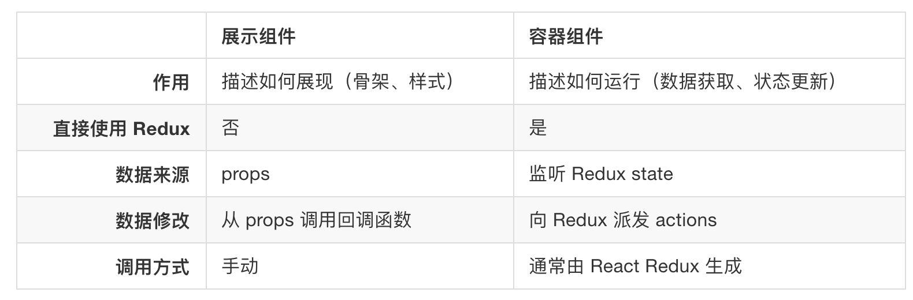

# React-Redux

## 容器组件和展示组件

  Redux 的 React 绑定库是基于 容器组件和展示组件相分离 的开发思想

  

* UI（展示）组件：只定义外观不关心数据来源和如何改变。传入什么就渲染什么。
 >会使用函数式无状态组件除非需要本地 state 或生命周期函数的场景。这并不是说展示组件必须是函数 -- 只是因为这样做容易些。如果你需要使用本地 state，生命周期方法，或者性能优化，可以将它们转成 class。

* 容器组件：来把展示组件连接到 Redux，来监听 Redux store 变化并处理如何过滤出要显示的数据。
>技术上讲，容器组件就是使用 store.subscribe() 从 Redux state 树中读取部分数据，并通过 props 来把这些数据提供给要渲染的组件。你可以手工来开发容器组件，但建议使用 React Redux 库的 connect() 方法来生成，这个方法做了性能优化来避免很多不必要的重复渲染。（这样你就不必为了性能而手动实现 React 性能优化建议 中的 shouldComponentUpdate 方法。）

* 其它组件：有时很难分清到底该使用容器组件还是展示组件。例如，有时表单和函数严重耦合在一起

## connet()

* mapStateToProps

  使用 connect() 前，需要先定义 mapStateToProps 这个函数来指定如何把当前 Redux store state 映射到展示组件的 props 中。例如，VisibleTodoList 需要计算传到 TodoList 中的 todos，所以定义了根据 state.visibilityFilter 来过滤 state.todos 的方法，并在 mapStateToProps 中使用。

  ```
  const getVisibleTodos = (todos, filter) => {
    switch (filter) {
      case 'SHOW_COMPLETED':
        return todos.filter(t => t.completed)
      case 'SHOW_ACTIVE':
        return todos.filter(t => !t.completed)
      case 'SHOW_ALL':
      default:
        return todos
    }
  }

  const mapStateToProps = state => {
    return {
      todos: getVisibleTodos(state.todos, state.visibilityFilter) //可以映射出对store中state加工过的数据
    }
  }
  ```

* mapDispatchToProps

  除了读取 state，容器组件还能分发 action。类似的方式，可以定义 mapDispatchToProps() 方法接收 dispatch() 方法并返回期望注入到展示组件的 props 中的回调方法


  ##  React Redux 组件 <Provider> 来 魔法般的 让所有容器组件都可以访问 store

  ```
  render(
  <Provider store={store}>
    <App />
  </Provider>,
  document.getElementById('root')
)
  ```
