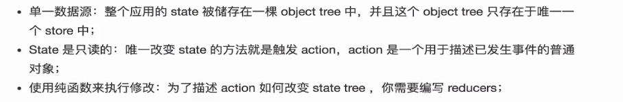

# Redux

[手册文档](https://www.redux.org.cn/)

## redux简介

### 什么是Redux

工作流程：
* 1：用户操作View 发出Action, 发出方式就用到dispatch方法。
* 2：假如没有中间件，Store自动调用Reducer,并且传入两个参数（当前State和收到的Action）,Reducer会返回新的State。如果有中间件，Store会将当前State和收到的Action传递给Middleware，Middleware会调用reducer，然后返回新的State.
* 3:State一旦有变化，Store就会调用监听函数，通知所有都订阅者，来更新View.

到此为止，一次用户交互流程结束。可以看到，在整个流程中数据都是单向流动的。

### Redux和Flux都对比

### Redux的优点
##

# 为什么要用Redux?

### Redux的三个基本原则

### Redux 有哪几部分构成？

## react-redux介绍
视图层绑定的几个概念
* Provider
* connect()
* selector
* dispatch

