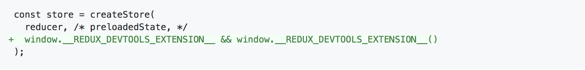
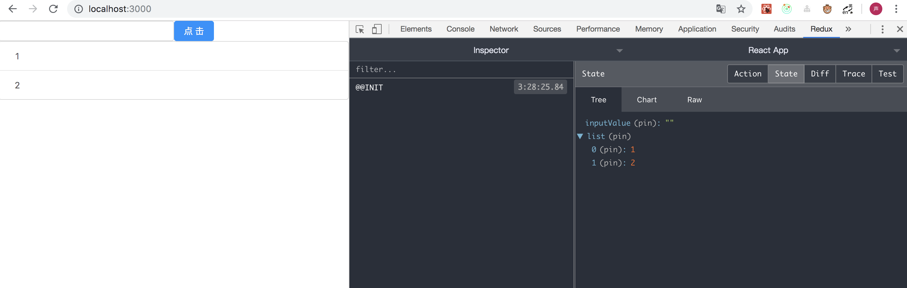
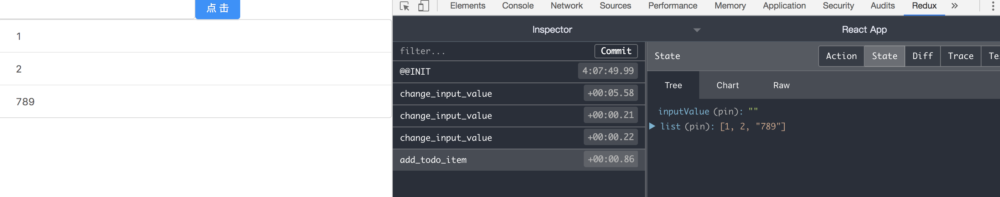
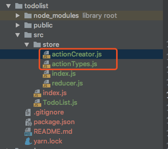
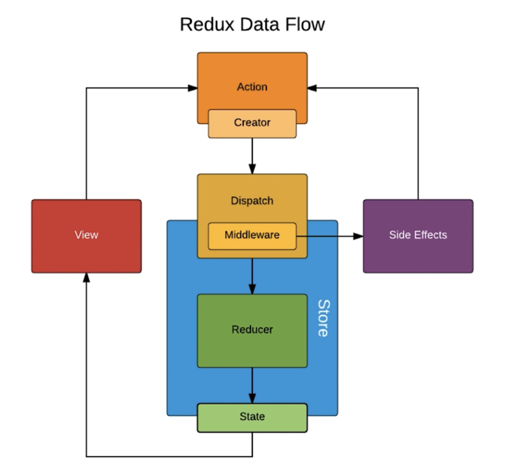
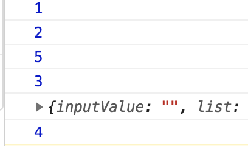

引入redux
yanr add redux


* [代码](https://github.com/xiaojinisking/react_learn)

## 最简单的 redux的使用

store 的相关方法：
* store.createStore(reducer)  创建store
* store.dispath(action)  action传递给store
* store.subscribe(listener)
* store.getState();

* 1：创建store 数据仓库
  store.createStore(reducer) 函数，参数是一个reducer处理函数

  store.js

  ```
  //创建数据公共仓库
  import {createStore} from 'redux';
  import reducer from './reducer';

  const store = createStore(reducer);

  export default store;
  ```

  reducer.js

  ```
  const defaultState = {
  	inputValue: '',
  	list: [1,2]
  }

  export default (state = defaultState, action) => {
  	return state;
  }
  ```

  TodoList.js  获取store

  ```
  import React, {Component} from 'react';
  import 'antd/dist/antd.css';

  import {Row, Col, Input, Button, List} from "antd";
  import store from './store';

  class TodoList extends Component {
  	constructor(props) {
  		super(props);
  		this.state = store.getState();  //获取store数据
  		console.log(store.getState());
  		console.log(this.state.list);
  	}

  	render() {
  		return (
  			<div>
  				<Row>
  					<Col span={12}>
  						<Input/>
  					</Col>
  					<Col span={12}>
  						<Button type="primary">点击</Button>
  					</Col>
  				</Row>
  				<Row>
  					<Col span={24}>
  						<List
  							bordered
  							dataSource={this.state.list}
  							renderItem={item => (<List.Item>{item}</List.Item>)}
  						/>
  					</Col>
  				</Row>
  			</div>
  		)
  	}
  }

  export default TodoList;

  ```

  ### redux chrome调试工具使用：
  [文档](https://github.com/zalmoxisus/redux-devtools-extension#usage)

    

    就可以开启调试工具拉
    


  ## 加入action,打通reducer进行数据修改，组件监听store变化，修改组件的state

TodoList.js 加入input修改和按钮提交的action ,dispath到store.新增一个监听store的回调函数handStoreChange。

```
import React, {Component} from 'react';
import 'antd/dist/antd.css';

import {Row, Col, Input, Button, List} from "antd";
import store from './store';

class TodoList extends Component {
	constructor(props) {
		super(props);
		this.state = store.getState();
		this.handInputChange = this.handInputChange.bind(this);
		this.handStoreChange = this.handStoreChange.bind(this);
		this.handSubmie = this.handSubmie.bind(this);
		store.subscribe(this.handStoreChange);	//监听state变化
	}


	render() {
		return (
			<div>
				<Row>
					<Col span={12}>
						<Input onChange={this.handInputChange} value={this.state.inputValue}/>
					</Col>
					<Col span={12}>
						<Button type="primary" onClick={this.handSubmie}>点击</Button>
					</Col>
				</Row>
				<Row>
					<Col span={24}>
						<List
							bordered
							dataSource={this.state.list}
							renderItem={item => (<List.Item>{item}</List.Item>)}
						/>
					</Col>
				</Row>
			</div>
		)
	}

	handInputChange(e) {
		const action = {
			type: 'change_input_value',
			value: e.target.value
		}

		store.dispatch(action);
	}


	handStoreChange(){
		this.setState(store.getState());
	}

	handSubmie(){
		const action = {
			type:'add_todo_item',
		}
		store.dispatch(action);
	}


}

export default TodoList;
```

reducer.js  新增两个处理action的方法
```
const defaultState = {
	inputValue: '',
	list: [1, 2]
}

//reducer可以接受state,但是决不能修改state
export default (state = defaultState, action) => {
	console.log(state, action);

	if (action.type === 'change_input_value') {
		const newState = JSON.parse(JSON.stringify(state));		//深拷贝一份state
		newState.inputValue = action.value;
		return newState;
	}

	if (action.type === 'add_todo_item') {
		const newState = JSON.parse(JSON.stringify(state));   //深拷贝一份state
		newState.list.push(newState.inputValue);
		newState.inputValue='';
		return newState;
	}

	return state;
}
```

store.js  加入一个redux调试工具的参数
```
//创建数据公共仓库
import {createStore} from 'redux';
import reducer from './reducer';

const store = createStore(
	reducer,
	window.__REDUX_DEVTOOLS_EXTENSION__ && window.__REDUX_DEVTOOLS_EXTENSION__()
);

export default store;
```





## 优化Action与Reducer

ActionCreate.js
便于自动化测试，提供代码可维护性

ActionType.js
提供维护性，避免错误出现





actionTypes.js
```
export const CHANGE_INPUT_VALUE='change_input_value';
export const ADD_TODO_ITEM='add_todo_item';
export const DELETE_TODO_ITEM='delete_todo_item';
```

actionCreator.js
```
import * as ACTION_TYPES from './actionTypes';

/**
 * 输入框数据 action
 * @param value
 * @returns {{type: string, value: *}}
 */
export const getInputChangeAction = (value) =>{
	return {
		type: ACTION_TYPES.CHANGE_INPUT_VALUE,
		value: value
	}
}

/**
 * 添加item action
 * @returns {{type: string}}
 */
export const getAddTodoItemAction = ()=>({
	type:ACTION_TYPES.ADD_TODO_ITEM
})

/**
 * 删除tem action
 * @param index
 * @returns {{index: *, type: string}}
 */
export const getDelTodoItemAction = (index)=>{
	return {
		type:ACTION_TYPES.DELETE_TODO_ITEM,
		index:index
	}
}
```

TodoList.js
```
import React, {Component} from 'react';
import 'antd/dist/antd.css';

import {Row, Col, Input, Button, List} from "antd";
import store from './store';
import * as ACTION_TYPES from './store/actionTypes';
import * as ACTION_CREATORS from './store/actionCreator';


class TodoList extends Component {
	constructor(props) {
		super(props);
		this.state = store.getState();
		this.handInputChange = this.handInputChange.bind(this);
		this.handStoreChange = this.handStoreChange.bind(this);
		this.handSubmie = this.handSubmie.bind(this);
		store.subscribe(this.handStoreChange);	//监听state变化
	}


	render() {
		return (
			<div>
				<Row>
					<Col span={12}>
						<Input onChange={this.handInputChange} value={this.state.inputValue}/>
					</Col>
					<Col span={12}>
						<Button type="primary" onClick={this.handSubmie}>点击</Button>
					</Col>
				</Row>
				<Row>
					<Col span={24}>
						<List
							bordered
							dataSource={this.state.list}
							renderItem={(item,index) => (<List.Item onClick={this.handItemDelete.bind(this,index)}>{item}</List.Item>)}
						/>
					</Col>
				</Row>
			</div>
		)
	}

	handInputChange(e) {
		const action = ACTION_CREATORS.getInputChangeAction(e.target.value)

		store.dispatch(action);
	}


	handStoreChange(){
		this.setState(store.getState());
	}

	handSubmie(){
		const action = ACTION_CREATORS.getAddTodoItemAction();
		store.dispatch(action);
	}

	handItemDelete(index){
		const action = {
			type:ACTION_TYPES.DELETE_TODO_ITEM,
			index:index
		}
		store.dispatch(action);
	}


}

export default TodoList;
```

reducer.js
```
import * as ACTION_TYPES from './actionTypes';

const defaultState = {
	inputValue: '',
	list: [1, 2]
}

//reducer可以接受state,但是决不能修改state,reducer只是根据旧state生成了新state,然后交给store,store自己去更新到state
//纯函数是指，给定固定的输入，就一定会有固定的输出，而且不会有任何副作用。（比如state.inputValue=action.value 这种操作就是副作用 ）
export default (state = defaultState, action) => {
	console.log(state, action);

	if (action.type === ACTION_TYPES.CHANGE_INPUT_VALUE) {
		const newState = JSON.parse(JSON.stringify(state));		//深拷贝一份state
		newState.inputValue = action.value;
		return newState;
	}

	if (action.type === ACTION_TYPES.ADD_TODO_ITEM) {
		const newState = JSON.parse(JSON.stringify(state));   //深拷贝一份state
		newState.list.push(newState.inputValue);
		newState.inputValue='';
		return newState;
	}

	if (action.type === ACTION_TYPES.DELETE_TODO_ITEM) {
		const newState = JSON.parse(JSON.stringify(state));   //深拷贝一份state
		newState.list.splice(action.index,1);
		return newState;
	}

	return state;
}
```


## UI组件和容器组件拆分
UI组件负责页面渲染，容器组件负责页面逻辑

原todolist
```
import React, {Component} from 'react';
import 'antd/dist/antd.css';

import {Row, Col, Input, Button, List} from "antd";
import store from './store';
import * as ACTION_TYPES from './store/actionTypes';
import * as ACTION_CREATORS from './store/actionCreator';


class TodoList extends Component {
	constructor(props) {
		super(props);
		this.state = store.getState();
		this.handInputChange = this.handInputChange.bind(this);
		this.handStoreChange = this.handStoreChange.bind(this);
		this.handSubmie = this.handSubmie.bind(this);
		store.subscribe(this.handStoreChange);	//监听state变化
	}


	render() {
		return (
			<div>
				<Row>
					<Col span={12}>
						<Input onChange={this.handInputChange} value={this.state.inputValue}/>
					</Col>
					<Col span={12}>
						<Button type="primary" onClick={this.handSubmie}>点击</Button>
					</Col>
				</Row>
				<Row>
					<Col span={24}>
						<List
							bordered
							dataSource={this.state.list}
							renderItem={(item,index) => (<List.Item onClick={this.handItemDelete.bind(this,index)}>{item}</List.Item>)}
						/>
					</Col>
				</Row>
			</div>
		)
	}

	handInputChange(e) {
		const action = ACTION_CREATORS.getInputChangeAction(e.target.value)

		store.dispatch(action);
	}


	handStoreChange(){
		this.setState(store.getState());
	}

	handSubmie(){
		const action = ACTION_CREATORS.getAddTodoItemAction();
		store.dispatch(action);
	}

	handItemDelete(index){
		const action = {
			type:ACTION_TYPES.DELETE_TODO_ITEM,
			index:index
		}
		store.dispatch(action);
	}


}

export default TodoList;
```


拆分成容器组件TodoList.js和UI组件TodoListUi.js

TodoList.js
```
import React, {Component} from 'react';
import 'antd/dist/antd.css';


import store from './store';
import * as ACTION_TYPES from './store/actionTypes';
import * as ACTION_CREATORS from './store/actionCreator';
import TodoListUi from './TodoListUi';


class TodoList extends Component {
	constructor(props) {
		super(props);
		this.state = store.getState();
		this.handInputChange = this.handInputChange.bind(this);
		this.handStoreChange = this.handStoreChange.bind(this);
		this.handSubmie = this.handSubmie.bind(this);
		this.handItemDelete = this.handItemDelete.bind(this);
		store.subscribe(this.handStoreChange);	//监听state变化
	}


	render() {
		return <TodoListUi
			handInputChange={this.handInputChange}
			inputValue={this.state.inputValue}
			handSubmie={this.handSubmie}
			handItemDelete={this.handItemDelete}
			list={this.state.list}
		/>
	}

	handInputChange(e) {
		const action = ACTION_CREATORS.getInputChangeAction(e.target.value)

		store.dispatch(action);
	}


	handStoreChange() {
		this.setState(store.getState());
	}

	handSubmie() {
		const action = ACTION_CREATORS.getAddTodoItemAction();
		store.dispatch(action);
	}

	handItemDelete(index) {
		const action = {
			type: ACTION_TYPES.DELETE_TODO_ITEM,
			index: index
		}
		store.dispatch(action);
	}


}

export default TodoList;
```


TodoListUi.js    List 这个地方要注意下this指向的问题点解决，使用到箭头函数出来了箭头函数传参

```
//UI组件

import React, {Component} from 'react';
import {Row, Col, Input, Button, List} from "antd";

class TodoListUi extends Component {
	render() {
		return (
			<div>
				<Row>
					<Col span={12}>
						<Input
							onChange={this.props.handInputChange}
							value={this.props.inputValue}
						/>
					</Col>
					<Col span={12}>
						<Button
							type="primary"
							onClick={this.props.handSubmie}
						>点击</Button>
					</Col>
				</Row>
				<Row>
					<Col span={24}>
						<List
							bordered
							dataSource={this.props.list}
							renderItem={(item, index) => (
								<List.Item
									onClick={()=>{this.props.handItemDelete(index)}}
								>
									{item}
								</List.Item>)
							}
						/>
					</Col>
				</Row>
			</div>
		);
	}
}

export default TodoListUi;
```


## 无状态组件
一个组件内如果只有一个render函数那么这个就是一个无状态组件，就像上面的TodoListUi 组件。无状态组件就是一个函数 。一般UI组件都可以定义成一个无状态组件，因为无状态组件不需要逻辑的处理。

无状态组件的优势：性能要比状态组件要高，因为无状态组件就是一个函数。而有状态组件是类，它需要执行的东西相对多些，比如一些生命周期函数等

改造前UI组件

```
//UI组件

import React, {Component} from 'react';
import {Row, Col, Input, Button, List} from "antd";

class TodoListUi extends Component {
	render() {
		return (
			<div>
				<Row>
					<Col span={12}>
						<Input
							onChange={this.props.handInputChange}
							value={this.props.inputValue}
						/>
					</Col>
					<Col span={12}>
						<Button
							type="primary"
							onClick={this.props.handSubmie}
						>点击</Button>
					</Col>
				</Row>
				<Row>
					<Col span={24}>
						<List
							bordered
							dataSource={this.props.list}
							renderItem={(item, index) => (
								<List.Item
									onClick={()=>{this.props.handItemDelete(index)}}
								>
									{item}
								</List.Item>)
							}
						/>
					</Col>
				</Row>
			</div>
		);
	}
}

export default TodoListUi;
```


改造后组件
```
//UI组件

import React, {Component} from 'react';
import {Row, Col, Input, Button, List} from "antd";

const  TodoListUi = (props)=>(

		<div>
			<Row>
				<Col span={12}>
					<Input
						onChange={props.handInputChange}
						value={props.inputValue}
					/>
				</Col>
				<Col span={12}>
					<Button
						type="primary"
						onClick={props.handSubmie}
					>点击</Button>
				</Col>
			</Row>
			<Row>
				<Col span={24}>
					<List
						bordered
						dataSource={props.list}
						renderItem={(item, index) => (
							<List.Item
								onClick={()=>{props.handItemDelete(index)}}
							>
								{item}
							</List.Item>)
						}
					/>
				</Col>
			</Row>
		</div>
)


export default TodoListUi;

```

## Redux中异步请求
axios

TodoList页面 componentDidMount 生命周期 进行异步请求获取数据，然后走action 修改store数据。

```
componentDidMount() {
		axios.get('/lists').then((res)=>{
			console.log(res);
			const action = ACTION_CREATORS.initStateDataAction(res.data);
			store.dispatch(action);
		})
	}
```


reducer.js
```
if (action.type === ACTION_TYPES.INIT_STATE_DATA) {
	const newState = JSON.parse(JSON.stringify(state));		//深拷贝一份state
	newState.list = action.data;
	return newState;
}
```
## redux中间件
redux-thunk


中间是指定 redux的action和store的中间

未使用redux-thunk的时候 action是一个对象，使用redux-thunk后可以使用函数。
若给dispath 传递的是一个对象，那么dispath直接将对象传递给store.
若给dispath 传递的是一个函数，那么执行这个函数，如果里面有dispath(action),那么继续执行dispath。主要是这个函数可以拿到dispath的函数入参，所以他执行里面可以再调用dispath.就相当于disptah这个参数穿过了函数。就认为由原来单对象变成函数传递给dispath,这个函数可以先执行，后续的流程由函数来控制是否还要dispath。

redux-saga
[文档](https://redux-saga-in-chinese.js.org/)
redux-saga 是一个使用ES6到Generator功能，让异步的流程更易于读取、写入和测试。


## Redux-thunk 优化异步请求
1: 安装redux-thunk

yarn add redux-thunk

2: store加入中间件

[参考](https://github.com/zalmoxisus/redux-devtools-extension)

原先文件
```
//创建数据公共仓库
import {createStore} from 'redux';
import reducer from './reducer';

const composeEnhancers =
const store = createStore(
	reducer,
	window.__REDUX_DEVTOOLS_EXTENSION__ && window.__REDUX_DEVTOOLS_EXTENSION__()
);

export default store;
```

加入 rerux-thunk 和redux-develtools中间件

```
//创建数据公共仓库
import {createStore} from 'redux';
import reducer from './reducer';

const composeEnhancers =
	typeof window === 'object' &&
	window.__REDUX_DEVTOOLS_EXTENSION_COMPOSE__ ?
		window.__REDUX_DEVTOOLS_EXTENSION_COMPOSE__({
			// Specify extension’s options like name, actionsBlacklist, actionsCreators, serialize...
		}) : compose;

const enhancer = composeEnhancers(
	applyMiddleware('thunk'),
	// other store enhancers if any
);

const store = createStore(
	reducer,
	enhancer
);

export default store;
```


ActionCreate.js

```
import * as ACTION_TYPES from './actionTypes';
import axios from "axios";
import store from "./index";

/**
 * 输入框数据 action
 * @param value
 * @returns {{type: string, value: *}}
 */
export const getInputChangeAction = (value) =>{
	return {
		type: ACTION_TYPES.CHANGE_INPUT_VALUE,
		value: value
	}
}

/**
 * 添加item action
 * @returns {{type: string}}
 */
export const getAddTodoItemAction = ()=>({
	type:ACTION_TYPES.ADD_TODO_ITEM
})

/**
 * 删除tem action
 * @param index
 * @returns {{index: *, type: string}}
 */
export const getDelTodoItemAction = (index)=>{
	return {
		type:ACTION_TYPES.DELETE_TODO_ITEM,
		index
	}
}

/**
 * 初始化数据
 * @param data
 * @returns {{data: *, type: string}}
 */
export const initStateDataAction = (data)=>{
	return {
		type:ACTION_TYPES.INIT_STATE_DATA,
		data
	}
}


/**
 * 异步获取数据redux-thunk
 * @returns {Function}
 */
export const getTodoList = ()=>{
	return dispatch =>{
		axios.get('/lists').then((res)=>{
			const action = initStateDataAction(res.data);
			console.log(3);
			dispatch(action);
			console.log(4);
		})
	}
}
```


TodoList.js

```
componentDidMount() {
		console.log(1);
		const action = ACTION_CREATORS.getTodoList();
		console.log(2);
		store.dispatch(action);
		console.log(5)
	}
```
log 顺序


## redux-saga优化异步流程
①：和store的整合
```
//创建数据公共仓库
import {createStore, compose, applyMiddleware} from 'redux';
import reducer from './reducer';
import createSagaMiddleware from 'redux-saga';
import mySaga from './sagas';

const sagaMiddleware = createSagaMiddleware()

const composeEnhancers =
	typeof window === 'object' &&
	window.__REDUX_DEVTOOLS_EXTENSION_COMPOSE__ ?
		window.__REDUX_DEVTOOLS_EXTENSION_COMPOSE__({
			// Specify extension’s options like name, actionsBlacklist, actionsCreators, serialize...
		}) : compose;

const enhancer = composeEnhancers(
	applyMiddleware(sagaMiddleware)
);

const store = createStore(
	reducer,
	enhancer
);

sagaMiddleware.run(mySaga)

export default store;
```

核心文件saga.js  拦截action ,处理action
```
import {put, takeEvery} from 'redux-saga/effects'
import * as ACTION_CREATORS from './actionCreator';
import axios from "axios";
import * as ACTION_TYPES from "./actionTypes";

function* fetchTodoLists() {
	console.log(4);
	try{
		const res = yield axios.get('/lists');
		const action = ACTION_CREATORS.initStateDataAction(res.data);
		yield put(action);
		console.log(res);
	}catch (e) {
		console.log(e);
	}
}


function* mySaga() {
	yield takeEvery(ACTION_TYPES.GET_INIT_TODOLIST_DATA, fetchTodoLists);
}

export default mySaga;
```

组件中向派发普通action即可，只是saga是进行拦截处理的


## 引入react-Redux
关键两个API
* Provider 在最外层组件添加一个Provider，将state作为作为最顶层的数据往下传递
* Connect  连接组件和store,将store的state和dispath 映射到props内在组件内通过props访问


index.js

```
import React from 'react';
import ReactDOM from 'react-dom';
import {Provider} from 'react-redux';
import TodoList from './TodoList';
import store from './store';

const App = (
	<Provider store={store}>
		<TodoList/>
	</Provider>

);

ReactDOM.render(App, document.getElementById('root'));
```


TodoList.js
```
import React, {Component} from 'react';
import store from './store';
import * as ACTION_CREATORS from './store/actionCreators';
import {connect} from "react-redux";

class TodoList extends Component {
	render() {
		const {inputValue, list, handeleInputChange,handleSubmit,handleDelete} = this.props;

		return (
			<div>
				<div>
					<input type="text" value={inputValue} onChange={handeleInputChange}/>
					<button onClick={handleSubmit}>提交</button>
				</div>
				<div>
					<ul>
						{
							list.map((item, index) => (
								<li onClick={() => handleDelete(index)} key={index}>{item}</li>
							))
						}
					</ul>
				</div>
			</div>
		);
	}

	componentDidMount() {
		let action = ACTION_CREATORS.getSyncListDataAction();
		store.dispatch(action);
	}

}

//将store中的state映射到本地的Props
const mapStateToProps = (state) => {
	return {
		inputValue: state.inputValue,
		list: state.list
	}
}

//将dispath方法映射到props
const mapDispatchToProps = (dispatch) => {
	return {
		handeleInputChange(e) {
			let action = ACTION_CREATORS.getInputChangeAction(e.target.value);
			dispatch(action);
		},
		handleSubmit() {
			let action = ACTION_CREATORS.getAddTodoListItemAction();
			dispatch(action);
		},
		handleDelete(index) {
			let action = ACTION_CREATORS.getDelTodoListItemAction(index);
			dispatch(action);
		}
	}
}

//connect(mapStateToProps,null)(TodoList) 传入UI组件生成一个新的容器组件 export出去
export default connect(mapStateToProps, mapDispatchToProps)(TodoList);
```
