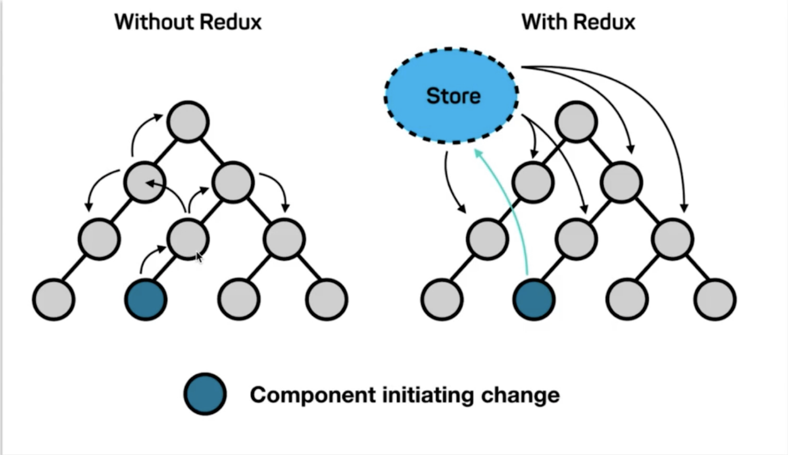
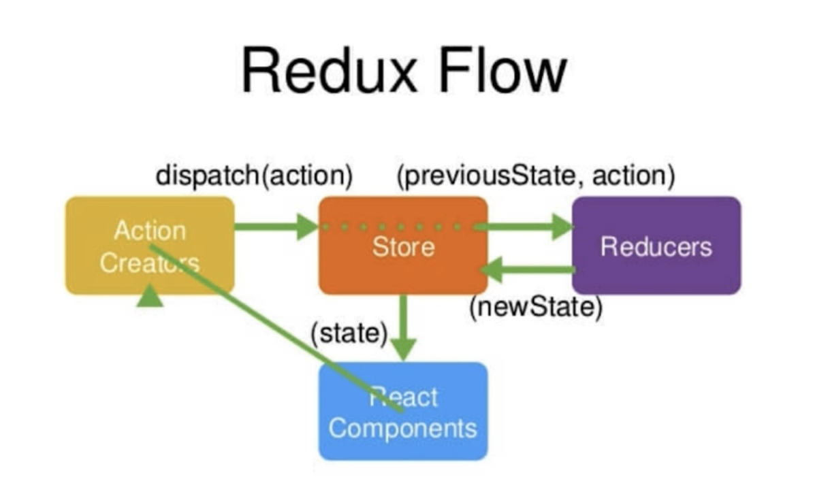

# redux介绍
  Redux是JavaScript状态容器，提供可预测化的状态管理。可以让你构建一致化应用，运行于不同的环境（客户端、服务器、原生应用），并且易于测试

## redux的产生是为了解决什么问题

  随着js单页应用的开发日趋复杂，javascript需要管理比任何时候都要多的state（状态）。这些state可能包括服务器响应、缓存数据、本地生成未持久化到服务器的数据，也包括UI状态，如激活的路由，被选中的标签，是否显示加载动效或者分页器等等。

  管理不断变化的 state 非常困难。如果一个 model 的变化会引起另一个 model 变化，那么当 view 变化时，就可能引起对应 model 以及另一个 model 的变化，依次地，可能会引起另一个 view 的变化。

  在redux中，数据在组件中是单向流动的，数据从一个方向父组件流向子组件（通过props），所以，两个非父子组件之间的通讯相对麻烦，redux的出现就是为了解决state里的数据问题。


  

  如果没有redux这种数据管理存在，那么底层一个组件进行了数据修改，然后其他树节点的需要修改，那么需要先往上一层层传递，然后再向下传递。

  如果有redux这种公共数据管理存在，那么底层那个节点修改了store,那么其他订阅了store中状态的节点再从store中进行取出数据，怎更新了对应的节点。

## redux 的好处
* 结果的可预测性：只有一个真实的来源（store）,当你将你的当前状态与应用程序的action 和其他部分同步时不会出什么问题。
* 可维护性：Redux对应该如何组织代码有严格的指导原则；这进一步的确保了可预测的结果，使代码更容易维护。
* 易于测试：在redux中编写代码涉及到与编写测试代码都黄金规则相关的纯函数。


## redux的三大原则
* 1：唯一数据源
* 2：只保持只读状态
* 3：数据改变只通过纯函数来执行

1：唯一数据源
>整个应用的state都被存储到一个store状态树里面，并且这个状态树，只存在于唯一的store中

2：保持只读状态
>state是只读的，唯一改变state的方法就是触发action,action是一个用于描述已发生事件的普通对象

这样确保了视图和网络都不能直接修改state,相反他们只能表达想要修改的意图，因为所有的修改都被集中化处理，且严格按照一个接一个的顺序执行，因此不用担心race condition的出现。action就是普通的对象而已，因此它们可以被日志打印、序列化、存储、后期调试或测试时回放出来。

```
store.dispath({
  type:'COMPLETE_TODO',
  index:1
  })
```

3：数据改变只能通过纯函数来执行
>使用纯函数来执行修改，为了描述action如何改变state的，你需要编写reducers

Reducer只是一些纯函数，它接受先前的state和action，并返回新的state。刚开始你可以只有一个reducer,随着应用变大，你可以把它拆分成多个小刀reducers,分别独立的操作state tree的不同部分，因为reducer只是函数，你可以控制他的调用顺序，传入的附加数据，甚至编写可复用的reducer来处理一些通用的任务，比如分页器。


## redux的工作流



store存储着状态,想要改变store必须使用action,store进行更新时使用reducer，那么store，action,reducer是啥呢？

store和action都是对象，action中必须有一个type字段对进行的操作进行说明，可能会有数据。store会赋值给组件中的state

reducer是一个纯函数，接受两个参数，第一个参数是累计对象（即state）,第二个参数就是action。reducer根据action.type的不同对state进行不同的操作，最后返回一个新的state,这个心的state同时又是下一次的累积对象。

流程理解：

react 中创建action 然后使用store.dispath(action) 传入到 store,store接到action后，将当前的state和action转发到reducer，然后reducer按照action对state进行处理，处理完再返回新的state给store.react组件上通过store.subscribe()进行定于store变化来获取新的state.
