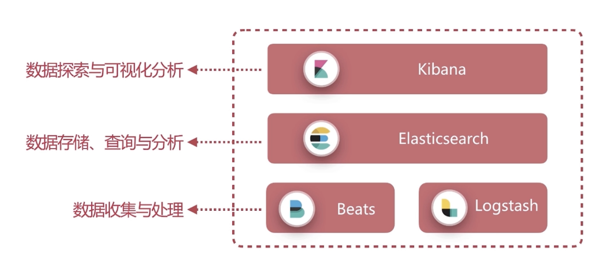
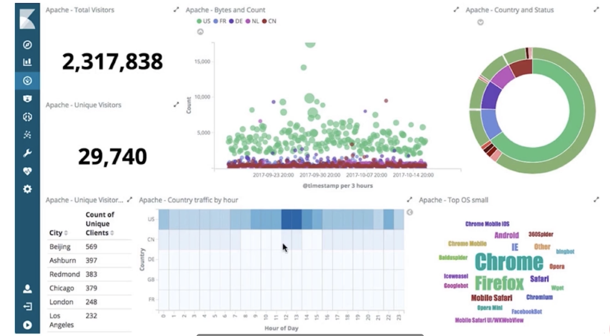

# Elastic Stack简介

>Elastic Stack 组成：

整个的核心是Elasticsearch

* Beats  Logstash

作用： 数据收集与处理

数据源多样性：
  - 数据文件，如日志、Excel等
  - 数据库，如mysql、Oracle等
  - http服务
  - 网络数据

支持自定义扩展，无限可能

* Kibana

  数据探索与可视化分析工具

  

>Elastic Stack的应用场景：

* 搜索引擎
* 日志分享
* 指标分析
