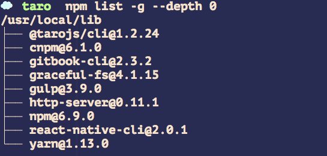

# npm & yarn


## npm

[中文手册](https://www.npmjs.cn/getting-started/what-is-npm/)

>常用命令

* 查看全局安装包
```
 npm list -g --depth 0
```




* 全局安装

```
# 使用 npm 安装 CLI
$ npm install -g @tarojs/cli

# OR 使用 yarn 安装 CLI
$ yarn global add @tarojs/cli
```


* 全局卸载

```
npm install -g @vue/cli

yarn global remove vue-cli
```
