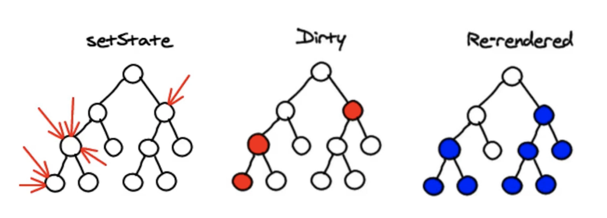
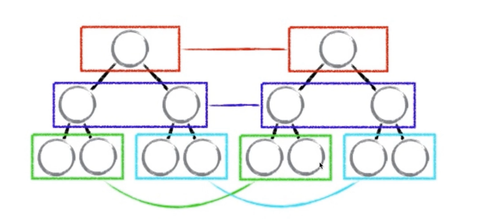
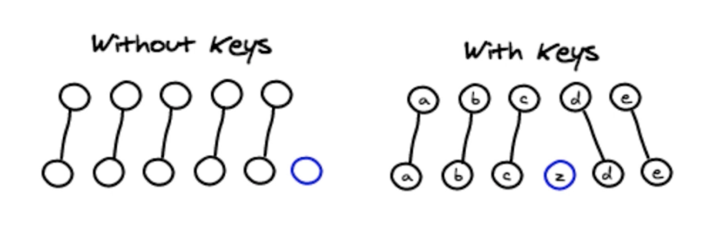

# 协调DOM更新
>diffing算法用来找出两棵树的所有不同点，类似于游戏的找别扭。

React 页面变化底层

* 1：state，props 数据
* 2：JSX模板
* 3：数据+模板 生产虚拟DOM(虚拟DOM就是一个JS对象，用来描述真实DOM）
  转成虚拟DOM:['div',{id:'abc'},['span',{},'hello world']]
* 4:用虚拟DOM的数据生成真实的DOM，来显示
```
  <div id='abc'><psan>hello world</span></div>
```
* 5:state发生变化
* 6：数据+模板 生成新的虚拟DOM
 ['div',{id:'abc'},['span',{},'bye bye']]

* 7:比较原始虚拟DOM和新的虚拟DOM的区别，找到区别是span中内容
* 8：直接操作DOM，改变span中的内容

优点：
* 1：性能提升了
* 2：它使得跨端应用得以实现。JSX生成虚拟DOM，然后虚拟DOM可以生成任意的语法，比如html的DOM，原生的组件等




采用同层比较，从下往上，只有找到差异，那么下面的所有节点都将更新，所以为什么之前说，父组件render()然后子组件也将render,无论是否有差异。



react 列表的diff算法，加入了keys比对。所以key和值固定关系是很重要的，我们在列表的循环时，不要使用index作为key值是有原因的，index和值是不稳定的关系。

