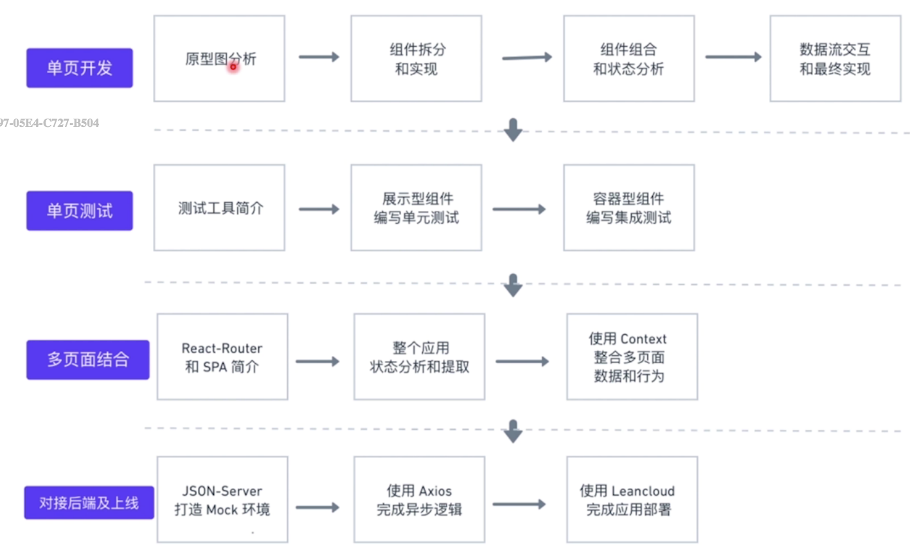

开发流程
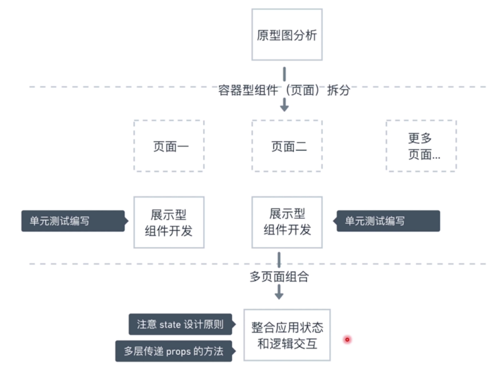


目录结构
* components 为存放ui组件
* containers 为存放容器型组件
* 这两个文件夹下单__test__文件夹存放所有组件测试文件
* 文件使用Pascal Case命名法   首字母大写
* src根目录下放统一使用到一些文件


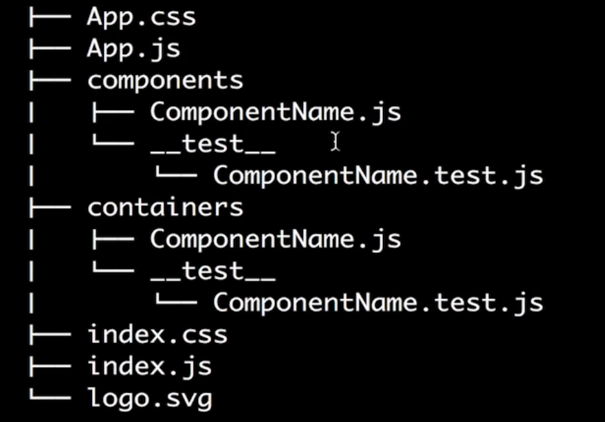

展示组件

①：priceList组件


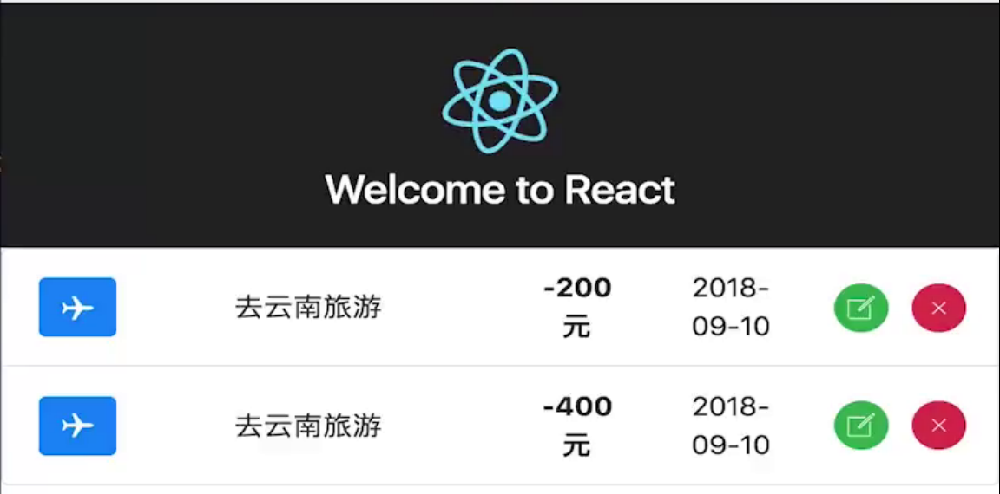
```
import React from 'react';
import Ionicon from 'react-ionicons';

//UI组件定义为函数型的
const PriceList = ({items, onModifyItem, onDeleteItem}) => {
	return (
		 <ul className="list-group list-group-flush">
			 {
			 	items.map((item)=>(
			 		 <li key={item.id} className="list-group-item  d-flex justify-content-between align-items-center">
						 <span className=" col-1">
							 <Ionicon
									className="rounded-circle"
									icon={item.category.iconName}
									fontSize="30px"
									color="#fff"
									style={{backgroundColor:'#007bff',"padding":'5px'}}
							 />
						 </span>
						 <span className="col-5">{item.title}</span>
						 <span className="col-2 font-weight-bold">
							 {(item.category.type==='outcome')?'-':'+'}
							 {item.price}元
						 </span>
						 <span className="col-2">{item.date}</span>
						 <a className="col-1" onClick={()=>onModifyItem(item)}>
							 <Ionicon
									className="rounded-circle"
									icon='ios-create-outline'
									fontSize="30px"
									color="#fff"
									style={{backgroundColor:'#28a745',"padding":'5px'}}
							 />
						 </a>
						 <a className="col-1" onClick={()=>onDeleteItem(item)}>
							 <Ionicon
								className="rounded-circle"
								icon='ios-close'
								fontSize="30px"
								color="#fff"
								style={{backgroundColor:'#dc3545',"padding":'5px'}}
						 />
						 </a>
					 </li>
				))
			 }
		 </ul>
	)
}
//加入类型校验
PriceList.proTypes = {
	item:PropTypes.array.isRequired,
	onModifyItem:PropTypes.func.isRequired,
	onDeleteItem:PropTypes.func.isRequired
}


export default PriceList;
```

组件使用
```

const items = [
	{
		"id": 1,
		"title": "去云南旅游",
		"price": 200,
		"date": "2018-09-01",
		"category": {
			"id": 1,
			"name": "旅行",
			"type": "outcome",
			"iconName":"ios-plane"
		}

	},{
		"id": 2,
		"title": "去云南旅游",
		"price": 200,
		"date": "2018-09-03",
		"category": {
			"id": 1,
			"name": "旅行",
			"type": "outcome",
			"iconName":"ios-plane"
		}

	}
];

class App extends Component {
	render() {
		return (
			 <div className="App" >
				 <PriceList
						items={items}
						onModifyItem={(item)=>{alert(item.id)}}
						onDeleteItem={(item)=>{alert(item.id)}}
				 />
			 </div>
		);
	}
}


export default App;

```

结果：


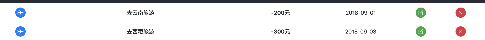


②：价格总和组件
分析组件定义规范
```
<TotalPrice
  income={600}
  outcome={500}
/>
```

```
import React from 'react';
import PropTypes from 'prop-types';

const TotalPrice = ({income, outcome}) => {
	return (
		 <div className="d-flex justify-content-between">
			 <div className="p-2 bd-highlight">收入：{income}</div>
			 <div className="p-2 bd-highlight">支出：{outcome}</div>
		 </div>
	)
}

TotalPrice.propTypes = {
	income: PropTypes.number.isRequired,
	outcome: PropTypes.number.isRequired
}

export default TotalPrice;
```

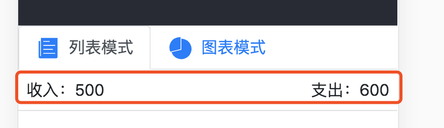


③：Tab切换组件
分析组件定义规范
```
<ViewTab
  activeTab='list'
  onTabChange={onTabChange}
/>
```

ViewTab组件

```
import React from 'react';
import Ionicon from 'react-ionicons';
import PropTypes from 'prop-types';
import {LIST_VIEW, CHART_VIEW} from '../utility';


const generateLinkClass = (current, view) => {
	return (current === view) ? 'nav-link active' : 'nav-link'
}


const ViewTab = ({activeTab, onTabChange}) => {
	return (
		 <ul className="nav nav-tabs">
			 <li className="nav-item">
				 <a
						className={generateLinkClass(activeTab, LIST_VIEW)}
						href="#"
						onClick={(e)=>{e.preventDefault();onTabChange(LIST_VIEW)}}
				 >
					 <Ionicon
							className="mr-2"
							icon='ios-paper'
							fontSize="25px"
							color="#007bff"

					 />
					 列表模式
				 </a>
			 </li>
			 <li className="nav-item">
				 <a
						className={generateLinkClass(activeTab, CHART_VIEW)}
						href="#"
						onClick={(event)=>{event.preventDefault();onTabChange(CHART_VIEW)}}
				 >
					 <Ionicon
							className="mr-2"
							icon='ios-pie'
							fontSize="25px"
							color="#007bff"
							onClick={()=>onTabChange(CHART_VIEW)}
					 />
					 图表模式
				 </a>
			 </li>

		 </ul>
	)
}

ViewTab.propTypes = {
	activeTab:PropTypes.string.isRequired,
	onTabChange:PropTypes.func.isRequired
}

export default ViewTab;
```

组件使用

```
<ViewTab
		activeTab={LIST_VIEW}
		onTabChange={(view)=>(console.log(view))}     //定义一个回调函数
 />
```

效果：


④：月份选择组件
要求：
* 按钮显示传入的年月，点击按钮可以打开和关闭下拉菜单
* 显示前后四年和01月到12月
* 传入的年和月 打开菜单以后应该是高亮
* 点击不同的年可以切换，点击月份应该触发回调

组件结构
```
<MonthPicker
  year={2018}
  month={8}
  onChange={onchange}
/>
```

```
import React, {Component} from 'react';
import PropTypes from 'prop-types';
import {range} from '../utility';


class MonthPicker extends Component {
	constructor(props) {
		super(props);
		this.state = {
			dropdown: false,
			selectYear: props.year
		}
	}

	handlerClick = (event) => {
		event.preventDefault();
		this.setState(prevState => ({dropdown: !prevState.dropdown}))
	}


	selectYear = (e, year) => {
		e.preventDefault();
		this.setState({selectYear: year})
	}

	selectMonth = (e, month) => {
		e.preventDefault();
		this.props.onChange(this.state.selectYear, month)
	}

	render() {
		const {dropdown, selectYear} = this.state;
		const {year, month} = this.props;
		const MonthRange = range(12, 1);
		const YearRange = range(8, -4).map(number => number + year)


		return (
			 <div className="dropdown">
				 <button onClick={this.handlerClick} className="btn btn-secondary dropdown-toggle" type="button"
								 id="dropdownMenu2" data-toggle="dropdown"
								 aria-haspopup="true" aria-expanded="false">
					 {`${year}年 ${month}月`}
				 </button>
				 {
					 dropdown &&
					 <div className="dropdown-menu" aria-labelledby="dropdownMenu2" style={{display: 'block', left: 0}}>
						 <div className="row">
							 <div className="col">
								 {
									 YearRange.map((year) =>
											<a
												 key={year}
												 className={(year === selectYear) ? 'active dropdown-item' : 'dropdown-item'}
												 href="#"
												 onClick={(e) => this.selectYear(e, year)}
											>
												{year}年
											</a>
									 )
								 }
							 </div>

							 <div className="col">
								 {
									 MonthRange.map(item =>
											<a
												 key={item}
												 className={(item === month) ? 'active dropdown-item' : 'dropdown-item'}
												 href="#"
												 onClick={(e) => this.selectMonth(e, item)}
											>{item}月</a>
									 )
								 }
							 </div>
						 </div>
					 </div>
				 }

			 </div>
		)
	}
}

MonthPicker.propTypes = {
	year : PropTypes.number.isRequired,
	month:PropTypes.number.isRequired,
	onChange:PropTypes.func.isRequired
}

export default MonthPicker;
```
结果
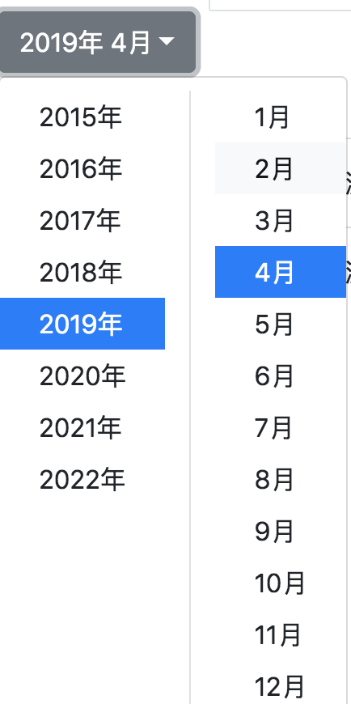


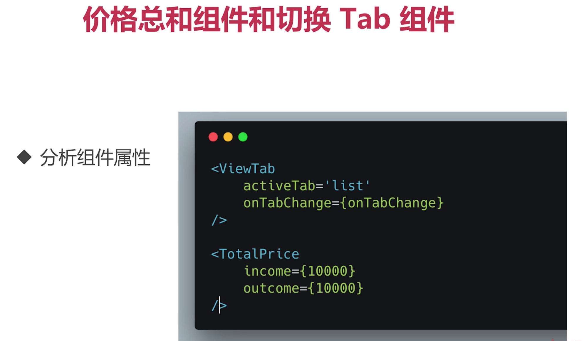

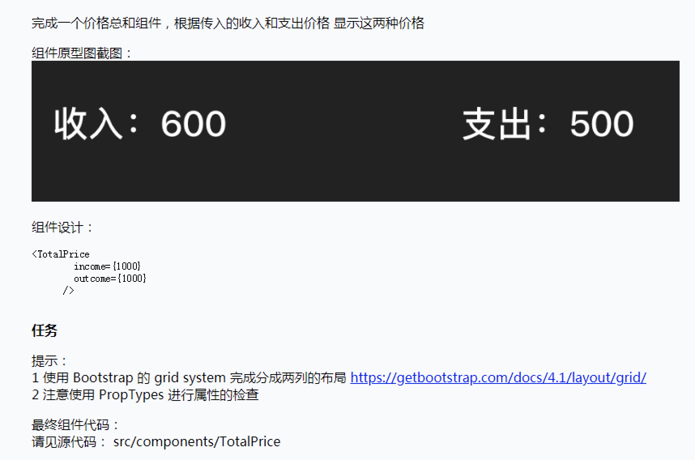


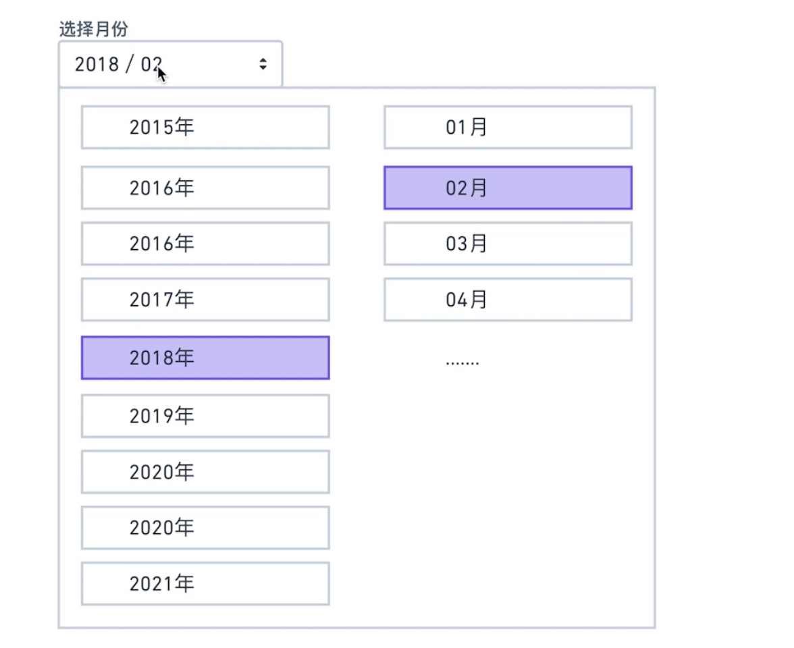


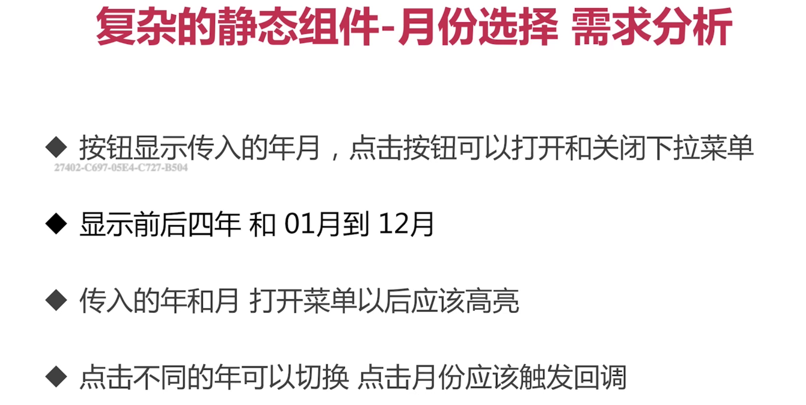

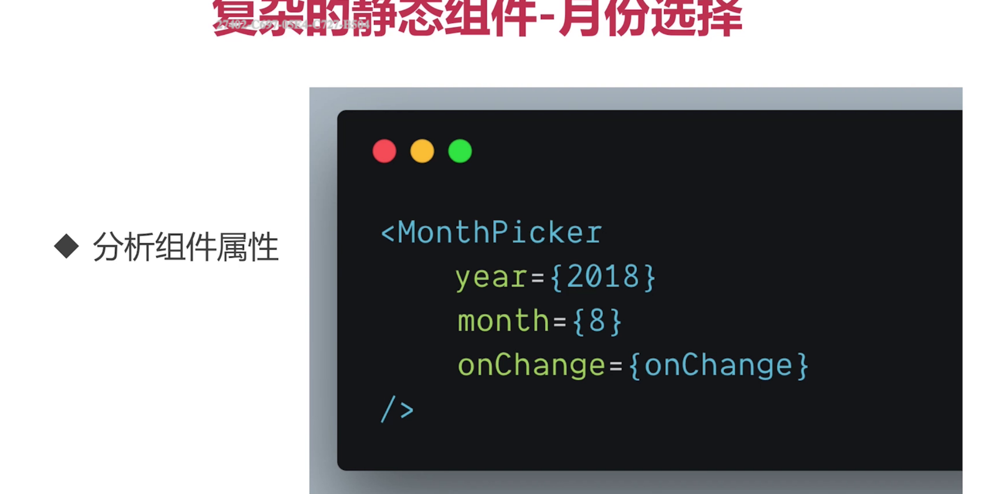


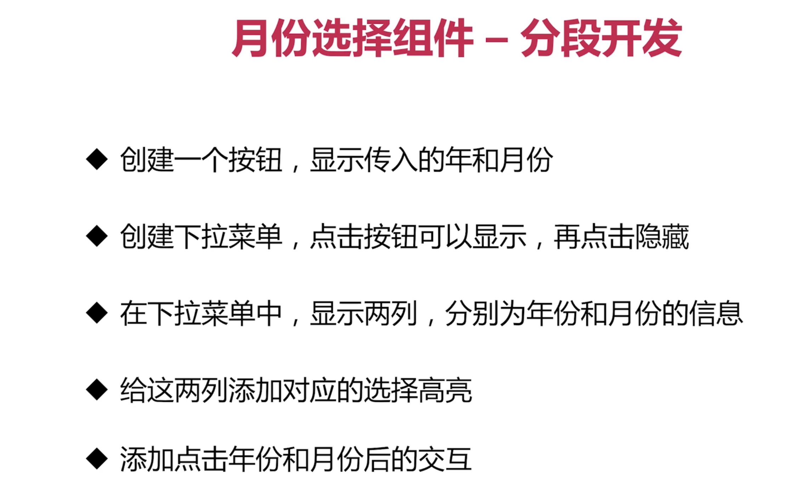


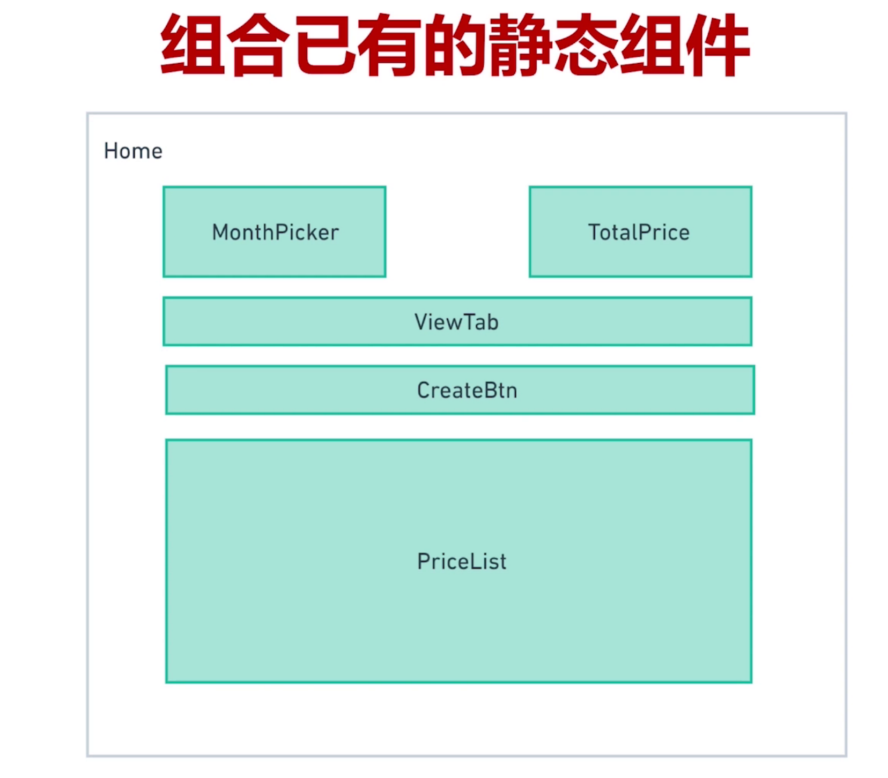


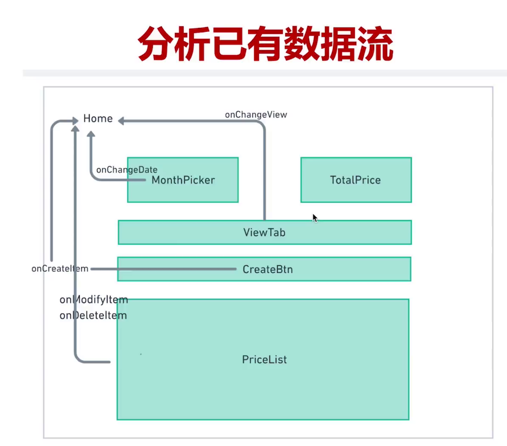


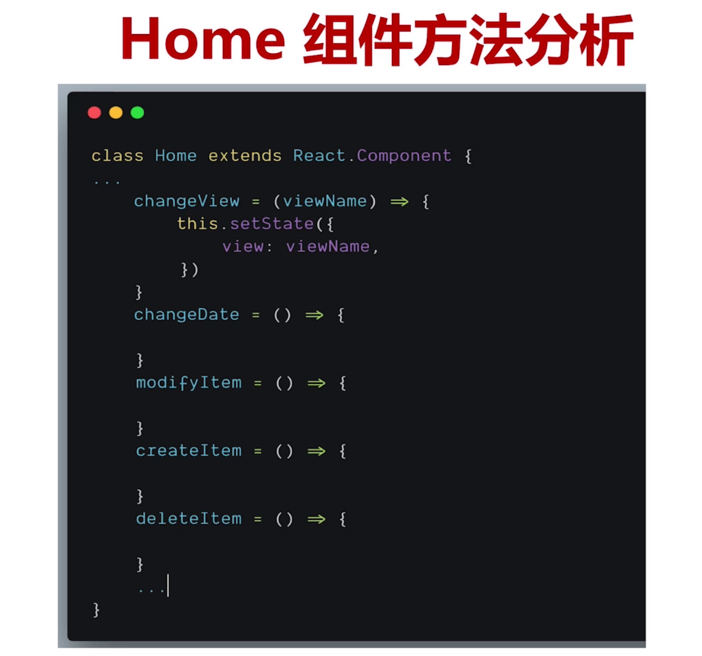


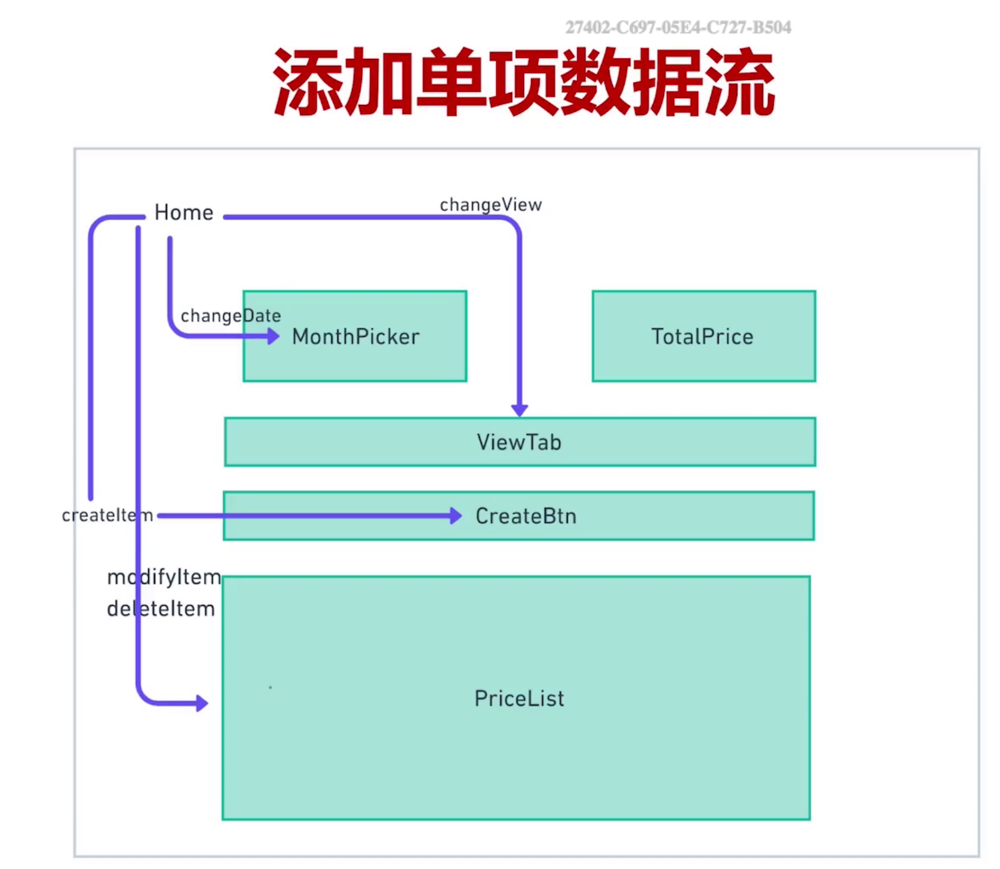


## 组件测试

>价格列表单元测试用例分析
* 传入特定数组 是否渲染对应长度的条目
* 每个条目是否渲染特定组件和内容
* 点击按钮是否触发特定回调


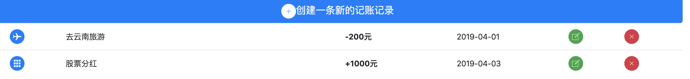

```
import React from 'react';
import {shallow} from 'enzyme';
import PriceList from '../PriceList';
import Ionicon from 'react-ionicons';

const categorys = {
	"1": {
		"id": 1,
		"name": "旅行",
		"type": "outcome",
		"iconName": "ios-plane"
	},
	"2": {
		"id": 2,
		"name": "理财收入",
		"type": "income",
		"iconName": "ios-apps"
	},
}

const items = [
	{
		"id": 1,
		"title": "去云南旅游",
		"price": 200,
		"date": "2019-04-01",
		"cid": 1

	}, {
		"id": 2,
		"title": "去西藏旅游",
		"price": 300,
		"date": "2019-03-03",
		"cid": 1
	}, {
		"id": 3,
		"title": "股票分红",
		"price": 1000,
		"date": "2019-04-03",
		"cid": 2
	}
];


const itemsWithCategory = items.map((item) => {
		 item.category = categorys[item.cid];
		 return item;
	 }
);

const props = {
	items: itemsWithCategory,
	onModifyItem: jest.fn(),
	onDeleteItem: jest.fn()				//jest.fn() 可以用了被捕获是否触发
}

let wrapper
let firstItem
describe('test PriceList component', () => {
	beforeEach(() => {															//钩子，每个运行单个测试测试用例时都会运行此处
		wrapper = shallow(<PriceList {...props}/>)
		firstItem = wrapper.find(".list-group-item")
	})

	it("是否渲染组件符合快照", () => {
		expect(wrapper).toMatchSnapshot()
	})

	it('是否渲染正确的item个数', () => {
		expect(firstItem.length).toEqual(itemsWithCategory.length)
	});

	it('是否每个item项目渲染了正确的icon 和price', () => {
		const iconList = wrapper.find(".list-group-item").first().find(Ionicon)				//find 不仅可以搜索dom元素还可以获取组件
		expect(iconList.length).toEqual(3)	//检查每个Item项是否渲染了3个icon
		expect(iconList.first().props().icon).toEqual(itemsWithCategory[0].category.iconName)		//检查第一个icon的icon属性是否等于数据中的值。props(）是获取所有属性
		expect(iconList.first().prop('icon')).toEqual(itemsWithCategory[0].category.iconName)		//检查第一个icon的icon属性是否等于数据中的值。prop('icon'）是获取icon属性
	})

	it('点击按钮是否触发指定的事件', () => {
		firstItem.find('a').first().simulate('click')						//simulate 表示模拟事件
		expect(props.onModifyItem).toHaveBeenCalledWith(itemsWithCategory[0])					//表是否函数被调用且是传递参数为()的值
	})
})

```

>月份选择单元测试用例分析
* 测试默认状-按钮上渲染年和月是否正确，下拉框是否显示等
* 测试点击后状态-下拉框是否显示，年和月到列表是否正确等
* 点击年和月以后是否触发正确的回调
* 对于传递一些特殊的值是否有特殊处理
* 特殊DOM事件的一些触发和处理方法


```
import React from 'react'
import ReactDOM from 'react-dom'
import {mount} from 'enzyme'
import MonthPicer from '../MonthPicker'

let props = {
	year: 2018,
	month: 8,
	onChange: jest.fn()
}

let wrapper

describe('test MonthPicer component', () => {
	beforeEach(() => {
		wrapper = mount(<MonthPicer {...props}/>)
	})

	it('快照检测 ', function () {
		expect(wrapper).toMatchSnapshot()
	});

	it('测试默认状-按钮上渲染年和月是否正确，下拉框是否显示 ', function () {
		expect(wrapper.find('.dropwodn-btn').text()).toEqual("2018年 08月")			//检查默认渲染的
		expect(wrapper.find('.dropdown-menu').length).toEqual(0)								//从UI层面检查下拉框是否显示
		expect(wrapper.state('dropdown')).toEqual(false)												//通过state检查值是否正确
		expect(wrapper.state('selectYear')).toEqual(props.year)									//检查初始state是否正确
	});

	it('测试点击后状态-下拉框是否显示，年和月的列表是否正确', function () {
		wrapper.find('.dropwodn-btn').simulate('click')													//触发按钮点击
		expect(wrapper.find('.dropdown-menu').length).toEqual(1)								//从UI层面检查下拉框是否显示
		expect(wrapper.state('dropdown')).toEqual(true)												  //通过state检查值是否正确

		expect(wrapper.find('.year-range .dropdown-item').length).toEqual(9)		//检查下拉的年份菜单项是否为9个item
		expect(wrapper.find('.month-range .dropdown-item').length).toEqual(12)	//检查下拉的月份菜单项是否为12个item

		//测试打开后默认的选中内容是否正确
		expect(wrapper.find('.year-range .dropdown-item.active').text()).toEqual("2018年")
		expect(wrapper.find('.month-range .dropdown-item.active').text()).toEqual("08月")

		//测试年份计算
		expect(wrapper.find('.year-range .dropdown-item').first().text()).toEqual(`${props.year - 4}年`)
		expect(wrapper.find('.month-range .dropdown-item').first().text()).toEqual(`01月`)
	})


	it('点击年和月以后是否触发正确的回调', function () {
		wrapper.find('.dropwodn-btn').simulate('click')	//先模拟点击下
		wrapper.find('.year-range .dropdown-item').first().simulate('click')	//模拟年份选择

		expect(wrapper.find('.year-range .dropdown-item').first().hasClass("active")).toEqual(true)	//选中年后，UI添加了class
		expect(wrapper.state('selectYear')).toEqual(2014)																						//选中后state值是否正确

		wrapper.find('.month-range .dropdown-item').first().simulate('click')	//模拟月份选择
		expect(wrapper.state('dropdown')).toEqual(false)											//检查下拉菜单是否关闭
		expect(props.onChange).toHaveBeenCalledWith(2014, 1)									//检查props是否触发
	})

	//DOM事件的测试方法
	it('测试点击空白区域是否关闭下拉菜单',function () {
		let eventMap = {}
		document.addEventListener = jest.fn((event,cb) =>{
			eventMap[event] = cb
		})

		const wrapper = mount(<MonthPicer {...props}/>)				//这里重新执行是因为，我们的绑定事件是在componentDidMount 生命周期内，上面的wrapper已经执行完了，所以这里重新执行

		//点击按钮，打开下拉菜单
		wrapper.find('.dropwodn-btn').simulate('click')													//触发按钮点击
		expect(wrapper.state('dropdown')).toEqual(true)
		expect(wrapper.find('.dropdown-menu').length).toEqual(1)
		//点击按钮上，这时应该是不关闭
		eventMap.click({						//handlerDocuemntClick
			target:ReactDOM.findDOMNode(wrapper.instance())
		})
		expect(wrapper.state('dropdown')).toEqual(true)

		//点击在按钮之外的文档上面，这时应该关闭
		eventMap.click({						//handlerDocuemntClick
			target:document
		})
		expect(wrapper.state('dropdown')).toEqual(false)
	})

})
```

>首页容器型组件单元测试用例分析
* 测试默认状态-是否正确的渲染特定组件和数据 等
* 测试交互-点击交互该组件的state是否有相应的修改
* 测试交互-对应操作触发以后展示型组件的属性是否修改

```
import React from 'react'
import {mount} from 'enzyme'
import Home, {newItem} from '../Home'

import PriceList from '../../components/PriceList';
import ViewTab from '../../components/ViewTab';
import TotalPrice from '../../components/TotalPrice';
import MonthPicker from '../../components/MonthPicker';
import CreateBtn from '../../components/CreateBtn';
import Ionicon from 'react-ionicons';
import {LIST_VIEW, CHART_VIEW, parseToYearAndMonth, padLeft} from '../../utility';

let wrapper

describe('test Home container component', () => {
	beforeEach(() => {
		wrapper = mount(<Home/>)
	})

	//对于容器型组件，我们只需要确定传入的值，捕获正确的返回就行
	it('测试默认状态-是否正确的渲染特定组件和数据 等', () => {
		const currentDate = parseToYearAndMonth('2019-04-10')
		expect(wrapper.find(PriceList).length).toEqual(1)				//检查priceList组件是否渲染
		expect(wrapper.find(ViewTab).prop('activeTab')).toEqual(LIST_VIEW)			//ViewTab组件的默认属性activeTab 是否为 LIST_VIEW
		expect(wrapper.find(MonthPicker).prop('year')).toEqual(currentDate.year)
		expect(wrapper.find(MonthPicker).prop('month')).toEqual(currentDate.month)
		expect(wrapper.find(PriceList).props().items.length).toEqual(2)
	})

	it('测试view Tab切换，修改显示', () => {
		wrapper.find('.nav-item a').last().simulate('click')
		expect(wrapper.find(PriceList).length).toEqual(0)
		expect(wrapper.find('.chart-title').length).toEqual(1)
		expect(wrapper.find(ViewTab).prop('activeTab')).toEqual(CHART_VIEW)
	})


	it('点击月份，显示正确的item', () => {
		wrapper.find('.dropwodn-btn').simulate('click')
		wrapper.find('.month-range .dropdown-item').at(2).simulate('click')	//选中第三项
		expect(wrapper.find(MonthPicker).props().month).toEqual(3)					//月份值为3
		expect(wrapper.find(PriceList).props().items.length).toEqual(1)			//此时列表项为1
	})


	it('创建按钮点击测试', () => {
		wrapper.find(CreateBtn).simulate('click')
		expect(wrapper.find(PriceList).props().items.length).toEqual(2)			//此时列表项为2，新增一项
		expect(wrapper.state('items')[0]).toEqual(newItem)									//测试是否落在了第一项
	})

	it('测试item按钮', () => {
		const fisrstItem = wrapper.find(".list-group-item").first();
		const delBtn = fisrstItem.find(Ionicon).last()
		const editBtn = fisrstItem.find(Ionicon).at(1)
		editBtn.simulate('click')
		expect(fisrstItem.find('span').at(1).text()).toEqual('修改后的标题')

		delBtn.simulate('click')
		expect(wrapper.find(PriceList).props().items.length).toEqual(1)			//此时列表项为1，减少一项
	})
})
```

## 创建页面
### 拆分展示型组件
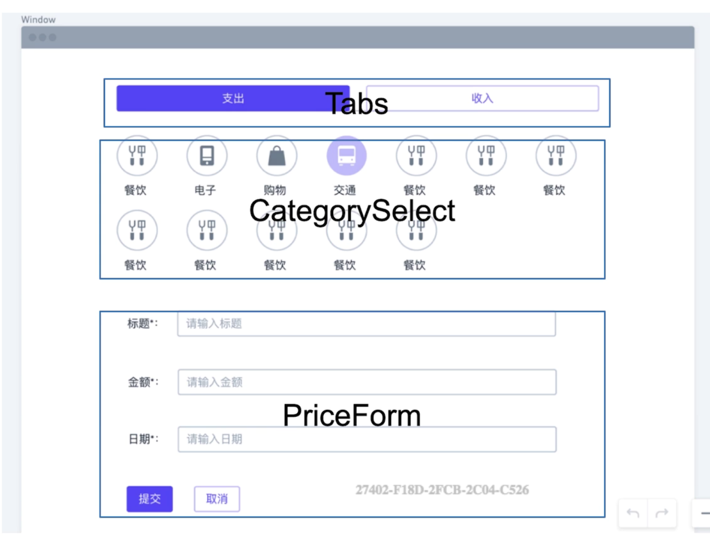


## TDD编程开发
* 分析需求
* 编写测试用例
* 实现组件的具体实现

实现分类选择

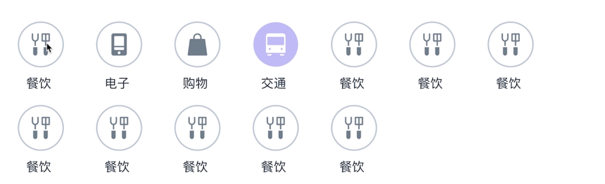

```
<Category
	categories={}							//分类项
	onSelectCategory={}				//选中事件
	selectedCategory={}				//选中的分类
/>
```
