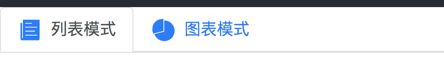

开发流程


目录结构
* components 为存放ui组件
* containers 为存放容器型组件
* 这两个文件夹下单__test__文件夹存放所有组件测试文件
* 文件使用Pascal Case命名法   首字母大写
* src根目录下放统一使用到一些文件


展示组件

①：priceList组件


```
import React from 'react';
import Ionicon from 'react-ionicons';

//UI组件定义为函数型的
const PriceList = ({items, onModifyItem, onDeleteItem}) => {
	return (
		 <ul className="list-group list-group-flush">
			 {
			 	items.map((item)=>(
			 		 <li key={item.id} className="list-group-item  d-flex justify-content-between align-items-center">
						 <span className=" col-1">
							 <Ionicon
									className="rounded-circle"
									icon={item.category.iconName}
									fontSize="30px"
									color="#fff"
									style={{backgroundColor:'#007bff',"padding":'5px'}}
							 />
						 </span>
						 <span className="col-5">{item.title}</span>
						 <span className="col-2 font-weight-bold">
							 {(item.category.type==='outcome')?'-':'+'}
							 {item.price}元
						 </span>
						 <span className="col-2">{item.date}</span>
						 <a className="col-1" onClick={()=>onModifyItem(item)}>
							 <Ionicon
									className="rounded-circle"
									icon='ios-create-outline'
									fontSize="30px"
									color="#fff"
									style={{backgroundColor:'#28a745',"padding":'5px'}}
							 />
						 </a>
						 <a className="col-1" onClick={()=>onDeleteItem(item)}>
							 <Ionicon
								className="rounded-circle"
								icon='ios-close'
								fontSize="30px"
								color="#fff"
								style={{backgroundColor:'#dc3545',"padding":'5px'}}
						 />
						 </a>
					 </li>
				))
			 }
		 </ul>
	)
}
//加入类型校验
PriceList.proTypes = {
	item:PropTypes.array.isRequired,
	onModifyItem:PropTypes.func.isRequired,
	onDeleteItem:PropTypes.func.isRequired
}


export default PriceList;
```

组件使用
```

const items = [
	{
		"id": 1,
		"title": "去云南旅游",
		"price": 200,
		"date": "2018-09-01",
		"category": {
			"id": 1,
			"name": "旅行",
			"type": "outcome",
			"iconName":"ios-plane"
		}

	},{
		"id": 2,
		"title": "去云南旅游",
		"price": 200,
		"date": "2018-09-03",
		"category": {
			"id": 1,
			"name": "旅行",
			"type": "outcome",
			"iconName":"ios-plane"
		}

	}
];

class App extends Component {
	render() {
		return (
			 <div className="App" >
				 <PriceList
						items={items}
						onModifyItem={(item)=>{alert(item.id)}}
						onDeleteItem={(item)=>{alert(item.id)}}
				 />
			 </div>
		);
	}
}


export default App;

```

结果：


②：价格总和组件
分析组件定义规范
```
<TotalPrice
  income={600}
  outcome={500}
/>
```

```
import React from 'react';
import PropTypes from 'prop-types';

const TotalPrice = ({income, outcome}) => {
	return (
		 <div className="d-flex justify-content-between">
			 <div className="p-2 bd-highlight">收入：{income}</div>
			 <div className="p-2 bd-highlight">支出：{outcome}</div>
		 </div>
	)
}

TotalPrice.propTypes = {
	income: PropTypes.number.isRequired,
	outcome: PropTypes.number.isRequired
}

export default TotalPrice;
```


③：Tab切换组件
分析组件定义规范
```
<ViewTab
  activeTab='list'
  onTabChange={onTabChange}
/>
```

ViewTab组件

```
import React from 'react';
import Ionicon from 'react-ionicons';
import PropTypes from 'prop-types';
import {LIST_VIEW, CHART_VIEW} from '../utility';


const generateLinkClass = (current, view) => {
	return (current === view) ? 'nav-link active' : 'nav-link'
}


const ViewTab = ({activeTab, onTabChange}) => {
	return (
		 <ul className="nav nav-tabs">
			 <li className="nav-item">
				 <a
						className={generateLinkClass(activeTab, LIST_VIEW)}
						href="#"
						onClick={(e)=>{e.preventDefault();onTabChange(LIST_VIEW)}}
				 >
					 <Ionicon
							className="mr-2"
							icon='ios-paper'
							fontSize="25px"
							color="#007bff"

					 />
					 列表模式
				 </a>
			 </li>
			 <li className="nav-item">
				 <a
						className={generateLinkClass(activeTab, CHART_VIEW)}
						href="#"
						onClick={(event)=>{event.preventDefault();onTabChange(CHART_VIEW)}}
				 >
					 <Ionicon
							className="mr-2"
							icon='ios-pie'
							fontSize="25px"
							color="#007bff"
							onClick={()=>onTabChange(CHART_VIEW)}
					 />
					 图表模式
				 </a>
			 </li>

		 </ul>
	)
}

ViewTab.propTypes = {
	activeTab:PropTypes.string.isRequired,
	onTabChange:PropTypes.func.isRequired
}

export default ViewTab;
```

组件使用

```
<ViewTab
		activeTab={LIST_VIEW}
		onTabChange={(view)=>(console.log(view))}     //定义一个回调函数
 />
```

效果：



④：月份选择组件
要求：
* 按钮显示传入的年月，点击按钮可以打开和关闭下拉菜单
* 显示前后四年和01月到12月
* 传入的年和月 打开菜单以后应该是高亮
* 点击不同的年可以切换，点击月份应该触发回调

组件结构
```
<MonthPicker
  year={2018}
  month={8}
  onChange={onchange}
/>
```

```
import React, {Component} from 'react';
import PropTypes from 'prop-types';
import {range} from '../utility';


class MonthPicker extends Component {
	constructor(props) {
		super(props);
		this.state = {
			dropdown: false,
			selectYear: props.year
		}
	}

	handlerClick = (event) => {
		event.preventDefault();
		this.setState(prevState => ({dropdown: !prevState.dropdown}))
	}


	selectYear = (e, year) => {
		e.preventDefault();
		this.setState({selectYear: year})
	}

	selectMonth = (e, month) => {
		e.preventDefault();
		this.props.onChange(this.state.selectYear, month)
	}

	render() {
		const {dropdown, selectYear} = this.state;
		const {year, month} = this.props;
		const MonthRange = range(12, 1);
		const YearRange = range(8, -4).map(number => number + year)


		return (
			 <div className="dropdown">
				 <button onClick={this.handlerClick} className="btn btn-secondary dropdown-toggle" type="button"
								 id="dropdownMenu2" data-toggle="dropdown"
								 aria-haspopup="true" aria-expanded="false">
					 {`${year}年 ${month}月`}
				 </button>
				 {
					 dropdown &&
					 <div className="dropdown-menu" aria-labelledby="dropdownMenu2" style={{display: 'block', left: 0}}>
						 <div className="row">
							 <div className="col">
								 {
									 YearRange.map((year) =>
											<a
												 key={year}
												 className={(year === selectYear) ? 'active dropdown-item' : 'dropdown-item'}
												 href="#"
												 onClick={(e) => this.selectYear(e, year)}
											>
												{year}年
											</a>
									 )
								 }
							 </div>

							 <div className="col">
								 {
									 MonthRange.map(item =>
											<a
												 key={item}
												 className={(item === month) ? 'active dropdown-item' : 'dropdown-item'}
												 href="#"
												 onClick={(e) => this.selectMonth(e, item)}
											>{item}月</a>
									 )
								 }
							 </div>
						 </div>
					 </div>
				 }

			 </div>
		)
	}
}

MonthPicker.propTypes = {
	year : PropTypes.number.isRequired,
	month:PropTypes.number.isRequired,
	onChange:PropTypes.func.isRequired
}

export default MonthPicker;
```
结果


