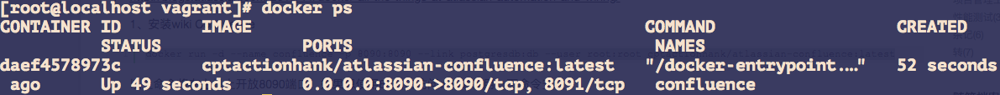
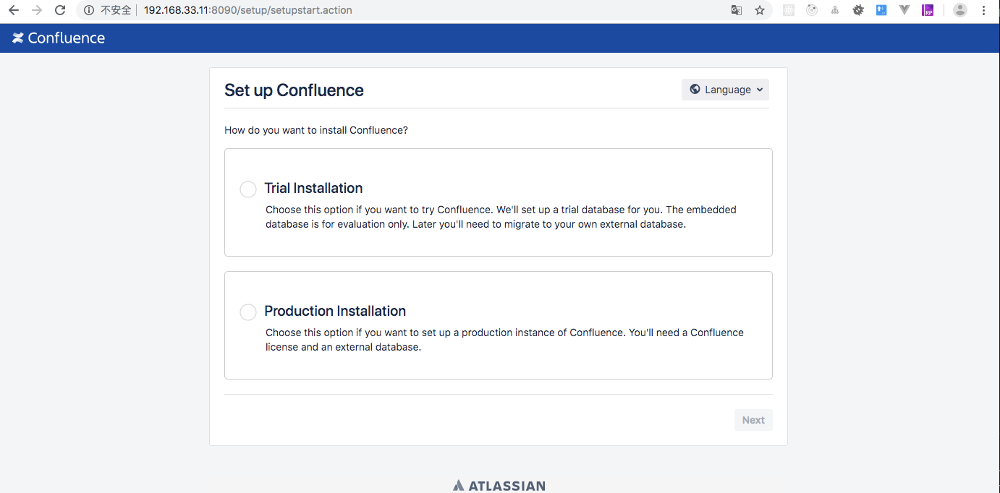
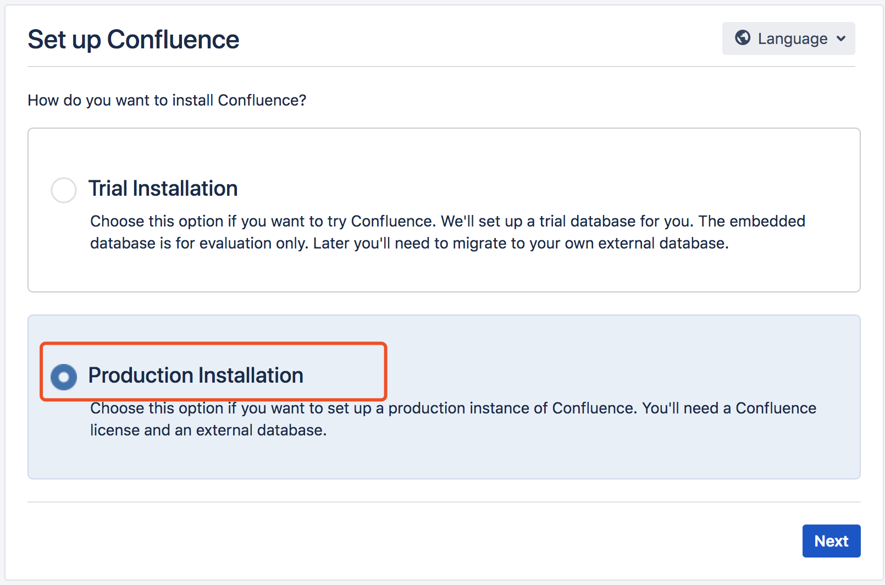
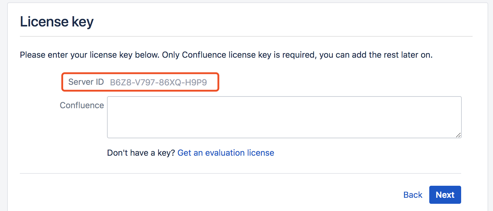
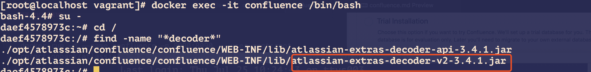
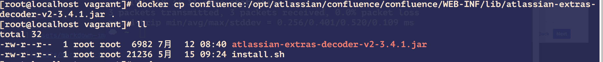
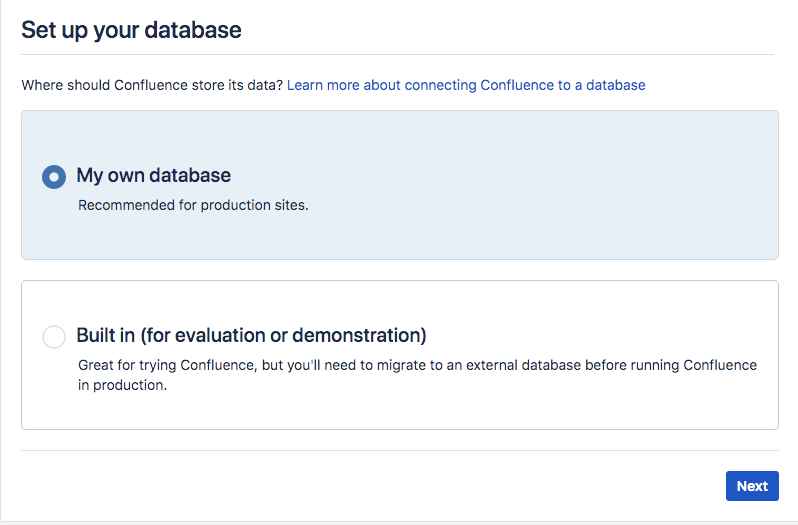
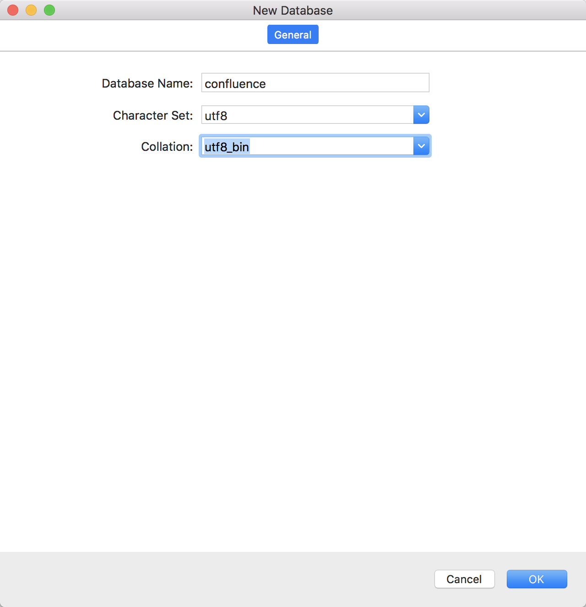
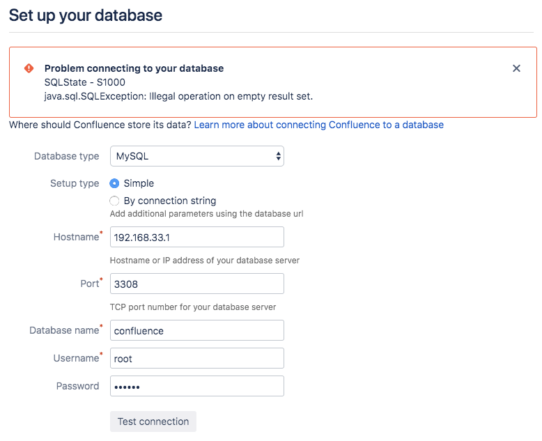

# docker安装confluence
[参考文章](https://www.cnblogs.com/rslai/p/8845777.html)

[使用指南](http://confluence.gjingao.com/pages/viewpage.action?pageId=328001)

### 安装wiki confluence
## 拉取镜像

```
docker run -d --name confluence -p 8090:8090  --user root:root cptactionhank/atlassian-confluence:latest
```

## 检查容器

```
docker ps
```



## 访问服务
访问：http://docker宿主机IP:8090 就可以看到confluence的配置页面了



### 破解 wiki
1：记录Server ID   B6Z8-V797-86XQ-H9P9




2：进入docker confluence 容器，查找decoder.jar文件
```
docker exec -it confluence /bin/bash    #进入容器

su -   # 切换到root账户    主语su - (root) 和su root区别：前者是切换到root并获得root的环境变量及执行权限，而后者只能获取root的执行权限，不能获得环境变量

cd /

find -name "*decoder*"  #查找名称中包括 decoder 的文件
```



3：将decoder.jar文件从容器中复制出来

confluence:为容器名称

宿主机中执行下面命令将容器中的文件拷贝出来

```
docker cp  confluence:/opt/atlassian/confluence/confluence/WEB-INF/lib/atlassian-extras-decoder-v2-3.3.0.jar .
```



4：开始破解


设置数据库




创建DB


如果使用myql连接可以回遇到数据库驱动问题

