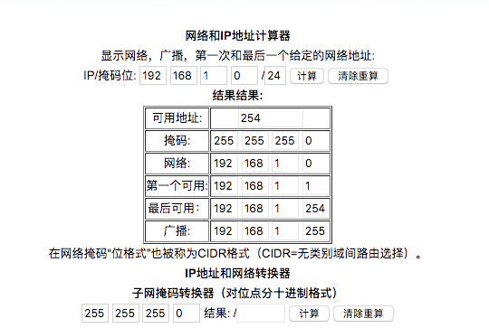

# Dockerfile

## 常用命令
* 构建镜像
  docker build -t 镜像名称  .   --no-cache

* 启动容器
  docker run -itd --name 容器名称  镜像名称

* 进入容器
  docker exec -it 容器名称 bash

* 创建网络
  docker network create --subnet=192.168.1.0/24 swoftNetwork

  --subnet 子网地址

  swoftNetwork 网络名称

  IP计算器 https://tool.520101.com/wangluo/ipjisuan/

  根据子网掩码 24计算出 游多少个可用的IP地址

  

* docker-php-ext-enable  redis
  命令相当于  修改php.ini的文件  加上  extension=redis.so
