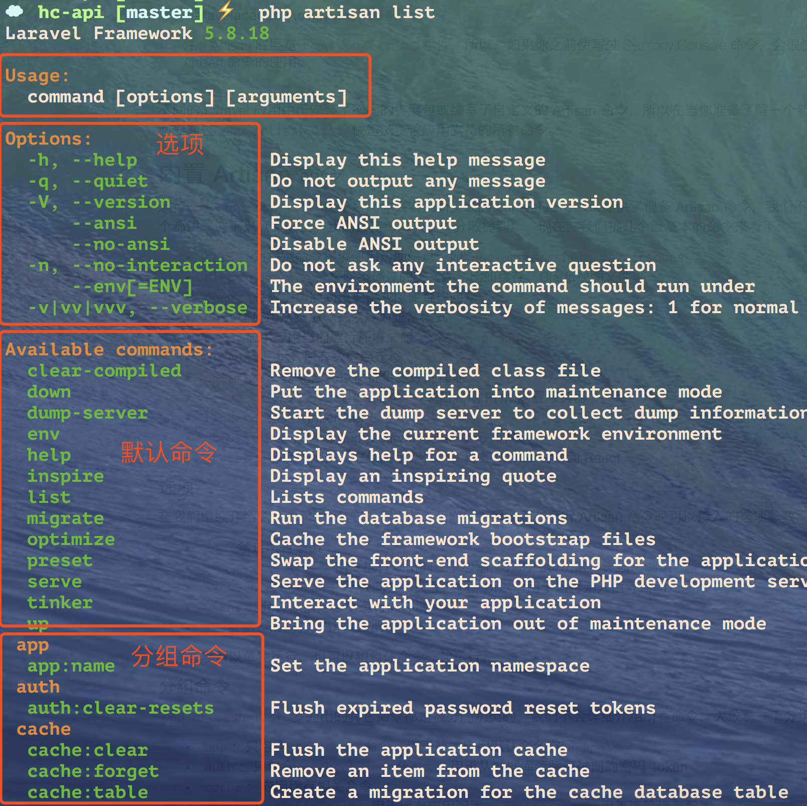
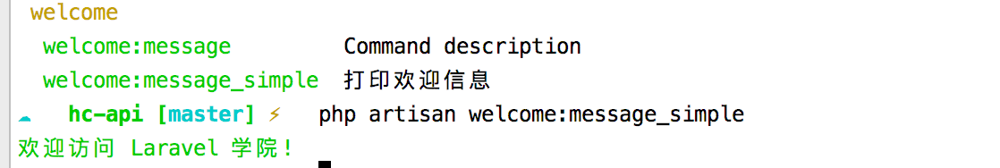

[文章](https://laravelacademy.org/post/9684.html)

## 命令行分类
在 Laravel 中，我们可以通过三种工具实现命令行交互：
* Artisan：Laravel 内置的命令行操作工具集，支持自定义命令；
* Tinker：一个由 [PsySH](https://github.com/bobthecow/psysh) 扩展包驱动的 REPL，允许你通过命令行与整个 Laravel 应用进行交互；
* Laravel 安装器，这个我们在框架安装部分已经提到过，比较简单，不再单独介绍。


## 内置Aritsan命令
通过 php artisan list 快速浏览该应用支持的所有命令


* usage:命令使用方法

* Options 选项：
  - q ：禁止所有操作
  - -v、-vv、-vvv： 命令执行行输出的三个级别、分别代表正常、详细、调试
  - --no-interaction： 不会问任何交互问题，所以使用于无人值守自动处理命令
  - --env：允许你指定命令运行的环境
  - --version：打印当前 Laravel 版本

* 默认命令
  - clear-compiled：移除编译过的类文件，比如缓存、Blade视图文件等
  - down：将应用切换到维护模式以便查找问题,这时访问网站上503
  - up：将应用从维护模式恢复为正常模式
  - dump-server：启动 dump server 收集 dump 信息
  - env：显示应用当前运行环境，如 local、production
  - help：为指定命令提供使用帮助信息，如 php artisan help make:request
  - migrate：运行所有数据库迁移
  - optimize：优化应用以便提供更好的性能
  - serve：在本地 localhost:8000 端口启动 PHP 内置服务器
  - tinker：进入 Tinker REPL
  - dump-server：启动 dump server 收集 dump 信息
  - preset：切换应用前端框架脚手架代码，比如从 Vue 切换到 React

* 分组命令
  - app：只包含 app:name 命令，用于替换应用默认命名空间 App\
  - auth：只包含 auth:clear-resets，用于从数据库清除已过期的密码 Token
  - cache：应用缓存相关命令
  - config：config:cache 用于缓存应用配置，config:clear 用于清除缓存配置
  - db：db:seed 用于通过填充器填充数据库（如果编写了填充器的话）
  - event：event:generate 用于根据注册信息生成未创建的事件类及监听器类
  - key：key:generate 用于手动设置应用的 APP_KEY
  - make：用于根据模板快速生成应用各种脚手架代码，如认证、模型、控制器、数据库迁移文件等等等，我们会将每个命令穿插在相应教程中介绍
  - migrate：数据库迁移相关命令（数据库教程中会详细介绍）
  - notifications：notifications:table 用于生成通知表
  - optimize：optimize:clear 用于清除缓存的启动文件
  - package：package:discover 用于重新构建缓存的扩展包 manifest
  - queue：队列相关命令（队列教程中会详细介绍）
  - route：路由相关命令，route:cache 和 route:clear 分别用于缓存路由信息和清除路由缓存，route:list 用于列出应用所有路由信息
  - schedule：调度任务相关命令（调度任务教程中会介绍）
  - session：对于数据库驱动的 Session，我们通过 session:table 生成 sessions 数据表
  - storage：storage:link 生成一个软链 public/storage 指向 storage/app/public
  - vendor：vendor:publish 用于发布扩展包中的公共资源
  - view：view:cache 用于编译应用所有 Blade 模板，view:clear 用于清除这些编译文件

## 编写自己的artisan 命令

**1：创建自定义命令文件**

--command 用于自定义该命令的名称
```
php artisan make:command WelcomeMessage --command=welcome:message
```

在app/console/Command目录下创建一个WelcomeMessage.php文件:
```
<?php

namespace App\Console\Commands;

use Illuminate\Console\Command;

class WelcomeMessage extends Command
{
    /**
     * The name and signature of the console command.
     *
     * @var string
     */
    protected $signature = 'welcom:message';

    /**
     * The console command description.
     *
     * @var string
     */
    protected $description = 'print welcome message';

    /**
     * Create a new command instance.
     *
     * @return void
     */
    public function __construct()
    {
        parent::__construct();
    }

    /**
     * Execute the console command.
     *
     * @return mixed
     */
    public function handle()
    {
        //
    }
}

```

**2：注册命令类**
创建完命令类后，需要在app/Console/Kernel.php中注册才能使用，就像控制器编写完，需要在路由文件中定义路由一样。
```
protected $commands = [
        App\Console\Commands\WelcomeMessage::class
    ];
```

运行 php artisan list 就可以看到 welcome:message 命令了


**3：编写具体的逻辑**
Artisan 命令的具体业务逻辑要定义到命令文件的 handle 方法中
```
public function handle()
{
    $this->info('欢迎访问 Laravel 学院!');
}
```

## 使用闭包形式创建命令
当然，就像我们可以在 routes/web.php 中基于闭包实现简单业务逻辑一样，对于这么简单的命令，我们也可以在 routes/console.php 中基于闭包实现

```
Artisan::command('welcome:message_simple', function () {
    $this->info('欢迎访问 Laravel 学院!');
})->describe('打印欢迎信息');
```

这样我们就可以在命令行运行 php artisan welcome:message_simple 打印欢迎信息了，效果和上面通过命令类实现的一样。



