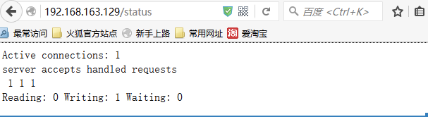

# 一：架构图

# 二：安装测试工具和性能统计工具
     压力测试工具我们使用的是apache自带的ab压力测试工具，安装了apache的服务器就有这个测试工具
     性能统计工具 ：nginx监控工具：ngx_http_sub_status_module

     压力测试工具：/usr/local/apache/bin/ab -c 1000 -n 50000 http://192.168.163.129/index.html               c:为并发数  n为总的请求数
     安装nginx的sub_status模块: ngx_http_sub_status_module
     ./configure --prefix=/usr/local/nginx --with-http_stub_status_module

     配置文件添加如下：
     location /status {
            stub_status on;             //开启stub_status，必填下面的是选填的
            access_log off;
            allow  192.168.1.138;    //只允许该IP访问
            deny all;
        }
     访问测试：



# nginx 单机1w并发优化
二：优化前的现状

①：1000并发请求：./bin/ab -c 1000 -n 50000 http://192.168.163.129/index.html
```
This is ApacheBench, Version 2.3 <$Revision: 655654 $>
Copyright 1996 Adam Twiss, Zeus Technology Ltd, http://www.zeustech.net/
Licensed to The Apache Software Foundation, http://www.apache.org/
Benchmarking 192.168.163.129 (be patient)
Completed 5000 requests
Completed 10000 requests
Completed 15000 requests
Completed 20000 requests
Completed 25000 requests
Completed 30000 requests
Completed 35000 requests
Completed 40000 requests
Completed 45000 requests
Completed 50000 requests
Finished 50000 requests

Server Software:        nginx/1.8.1
Server Hostname:        192.168.163.129
Server Port:            80
Document Path:          /index.html
Document Length:        612 bytes
Concurrency Level:      1000
Time taken for tests:   5.426 seconds
Complete requests:      50000
Failed requests:        1144
   (Connect: 0, Receive: 0, Length: 1144, Exceptions: 0)
Write errors:           0
Non-2xx responses:      1144
Total transferred:      41640828 bytes
HTML transferred:       30121356 bytes
Requests per second:    9214.98 [#/sec] (mean)
Time per request:       108.519 [ms] (mean)
Time per request:       0.109 [ms] (mean, across all concurrent requests)
Transfer rate:          7494.52 [Kbytes/sec] received
Connection Times (ms)
              min  mean[+/-sd] median   max
Connect:        0   51 380.0      1    3040
Processing:     1   14  67.0      5    2302
Waiting:        0   10  66.5      2    2302
Total:          2   65 392.0      6    3761
Percentage of the requests served within a certain time (ms)
  50%      6
  66%      8
  75%     10
  80%     12
  90%     30
  95%     42
  98%    511
  99%   3049
 100%   3761 (longest request)
总结：可见50000的请求中存在1144的错误请求，95%的请求都没超过100毫秒
```

②：提升到2000并发时

```
[root@localhost apache]# ./bin/ab -c 2000 -n 50000 http://192.168.163.129/index.html
This is ApacheBench, Version 2.3 <$Revision: 655654 $>
Copyright 1996 Adam Twiss, Zeus Technology Ltd, http://www.zeustech.net/
Licensed to The Apache Software Foundation, http://www.apache.org/
Benchmarking 192.168.163.129 (be patient)
socket: Too many open files (24)
这个错误的原因是客户的打开了太多请求：
我们可以通过ulimit -n 查看 它是指 linux系统中打开文件描述符的最大值，即可以打开最大的文件数，在liux系统中都是以文件数连接来计算的
临时调整：ulimit -n 20000
[root@localhost apache]# ./bin/ab -c 2000 -n 10000 http://192.168.163.129/index.html
This is ApacheBench, Version 2.3 <$Revision: 655654 $>
Copyright 1996 Adam Twiss, Zeus Technology Ltd, http://www.zeustech.net/
Licensed to The Apache Software Foundation, http://www.apache.org/
Benchmarking 192.168.163.129 (be patient)
Completed 1000 requests
Completed 2000 requests
Completed 3000 requests
Completed 4000 requests
Completed 5000 requests
Completed 6000 requests
Completed 7000 requests
Completed 8000 requests
Completed 9000 requests
Completed 10000 requests
Finished 10000 requests

Server Software:        nginx/1.8.1
Server Hostname:        192.168.163.129
Server Port:            80
Document Path:          /index.html
Document Length:        192 bytes
Concurrency Level:      2000
Time taken for tests:   1.182 seconds
Complete requests:      10000
Failed requests:        9177
   (Connect: 0, Receive: 0, Length: 9177, Exceptions: 0)
Write errors:           0
Non-2xx responses:      845
Total transferred:      8049813 bytes
HTML transferred:       5782848 bytes
Requests per second:    8460.09 [#/sec] (mean)
Time per request:       236.404 [ms] (mean)
Time per request:       0.118 [ms] (mean, across all concurrent requests)
Transfer rate:          6650.60 [Kbytes/sec] received
Connection Times (ms)
              min  mean[+/-sd] median   max
Connect:        0    6  13.4      2      76
Processing:     2   15  56.2      6     624
Waiting:        0   11  56.1      3     621
Total:          2   21  59.9      8     635
Percentage of the requests served within a certain time (ms)
  50%      8
  66%     10
  75%     11
  80%     12
  90%     47
  95%     72
  98%    101
  99%    508
 100%    635 (longest request)
总结：错误率太高了，一半的请求已经出错了，可见达到2000的并发几乎可以认为已经不行了
```

③：优化前的1w并发情况

```
[root@localhost apache]# ./bin/ab -c 10000 -n 50000 http://192.168.163.129/index.html
This is ApacheBench, Version 2.3 <$Revision: 655654 $>
Copyright 1996 Adam Twiss, Zeus Technology Ltd, http://www.zeustech.net/
Licensed to The Apache Software Foundation, http://www.apache.org/
Benchmarking 192.168.163.129 (be patient)
Completed 5000 requests
Completed 10000 requests
Completed 15000 requests
Completed 20000 requests
Completed 25000 requests
Completed 30000 requests
Completed 35000 requests
Completed 40000 requests
Completed 45000 requests
Completed 50000 requests
Finished 50000 requests

Server Software:        nginx/1.8.1
Server Hostname:        192.168.163.129
Server Port:            80
Document Path:          /index.html
Document Length:        192 bytes
Concurrency Level:      10000
Time taken for tests:   7.503 seconds
Complete requests:      50000
Failed requests:        48471
   (Connect: 0, Receive: 0, Length: 48471, Exceptions: 0)
Write errors:           0
Non-2xx responses:      1567
Total transferred:      41469427 bytes
HTML transferred:       29970012 bytes
Requests per second:    6664.25 [#/sec] (mean)
Time per request:       1500.544 [ms] (mean)
Time per request:       0.150 [ms] (mean, across all concurrent requests)
Transfer rate:          5397.71 [Kbytes/sec] received
Connection Times (ms)
              min  mean[+/-sd] median   max
Connect:        0  110 534.2      5    3103
Processing:     3   16  41.7     10     648
Waiting:        0   10  41.2      4     642
Total:          4  126 556.7     15    3698
Percentage of the requests served within a certain time (ms)
  50%     15
  66%     19
  75%     22
  80%     24
  90%     32
  95%    389
  98%   3119
  99%   3146
 100%   3698 (longest request)
```

# 三：开始优化
所谓大并发就是要解决：
* ①：开尽量多的scoket连接
* ②：能够打开尽量多的文件，并延socket返回


排除问题主要从：系统的dmesg和nginx的errorlog来观察     （ dmesg用来显示内核环缓冲区（kernel-ring buffer）内容，内核将各种消息存放在这里。）
优化思路：

* 1：socket的nginx优化

  ①：子进程允许打开的连接数（work_connection）
  nginx的master和worker的关系，worker也不是越多越好，太多会导致cpu饱和，一般原则是：worker process数量为CPU核数的1~2倍

  调整为：
  默认是一个worker process最大并发默认为1024
  nginx作为http服务器的时候
  max_clients  =  worker_process * worker_connections
  nginx作为反向代理服务器的时候：
  max_clients  =  worker_process * worker_connections/4      (因为nginx要同时保证客户端和后端被 代理server的两个链接，有因为链接请求都是双向的所有要除以4)

  ②：快速断开http连接, 关闭持久化连接（长连接）
     =====》
  keep-alive  用途：比如我们请求某个网站主页时，建立了TCP连接，但同时我们还需要请求很多其他的比如css，js等文件，那么其余的http请求就建立在了第一次的TCP连接之上了，就相当于排一次队买多张票一样
  优点：防止了频繁的TCP握手
  缺点：对于高并发网站来说，就利大于弊了，因为对于高并发网站来说每个TCP连接都是很珍贵的

  查看配置文件
  改为：
  默认保持65秒，现调整为0即不支持keep-alive，即使想用也要控制在2s内

  保持keepalive_timeout 时间长了导致大量的waiting状态请求

* 2：socket的系统层面
   ①：最大连接数somaxconn
          查看目前最大连接数   cat  /proc/sys/net/core/somaxconn                     注意proc内文件是指系统运行产生的是从系统的内存中捞出来的，修改会立即生效
          修改最大连接数：      echo 65535 > /proc/sys/net/core/somaxconn

   ②：加快tcp连接的回收recycle ,开启快速回收
         查看目前是否开启快速回收  cat /proc/sys/net/ipv4/tcp_tw_recycle     结果 0
         开启快速回收：     echo 1 > /proc/sys/net/ipv4/tcp_tw_recycle

   ③：空的tcp是否允许回收利用reuse
         查看是否开启了回收利用       cat /proc/sys/net/ipv4/tcp_tw_reuse     结果 0
         开启TCP空TCP的回收利用    echo 1 > /proc/sys/net/ipv4/tcp_tw_reuse

   ④：关闭洪水抵御
        查看是否开启了洪水抵御：cat /proc/sys/net/ipv4/tcp_syncookies  结果 1
        关闭洪水抵御  echo 0 > /proc/sys/net/ipv4/tcp_syncookies

   创建脚本开机自启动修改：可以写入  /etc/rc.local文件 来开机运行命令
        echo 65535 > /proc/sys/net/core/somaxconn
        echo 1 > /proc/sys/net/ipv4/tcp_tw_recycle
        echo 1 > /proc/sys/net/ipv4/tcp_tw_reuse
        echo 0 > /proc/sys/net/ipv4/tcp_syncookies

* 3：文件的nginx优化
       nginx设置每个进程允许打开的文件数：worker_rlimit_nofile 10000;

* 4：文件的系统层面优化
       查看目前文件允许打开的句柄数： ulimti -n           结果1024
       修改文件连接数      ulimit  - n  65535

# PHP服务器优化
即配置php-fpm的独立进程怎么跑

Nginx 是非阻塞IO & IO复用模型，通过操作系统提供的类似 epoll 的功能，可以在一个线程里处理多个客户端的请求。

Nginx 的进程就是线程，即每个进程里只有一个线程，但这一个线程可以服务多个客户端。

PHP-FPM 是阻塞的单线程模型，pm.max_children 指定的是最大的进程数量，pm.max_requests 指定的是每个进程处理多少个请求后重启(因为 PHP 偶尔会有内存泄漏，所以需要重启).

PHP-FPM 的每个进程也只有一个线程，但是一个进程同时只能服务一个客户端。
pm.max_children = (MAX_MEMORY - 500MB) / 20MB

大多数的 Linux 程序都倾向于使用进程而不是线程，因为 Linux 下相对来说创建进程的开销比较小，而 Linux 的线程功能又不是很强大。
（fpm可以延读文章：http://blog.sina.com.cn/s/blog_4d8cf3140101pa8c.html）

pm方式分为static 和 dynamic 两种，对于高并发我们就固定进程数
若要实现 一台机器多个端口执行fpm ，可以建立多个fpm配置文件 比如php-fpm9001.conf   然后运行时  使用的是  ./sbin/php-fpm  -y  etc/php-fpm9001.conf、
可以写个start.sh脚本来启动所有的端口 因为每个配置文件 listen的是不同的端口

但然这里没有这么做，一台机器fpm用的是一个端口
这样我们就可以看到16个PHP-fpm进程了

```
优化php服务器
ulimit -n 65535
echo 65535 > /proc/sys/net/core/somaxconn
echo 1 > /proc/sys/net/ipv4/tcp_tw_recycle
echo 1 > /proc/sys/net/ipv4/tcp_tw_reuse
echo 0 > /proc/sys/net/ipv4/tcp_syncookies
memcache优化
memcache在一台机器开启8个端口作为memcache
cd /usr/local/memcache
vim start.sh
start.sh的内容如下：
#!/bin/bash
/usr/local/memcache/bin/memcached -u nobody -c 2000 -p 11211 -m 512 -d
/usr/local/memcache/bin/memcached -u nobody -c 2000 -p 11212 -m 512 -d
/usr/local/memcache/bin/memcached -u nobody -c 2000 -p 11213 -m 512 -d
/usr/local/memcache/bin/memcached -u nobody -c 2000 -p 11214 -m 512 -d
/usr/local/memcache/bin/memcached -u nobody -c 2000 -p 11215 -m 512 -d
/usr/local/memcache/bin/memcached -u nobody -c 2000 -p 11216 -m 512 -d
/usr/local/memcache/bin/memcached -u nobody -c 2000 -p 11217 -m 512 -d
/usr/local/memcache/bin/memcached -u nobody -c 2000 -p 11218 -m 512 -d
然后开启memcache
sh start.sh
```

nginx和memcache的配置
nginx配置hash
