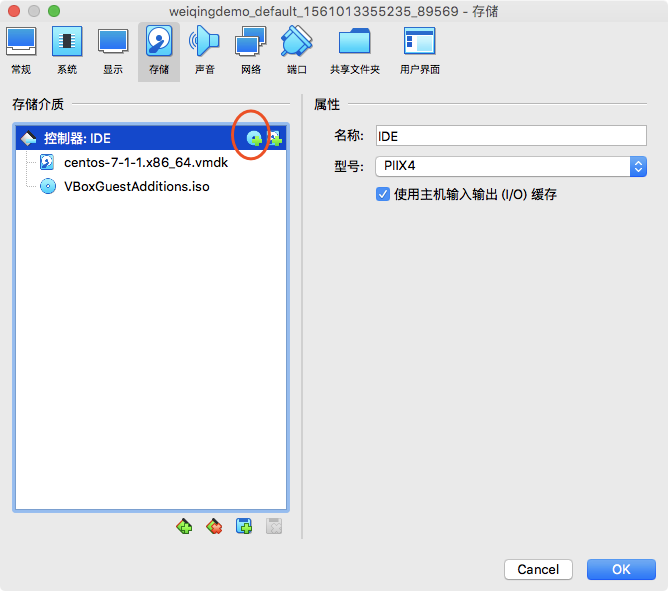
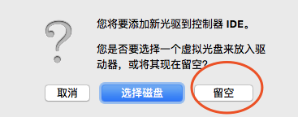
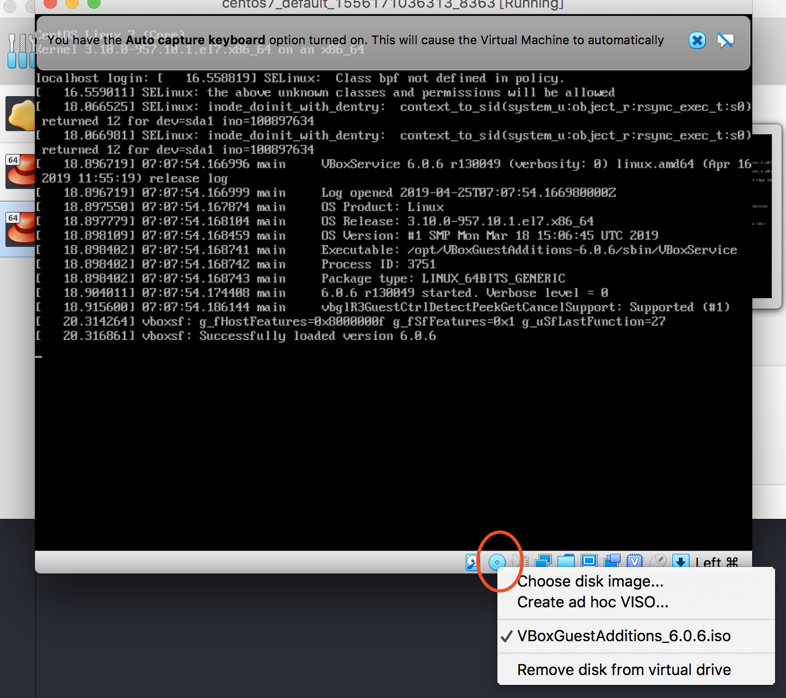

# Vagrant 常见问题

## 1:目录无法映射，需要安装VirtualBox Guest Additions

>错误提示
```
Vagrant was unable to mount VirtualBox shared folders. This is usually
because the filesystem “vboxsf” is not available. This filesystem is
made available via the VirtualBox Guest Additions and kernel module.
Please verify that these guest additions are properly installed in the
guest. This is not a bug in Vagrant and is usually caused by a faulty
Vagrant box. For context, the command attempted was:
mount -t vboxsf -o uid=1000,gid=1000 vagrant /vagrant
The error output from the command was:
mount: unknown filesystem type ‘vboxsf’
```
* 打开 /Applications/VirtualBox.app/Contents/MacOS
* 找到VBoxGuestAdditions.iso加载到虚拟机
   如果没有可以到这里下载 http://download.virtualbox.org/virtualbox/5.0.14/VBoxGuestAdditions_5.0.14.iso

磁盘挂载
若无光驱的进行添加光驱
  

  

 

* 进入虚拟机，安装需要的环境,

```
yum update
yum install gcc
yum install gcc-c++
yum install make
yum install kernel-headers
yum install kernel-devel
```

* 安装环境完成，重启机器
* 新增目录 /media/cdrom 挂载到CD/DVD虚拟光驱

```
mkdir  /media/cdrom
sudo mount /dev/sr0 /media/cdrom
```
* 执行安装命令

```
cd /media/cdrom/ && sh ./VBoxLinuxAdditions.run
```

* reboot下虚拟机即可


>也可尝试下：安装Vagrant插件vagrant-vbguest可以解决这个问题，因为该插件会在虚拟机内核升级之后重新安装VirtualBox Guest Additions。

```
vagrant plugin install vagrant-vbguest
```


## mac 和vagrant 映射目录 访问权限问题
注意www 用户和用户组要在vagrant中存在
```
config.vm.synced_folder "/Users/tea/Documents/vagrant/weiqingdemo/code","/var/www"
调整为如下：
config.vm.synced_folder "/Users/tea/Documents/vagrant/weiqingdemo/code","/var/www",create:true,owner:"www",group:"www"
```
