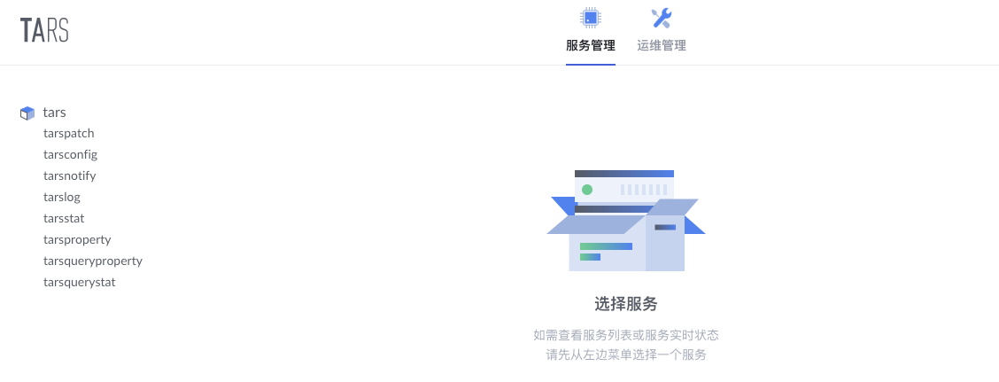
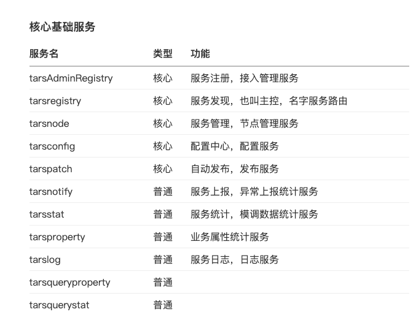

# 环境安装

* [三种](https://www.bookstack.cn/read/TarsPHP/env.md)


## docker 安装
[参考文档](https://tarsphp.gitbook.io/doc/huan-jing-da-jian/docker)

* 1:安装mysql

```
docker run --name mysql -e MYSQL_ROOT_PASSWORD=数据库密码 -d -p 3306:3306 -v /data/tars/mysql_data:/var/lib/mysql mysql:5.6 --innodb_use_native_aio=0

```


* 2:安装tar_php镜像

```
docker run -d -it --name tars --link mysql56 --env MOUNT_DATA=false --env DBIP=mysql56 --env DBPort=3306 --env DBUser=root --env DBPassword=123456 -p 3000:3000 -v /Users/tea/Documents/docker/tars_mysql8/data:/data tarscloud/tars:php

```

* 3：访问管理后台
http://localhost:3000/






[一些问题参考](https://xbc.me/tars/)
