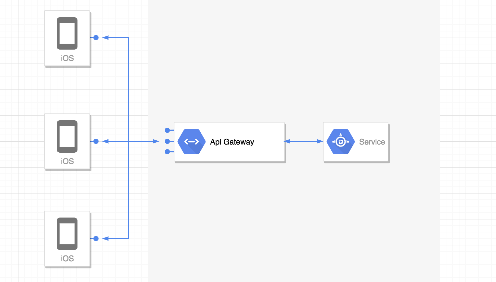
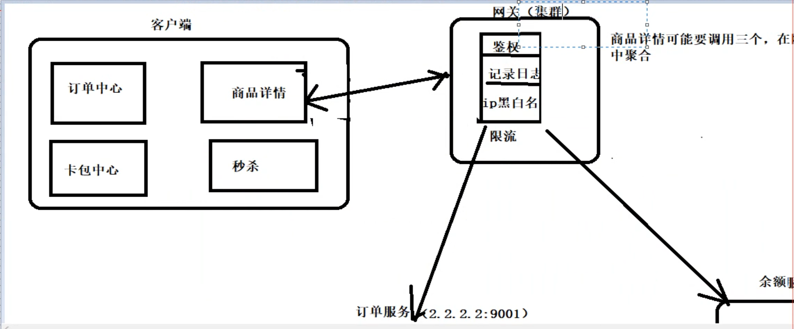

# 服务网关 Api GatetWay

用途：解决客户端如何访问服务
     为前台提供后台服务的聚合，提供一个统一的服务出口，解除他们之间的耦合，不过Api GatetWay 也可能成为单点故障或者性能瓶颈

作用：
* 提供统一的服务入口，让服务对前台透明
* 聚合后台的服务，节省流量，提升性能。比如客户端本来需要请求三个服务，现在请求一次网关，由网关去请求三次，然后聚合返回
* 提供安全、过滤、流控等API管理功能。因为可以在统一入口处：网关，进行拦截，过滤，限流等操作

