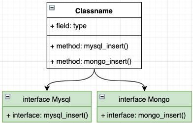
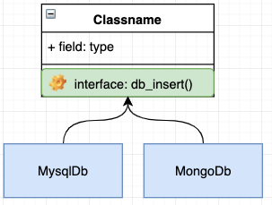

# 设计模式之依赖倒置
依赖倒置(Dependence Inversion Principle,简称DIP，是一种抽象的软件设计原则

>高层模块不应依赖于低层模块，两者应该依赖于抽象。
>
>抽象不应该依赖于实现，实现应该依赖于抽象。

具体是什么意思呢我们可以通过一个例子来说明下这个原则，大家应该都对电脑上的 USB 插口很熟悉，通过它我们可以扩展各种的外设能力，例如 U盘、游戏鼠标等等，只要接口一致，插上设备就能正常工作。

在这个例子中，我们的电脑就相当于是高层模块，而 U盘、鼠标等就相当于是底层模块。我们的电脑定义了一个插口（接口），可以供其他的设备插入使用，但是我们的电脑并不依赖于具体要插入的设备，它只是定义好了一个接口规范，只要是符合这个接口规范的设备都可以插入到这台电脑上来使用。那么对应到软件开发上来看指的就是 **依赖倒置原则转换了依赖关系，要求高层的模块不应该依赖于底层模块的实现，底层的模块要依赖于高层模块定义的接口**。

下面举个开发场景

场景：比如我们有一个业务需要对数据做入库操作，目标可能是 MySql、MongoDb 等。

实现一：不实用依赖倒置，即底层定义接口，高层模块实现。

如图就是在不实用依赖倒置的情况下，我们要完成此场景的功能非常的麻烦，我们的业务类（高层模块）要实现所有的 DB类（底层模块） 接口，如果再有新的 DB类（底层模块）介入，则又需要去修改业务类（高层模块）来实现新的 DB类（底层模块）这就破坏了类的开放封闭原则。

实现二：使用依赖倒置，即高层定义接口，底层模块实现。

如图，我们使用依赖倒置后，我们的业务类（高层模块）将不再依赖 DB类（底层模块）而是由 DB类（底层模块）负责实现业务类（高层模块）的接口，这样即使由新的底层模块加入到业务中时我们也不需要修改业务模块。

由此可见使用 依赖倒置DIP 的好处：
* 可以通过抽象使各个类或模块的实现彼此独立，不互相影响，实现模块间的松耦合（也是本质）；

* 可以规避一些非技术因素引起的问题（如项目大时，需求变化的概率也越大，通过采用依赖倒置原则设计的接口或抽象类对实现类进行约束，可以减少需求变化引起的工作量剧增情况。同时，发生人员变动，只要文档完善，也可让维护人员轻松地扩展和维护）；

* 可以促进并行开发（如，两个类之间有依赖关系，只要制定出两者之间的接口（或抽象类）就可以独立开发了，而且项目之间的单元测试也可以独立地运行，而TDD开发模式更是DIP的最高级应用（特别适合项目人员整体水平较低时使用））。
