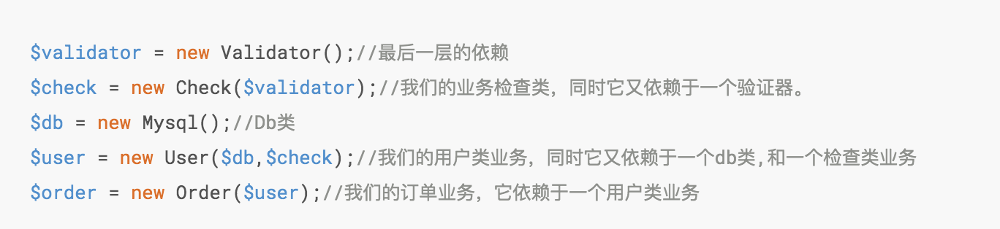

# 设计模式---IOC控制反转

IOC容器控制反转实现了DIP依赖倒置。它的定义是：***为相互依赖的组件提供抽象，将依赖的获取交给第三方来控制，即依赖对象不在被依赖的对象中获取 ***

业务场景：比如说我们的业务是一个订单入库的操作，在最初我们只是将数据存入到 Mysql 中，通常我们会封装一个 MysqlDb 的类用于数据库的操作

```
/**
 * Class MysqlDb
 *
 * @since 2.0
 */
class MysqlDb
{
    public function insert()
    {
        //TODO::插入一些数据
    }
}
```

紧接着我们看一下我们的业务类
```
/**
* Class Order
*
* @since 2.0
*/
class Order
{
    public function add()
    {
        //TODO::订单业务
        $db = new MysqlDb();//建立依赖
        $db->insert();//执行入库操作
    }
}
```

至此我们看似是完成类我们的需求，那这时如果让你改用 MongoDb 怎么办？那我们要先去写一个 MongoDb 的操作类，然后再去我们的 Order 类中修改 DB 的依赖，例如： 定义 Mongo Db 类

```
/**
 * Class MongoDb
 *
 * @since 2.0
 */
class MongoDb{
    public function insert()
    {
        //TODO::插入一些数据
    }
}
```

然后我们继续修改我们的业务类

```
/**
* Class Order
*
* @since 2.0
*/
class Order
{
    public function add()
    {
        //TODO::订单业务
//        $db = new MysqlDb();//将MysqlDb更改为MongoDb
        $db = new MongoDb();//建立依赖
        $db->insert();//执行入库操作
    }
}
```

显然这是一个非常糟糕的设计，组件之间还是高度耦合的，同时也破坏了开放封闭原则，也违背了DIP原则。高层的业务模块不应该维护依赖关系，两者应该将依赖抽象出来。那么之前说过 IOC 的出现好像就是为了解决这个问题的，那么它提供了什么方法呢？


IOC 是一个很大的概念，基于这个模式可以有很多种实现方式，但是其主流的有两种：***依赖查找(Dependency Lookup 简称DL),依赖注入(Dependency Injection 简称 DI)*** ,Swoft 使用的是 依赖注入(DI) 技术。我们也主要对 依赖注入DI 进行一个说明介绍，对 依赖查找（DL）感兴趣的朋友可自行 Google。


## 依赖注入

>它的出现是为了解决上面的一个类内去new 依赖的类
>
>由于DIP 的原则，我们不应该再模块内部来创建依赖关系即高层模块不应该依赖于底层模块，两者应该依赖于抽象

DI 是实现 IOC 的一种重要方式，如之前的例子所述，我们将依赖关系在业务中进行创建和绑定是非常糟糕的做法，`依赖注入DI`就是解决这种问题，它提供一种实现方式，将需要依赖的底层模块（MysqlDb，MongoDb等）的对象的引用传递给被依赖对象（业务模块）去使用，那么它是如何实现的呢？

DI 主要是由两种方式来实现依赖注入：`构造函数注入` 、`属性注入`。


我们先来定义一个接口。

```
/**
 * Interface DbDrive
 *
 * @since 2.0
 */
interface DbDrive
{
    public function insert();
}
```

然后我们将我们的数据库类都实现这个接口

```
/**
 * Class MysqlDb
 *
 * @since 2.0
 */
class MysqlDb implements DbDrive
{
    public function insert()
    {
        //TODO::插入一些数据
    }
}

/**
 * Class MongoDb
 *
 * @since 2.0
 */
class MongoDb implements DbDrive
{
    public function insert()
    {
        //TODO::插入一些数据
    }
}
```

然后改写一下我们的业务类。

```
/**
 * Class Order
 *
 * @since 2.0
 */
class Order
{
    /**
     * @var DbDrive
     */
    private $db;

    /**
     * Order constructor.
     *
     * @param DbDrive $driver
     */
    public function __construct(DbDrive $driver)
    {
        $this->db = $driver;
    }

    public function add()
    {
        //TODO::订单业务
        $this->db->insert();//执行入库操作
    }
}
```


至此我们就已经完成了`构造函数注入`的实现方式，这样我们就不需要在业务中（高层模块）关心我该依赖于谁来做那些事情，而是通过第三方（还记得之前举例子的人插u盘的行为）来完成依赖关系的创建，体现为代码就是这样。


```
$db = new MysqlDb();//创建一个依赖，这就好比是一个u盘
$order = new Order($db);//将需要依赖的对象通过构造函数传递进去，这就好比插入u盘
$order->add();//正常的去调用业务。
```

这样，我们就将我们的***依赖关系从内部转移到了外部***，其实这也就是IOC的核心思想，就是高层做接口，比如我们这时候需要更换Db驱动为 redis，则我们只需要编写 redis 类并实现 DbDrive 接口即可然后在业务调用的地方直接将 redis 类通过 构造函数注入 或者 属性注入 的方式注入需要的依赖就可以了，而无需修改我们的 业务类 。属性注入 的方式也是类似的操作只是注入的方式不同，是通过属性注入的这里就不做过多赘述了。


## IOC容器

>它的出现是为了解决:手动去new 依赖的对象。通过高层对象的反射获取依赖，从而去加载

容器又叫 IOC 容器，通过之前章节的案例我们通过 DI 实现了 IOC 控制反转，但是我们发现我们要手动的去创建依赖对象，然后再传递给高层模块去使用，显然这样的方式还是有缺陷的，并且效率很低，甚至会出现难以掌控的问题出现。假设我们的业务有十几上百个依赖，并且还存在依赖嵌套等问题，实际工作中这种情况便会很难处理，我们用伪代码来描述下这种情况（试着从最后一行向上阅读）



此时就暴露出来了很多问题，包括但不限于之前的问题，例如还有对象生命周期等问题。

这时需要引入一个新的技术那就是 `IOC 容器`，就是用来解决上述的问题，他的主要功能就是:

* 自动的管理依赖关系，避免手工管理的缺陷。
* 在需要使用依赖的时候自动的为我们注入所需依赖
* 管理对象的声明周期

为了更好的理解容器，我们来实现一个简单的通过 构造函数注入 的容器，

```
<?php

/**
 * Class Container
 */
class Container
{
    /**
     * 容器内所管理的所有实例
     * @var array
     */
    protected $instances = [];

    /**
     * @param $class
     * @param null $concrete
     */
    public function set($class, $concrete = null)
    {
        if ($concrete === null) {
            $concrete = $class;
        }
        $this->instances[$class] = $concrete;
    }

    /**
     * 获取目标实例
     *
     * @param $class
     * @param array $param
     *
     * @return mixed|null|object
     * @throws Exception
     */
    public function get($class, ...$param)
    {
        // 如果容器中不存在则注册到容器
        if (!isset($this->instances[$class])) {
            $this->set($class);
        }
        //解决依赖并返回实例
        return $this->resolve($this->instances[$class], $param);
    }

    /**
     * 解决依赖
     *
     * @param $class
     * @param $param
     *
     * @return mixed|object
     * @throws ReflectionException
     * @throws Exception
     */
    public function resolve($class, $param)
    {
        if ($class instanceof Closure) {
            return $class($this, $param);
        }
        $reflector = new ReflectionClass($class);
        // 检查类是否可以实例化
        if (!$reflector->isInstantiable()) {
            throw new Exception("{$class} 不能被实例化");
        }
        // 通过反射获取到目标类的构造函数
        $constructor = $reflector->getConstructor();
        if (is_null($constructor)) {
            // 如果目标没有构造函数则直接返回实例化对象
            return $reflector->newInstance();
        }

        // 获取构造函数参数
        $parameters = $constructor->getParameters();
        //获取到构造函数中的依赖
        $dependencies = $this->getDependencies($parameters);
        // 解决掉所有依赖问题并返回实例
        return $reflector->newInstanceArgs($dependencies);
    }

    /**
     * 解决依赖关系
     *
     * @param $parameters
     *
     * @return array
     * @throws Exception
     */
    public function getDependencies($parameters)
    {
        $dependencies = [];
        foreach ($parameters as $parameter) {
            $dependency = $parameter->getClass();
            if ($dependency === null) {
                // 检查是否有默认值
                if ($parameter->isDefaultValueAvailable()) {
                    // 获取参数默认值
                    $dependencies[] = $parameter->getDefaultValue();
                } else {
                    throw new Exception("无法解析依赖关系 {$parameter->name}");
                }
            } else {
                // 重新调用get() 方法获取需要依赖的类到容器中。
                $dependencies[] = $this->get($dependency->name);
            }
        }

        return $dependencies;
    }
}

class MysqlDb
{
    public function insert()
    {
        echo 'mysql';
    }
}

class Order
{
    private $db;

    public function __construct(MysqlDb $db)
    {
        $this->db = $db;
    }

    public function add()
    {
        $this->db->insert();
    }

}

$container = new Container();//使用容器
$order = $container->get('Order');//通过容器拿到我们的Order类
$order->add();//正常的使用业务
```

我们主要是利用反射类来完成容器的自动注入，换句话说容器其实就像是一个工厂模式，使用容器就和使用工厂类似的，它会帮我们解决好依赖关系然后再返回给我们对象示例，上方只是个简单的演示，还有许多地方并没有考虑到，比如循环机制的处理，对象的缓存，生命周期管理等。
