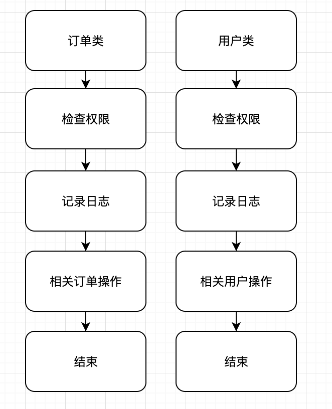
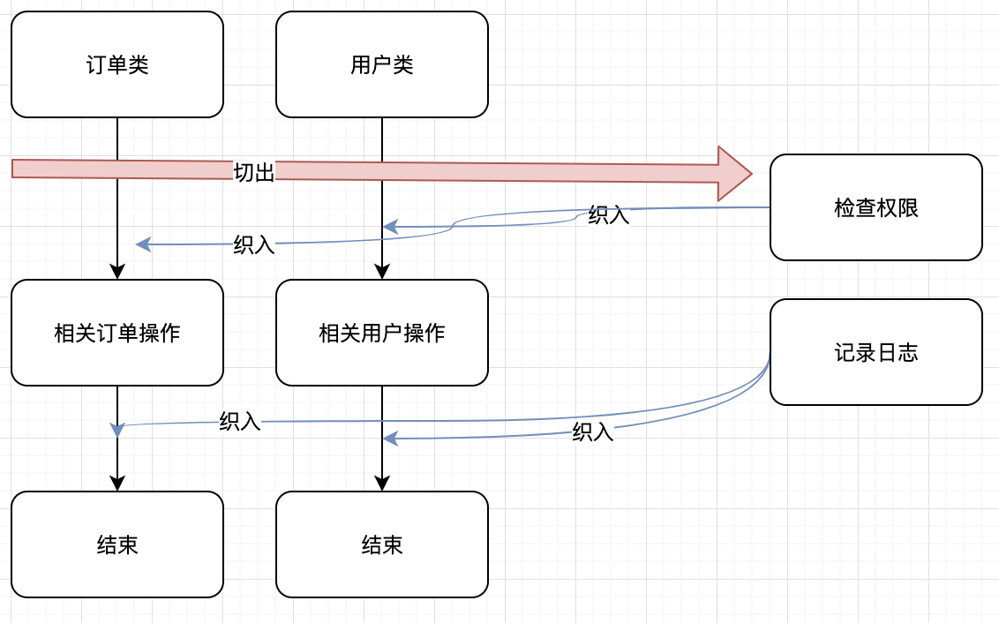

# 切面编程AOP
 面向切面，面向方面，也叫刀削面。

 面向切面编程（AOP是Aspect Oriented Program的首字母缩写） ，我们知道，面向对象的特点是继承、多态和封装。而封装就要求将功能分散到不同的对象中去，这在软件设计中往往称为职责分配。实际上也就是说，让不同的类设计不同的方法。这样代码就分散到一个个的类中去了。这样做的好处是降低了代码的复杂程度，使类可重用。

这种在运行时，动态地将代码切入到类的指定方法、指定位置上的编程思想就是面向切面的编程。

* 切面： 切入到指定类指定方法的代码片段称为切面（被切面切入点对象）
* 切入点：切入到哪些类、哪些方法则叫切入点
* 切片：把几个类共有的代码，抽取到一个切片中，等到需要时再切入对象中去，从而改变其原有的行为

## AOP与OOP的区别
AOP其实只是OOP的补充而已。OOP从横向上区分出一个个的类来，而AOP则从纵向上向对象中加入特定的代码。有了AOP，OOP变得立体了。如果加上时间维度，AOP使OOP由原来的二维变为三维了，由平面变成立体了。从技术上来说，AOP基本上是通过代理机制实现的。 
AOP在编程历史上可以说是里程碑式的，对OOP编程是一种十分有益的补充。

OOP

AOP

