官方扩展包laravel Passport(https://laravelacademy.org/post/19485.html)


[通过 Passport 实现 API 请求认证：单页面应用篇](https://laravelacademy.org/post/9745.html)
[通过 Passport 实现 API 请求认证：移动端应用篇](https://laravelacademy.org/post/9748.html)
[通过 Passport 实现 API 请求认证：第三方应用篇](https://laravelacademy.org/post/9752.html)
[通过 Passport 实现 API 请求认证：开放平台篇](https://laravelacademy.org/post/9753.html)
[通过 Passport 实现 API 请求认证：沙箱测试篇](https://laravelacademy.org/post/9756.html)
[通过 Passport 实现 API 请求认证：隐式授权令牌](https://laravelacademy.org/post/9760.html)
[通过 Passport 实现 API 请求认证：令牌作用域详解](https://laravelacademy.org/post/9762.html)


[快速上手](https://www.cnblogs.com/kimc1112/p/8473287.html)

[Laravel Passport认证-多表、多字段解决方案](https://blog.csdn.net/woqianduo/article/details/81782799)
[Laravel 的 API 认证系统 Passport 三部曲(二、passport的具体使用)--多表验证](https://www.jianshu.com/p/5c1d6479b407)

[Laravel Passport 认证（另一篇）](https://blog.csdn.net/lovemyself196221/article/details/79610535)


[Laravel Passport 里的授权类型介绍](https://www.v2ex.com/t/440904)

## Oauth2概述
### 什么是Oauth协议
OAuth 是 Open Authorization 的简写，OAuth 协议为用户资源的授权提供了一个安全的、开放而又简易的标准。

### 解决的问题
与以往的授权方式不同之处是 OAuth 的授权不会使第三方触及到用户的帐号信息（如用户名与密码），即第三方无需使用用户的用户名与密码就可以申请获得该用户资源的授权，因此 OAuth 是安全的。

在 OAuth 的流程中，用户登录了第三方的系统后，会先跳去服务方获取一次性用户授权凭据，再跳回来把它交给第三方，第三方的服务器会把授权凭据以及服务方给它的的身份凭据一起交给服务方，这样，服务方一可以确定第三方得到了用户对此次服务的授权（根据用户授权凭据），二可以确定第三方的身份是可以信任的（根据身份凭据），所以，最终的结果就是，第三方顺利地从服务方获取到了此次所请求的服务。

从上面的流程中可以看出，OAuth 完整地解决掉了用户、服务方、第三方 在某次服务时这三者之间的信任问题。

### 一般步骤
* 客户端要求用户给予授权
* 用户同意给予授权
* 根据上一步获得的授权，向认证服务器请求令牌（token）
* 认证服务器对授权进行认证，确认无误后发放令牌
* 客户端使用令牌向资源服务器请求资源
* 资源服务器使用令牌向认证服务器确认令牌的正确性，确认无误后提供资源

>注意：OAuth 本身不存在一个标准的实现，后端开发者自己根据实际的需求和标准的规定实现。所以上面的有些步骤是可以不用实现的，下面的授权类型中会介绍到

### Oauth的基本流程

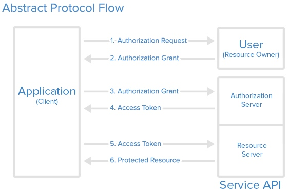

1：客户端(client)

指的是调取你程序Api的那个应用，或者说是终端，在passport里创建客户端可以通过artisan命令：
```
php artisan passport:client
```

2:Resource Owner（资源拥有者：用户）

3:Resource Server （服务器资源：数据中心）

4:Authorization Server （认证服务器）

5:Scope（权限范围）

指的是获取特定数据，或者进行特定操作的权限（ permission ），可以在 AuthServiceProvider 使用Passport::tokensCan()方法来具体定义权限（ scope ）
```
Passport::tokensCan([
    'read-tweets' => 'Read all tweets',
    'post-tweet' => 'Post new tweet',
]);
```

6:Access token(准入令牌)


## 授权类型（Grant Type）
授权（ Grant ），说白了就是从资源服务器获取准入令牌（ Access token ）的方式，也可以更通俗地说成颁发令牌（ token ）的方式。一共有五种授权方式，其中四种是用来获取令牌（ Access token ）的，另一个是用来刷新、或者说重新创建一个已有令牌（ token ）的.

* **认证授权**
  使用场景：第三方应用授权登录，第三方调到我方登录页，登录完成，跳会第三方，给她授权code,拿到授权code来请求令牌，拿到令牌来请求资源
* **隐式授权** （Implicit Grant）
  使用场景：常用于同一公司自有系统之间的认证，尤其是客户端应用不能安全存储令牌信息的时候。

* **用户密码授权**（Resource Ower Password Credentiais Grant）
  使用场景：允许你的一些应用，使用账号密码获取令牌。微信等一些第三方登录也可以使用这个授权方式，将openid作为账号，密码使用openid加密的串来获取令牌(https://liwei2.com/2018/07/18/2902.html)

* **客户端凭证令牌**（Client Credentials Grant）
  使用场景：适用于机器与机器之间的接口认证，类似我们做微信、微博、支付宝开放平台开发，需要先申请自己的应用，申请通过后，这些开放平台会给我们分配对应的 APP ID 和 APP SECRET。然后我们通过这个 APP ID 和 APP SECRET 去开放平台获取 Token（令牌），最后拿着这个令牌去访问认证资源即可。

* **私人访问令牌** （Pesonal Grant）
  使用场景：这种授权方式比较特殊，不需要授权码，也不需要用户输入登录凭证，而是用户给自己颁发访问令牌。这种授权方式在用户测试、体验平台提供的认证 API 接口时非常方便，比如微信开放平台和支付宝开发平台都有沙箱测试模式，在这种测试模式下获取授权令牌的方式其实就是通过私人访问令牌来实现的。

* 令牌刷新授权 （Refresh token grant）


### ①：认证授权
这是最常见的一种类型，说白了就是第三方登陆，也即当第三方的程序想着获取我们这边的受保护信息，这个第三方程序必须得获得我们这边用户的认证授权。更直白的，当第三方的客户端想着调用我们这边的用户信息，来**登陆**他们的网站，那么它得获得这个用户的认证授权。

大部分的流行 API 都会实现这一种授权类型。比如说 Facebook，当用户想着登陆我们的网站，我们可以先把用户重定向到 Facebook，让他先登陆 Facebook，然后 Facebook 会询问这个用户，是否同意我们的这个网站获取他在 Facebook 网站上的用户信息呢？用户点了授权以后，就又会被重定向回我们的网站，同时呢会附上一条认证码（ Authorization Code ），然后呢我们的网站要利用这个认证码（ Authorization Code ），再去向 Facebook 换取准入令牌（ access token ），有了准入令牌以后，我们才可以进一步获取该用户的详细信息。

这整个过程，又通常被叫做“三条腿的 Oauth ”（ 3-Legged OAuth ），当然了，还有“两条腿的 Oauth ”（ 2-Legged OAuth ），也就是接下来的这一种。

[github](https://github.com/xiaojinisking/Laravel-Passport-API-Server-Client-Demo.git)

server 端上提供的接口   地址：127.0.0.1:8000

client 是单页应用，向server请求oauth   127.0.0.1:8001


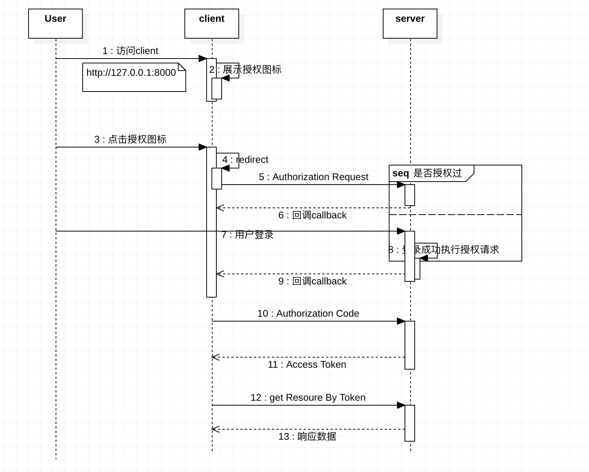

①：server上创建client
```
php artisan passport:client
```

插入oauth_clients表数据
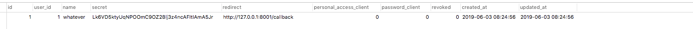


②：访问client页面，展示授权第三方图标
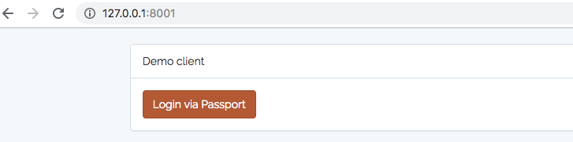

点击按钮，访问127.0.0.1:8001/redirect，对应控制器内请求了ttp://127.0.0.1:8000/oauth/authorize?client_id=1&response_type=code&scope=

但是因为没有授权过，所以跳转到第三方的登录页http://127.0.0.1:8000/login

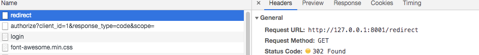

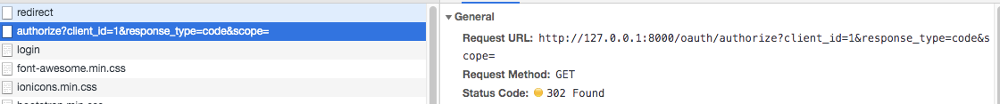

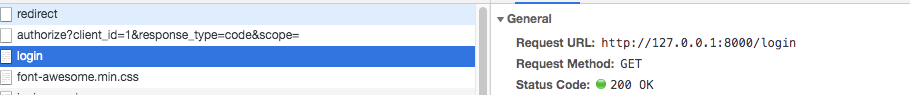

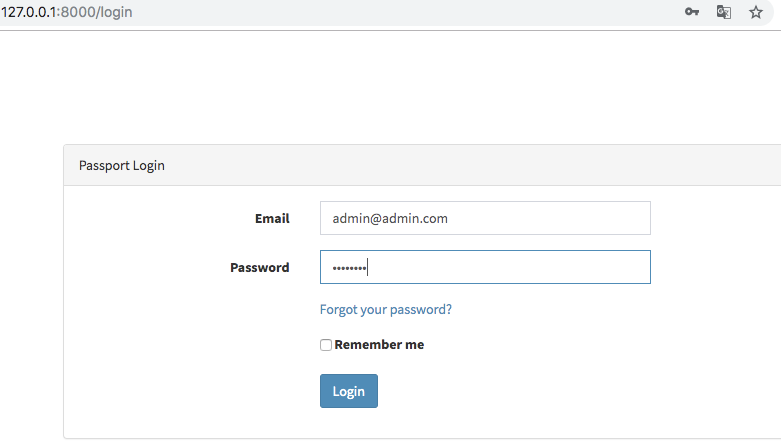

填完密码，提交用户密码

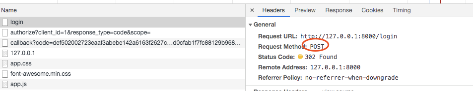

登录成功后，执行登录前端授权认证，

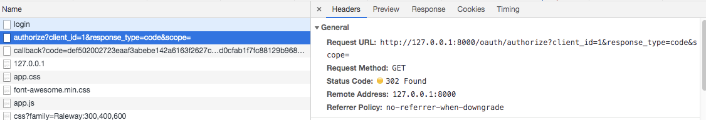


oauth/authorize 通过后，则回调client的地址

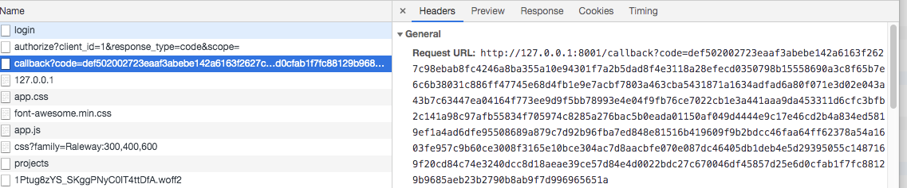
回调通知中，拿到了code,然后进行access token 的获取，获取成功后调整到/


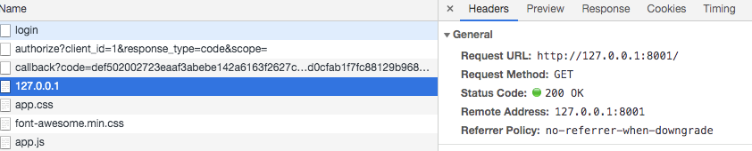

首页发起js的请求资源

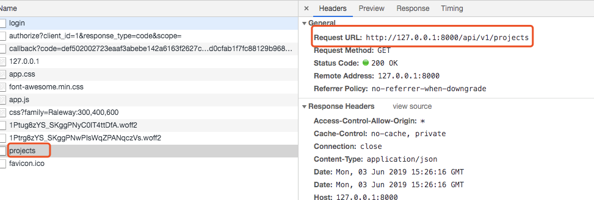

此时的请求带上了 Authorization 信息
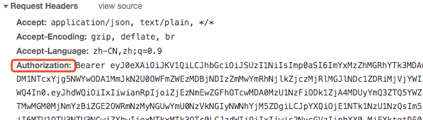

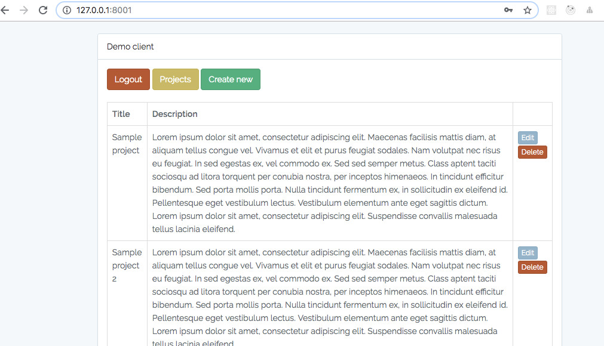


可以参考QQ第三方登录功能。

重新整理 认证授权 这种方式
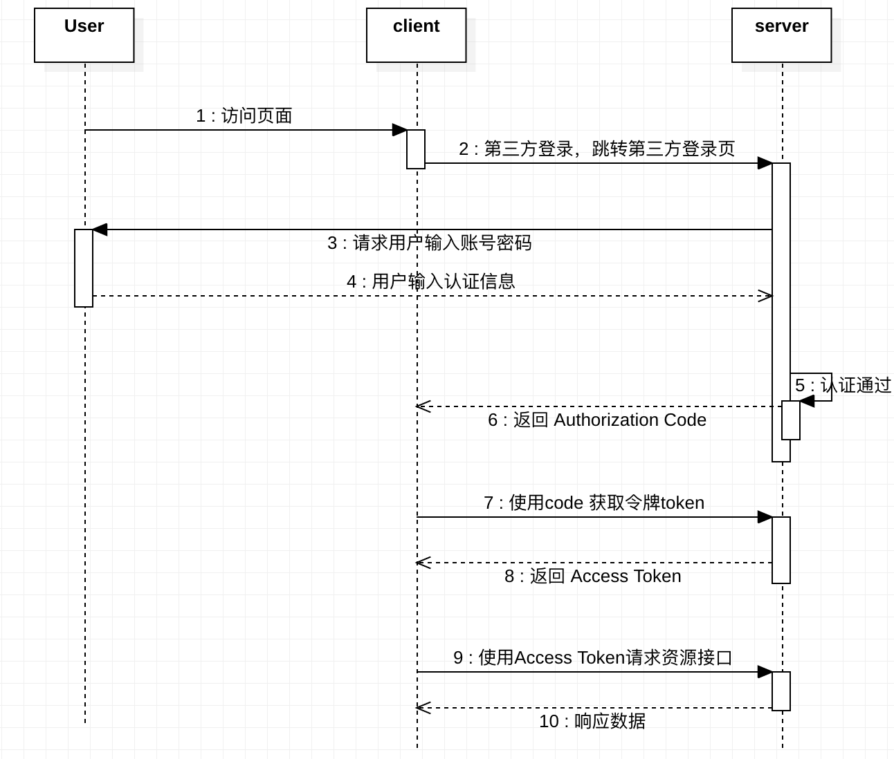

### 2:隐式授权
隐式授权令牌和通过授权码获取令牌有点类似，不过，它不需要获取授权码，就可以将令牌返回给客户端，通常适用于同一个公司自有系统之间的认证，尤其是客户端应用不能安全存储令牌信息的时候。

[隐式授权](https://laravelacademy.org/post/9760.html)


### 3:用户密码授权
OAuth2 密码授权允许你的其他第一方客户端，例如移动应用，使用邮箱地址/用户名+密码获取访问令牌。这使得你可以安全地颁发访问令牌给第一方客户端而不必要求你的用户走整个 OAuth2 授权码重定向流程。

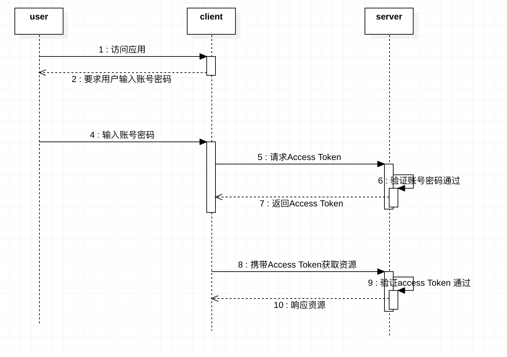

①：创建一个密码授权客户端
你可以通过使用带 --password 选项的 passport:client 命令来实现。如果你已经运行了 passport:install 命令，则不必再运行这个命令：

```
php artisan passport:client --password
```
>注意生成的密码授权客户端是在 oauth_clients表中password_cleint 为1的才是哦

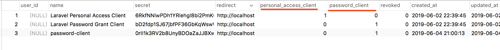


②：请求令牌
请求：/oauth/token  地址

grant_type 为 password

client_id 和 client_secret 为oauth_clients表中password_cleint 为1的 客户端

username 和 password为用户表单账号和密码
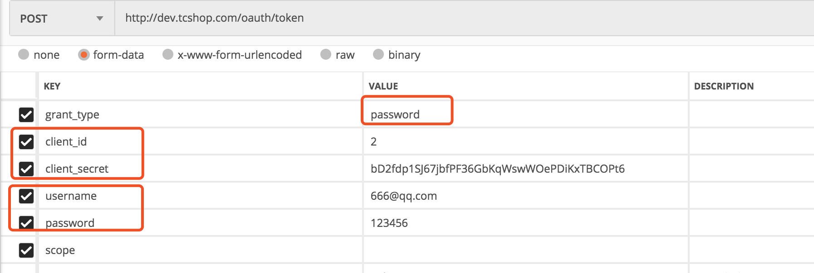


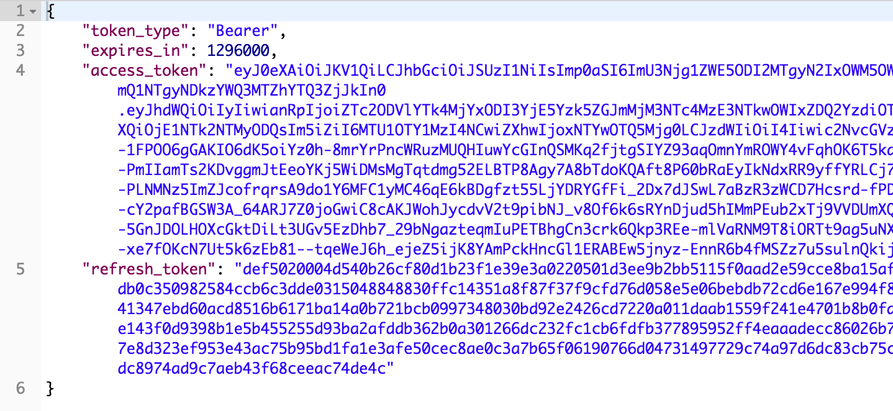

当使用密码授权进行认证的时候，Passport 会使用模型的 email 属性作为「用户名」。不过，你可以通过在模型上定义 findForPassport 方法来自定义这一默认行为：

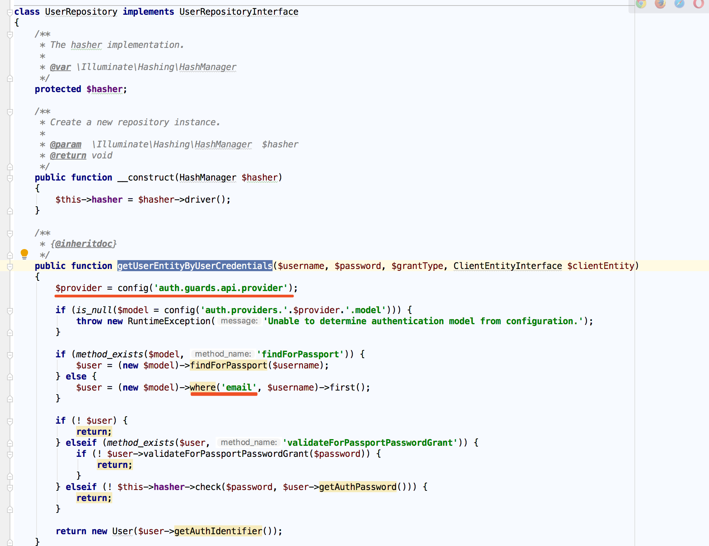

 * 重置验证username字段
所以我们在对应使用到user模型中重写findForPassport()方法

```
//仿造email的写法
public function findForPassport($username)
{
    return $this->where('username', $username)->first();
}
```
* 重置验证password字段，如果密码不需要重置
```
public function validateForPassportPasswordGrant($password)
 {
     //如果请求密码等于数据库密码 返回true（此为实例，根据自己需求更改）
     if($password == $this->password){
         return true;
     }
     return false;
 }
```

### 4：客户端凭证令牌
适用于机器与机器之间的接口认证，类似我们做微信、微博、支付宝开放平台开发，需要先申请自己的应用，申请通过后，这些开放平台会给我们分配对应的 APP ID 和 APP SECRET。然后我们通过这个 APP ID 和 APP SECRET 去开放平台获取 Token（令牌），最后拿着这个令牌去访问认证资源即可。

①：创建客户端
 命令时添加 --client 选项来实现
```
php artisan passport:client --client
```

②请求令牌

grant_type 为client_credentials

client_id 和 client_secret 为oauth_clients表中password_cleint 为1的 客户端
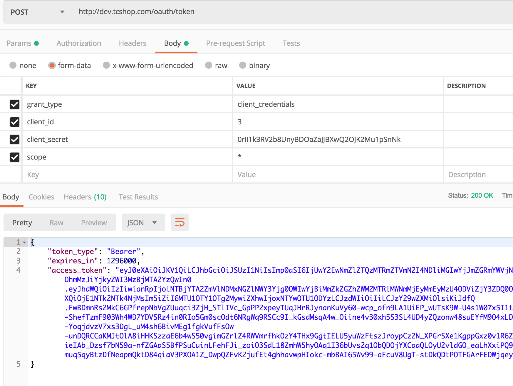

③：要使用这个方法，需要在 app/Http/Kernel.php 中添加新的中间件 CheckClientCredentials 到 $routeMiddleware：
```
use Laravel\Passport\Http\Middleware\CheckClientCredentials;

protected $routeMiddleware = [
    'client' => CheckClientCredentials::class,
];
```
然后将这个中间件应用到路由：

```

Route::get('/orders', function(Request $request) {
    ...
})->middleware('client');
```

要限定对特定路由域的访问，可以在添加 client 中间件到路由时提供一个以逗号分隔的域列表：
```
Route::get('/orders', function (Request $request) {
    ...
})->middleware('client:check-status,your-scope');
```
### 5：私人访问令牌
这种授权方式比较特殊，不需要授权码，也不需要用户输入登录凭证，而是用户给自己颁发访问令牌。

这种授权方式在用户测试、体验平台提供的认证 API 接口时非常方便，比如微信开放平台和支付宝开发平台都有沙箱测试模式，在这种测试模式下获取授权令牌的方式其实就是通过私人访问令牌来实现的。


demo
* 在后端系统注册测试应用
若执行过php artisan passport:client 就可以不用再执行下面的。
```
php artisan passport:client --personal
```

  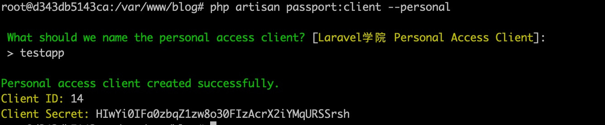

  这样，我们就模拟创建了一个测试应用 testapp，该应用记录存放在 oauth_clients 数据表中。

* 获取访问令牌

  既然是用户自己给自己颁发访问令牌，那就需要用到模型类了，我们以 User 模型类存储的用户为例进行演示。首先在该模型类中使用 HasApiTokens Trait。createToken（）是在trait中的。

  ```
  use Illuminate\Notifications\Notifiable;
  use Illuminate\Foundation\Auth\User as Authenticatable;
  use Laravel\Passport\HasApiTokens;

  class User extends Authenticatable
  {
      use HasApiTokens, Notifiable;

      ...
  ```

  然后我们在 routes/web.php 中定义一个新的路由，用于测试获取访问令牌：

  ```
  Route::get('auth/personal', 'Auth\LoginController@personal');
  ```
* 创建令牌方法

  创建好私人访问客户端之后，就可以使用 User 模型实例上的 createToken 方法为给定用户颁发令牌。 createToken 方法接收令牌名称作为第一个参数，以及一个可选的域数组作为第二个参数：

  ```
  $user = App\User::find(1);

  // Creating a token without scopes...
  $token = $user->createToken('Token Name')->accessToken;

  // Creating a token with scopes...
  $token = $user->createToken('My Token', ['place-orders'])->accessToken;
  ```

  接下来，在控制器 LoginController 编写对应的方法 personal：


  ```
  public function personal()
  {
      $user = User::where('name', '学院君')->first();
      $token = $user->createToken('Users')->accessToken;
      dd($token);
  }
  ```
  这样，我们访问 http://blog.test/auth/personal 就可以获取到该用户的访问令牌了。生成的令牌记录可以在 oauth_access_tokens 数据表中找到，私人访问令牌默认是长期有效的。


  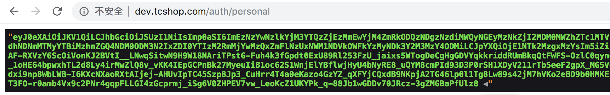

  拿到这个令牌之后我们就可以通过它访问认证接口了。

  * 访问认证接口

  还是以 Postman 为例，我们把上面获取到的令牌拷贝到 Bearer Token 头里面，访问 blog.test/api/user 接口，就可以获取到当前认证用户的信息了：

X-Requested-With header信息是设置当前为ajax请求

认证信息设置再header头内：Authorization，格式为：Bearer Token

  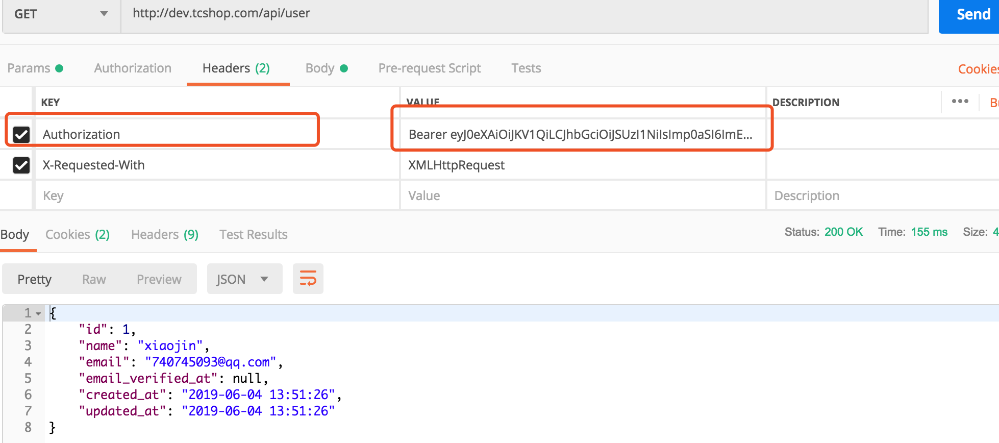

  依次类推，你还可以访问开放平台其它需要认证的 API 接口。


  ### 6：刷新令牌
  如果应用颁发的是短期有效的访问令牌，那么用户需要通过访问令牌颁发时提供的 refresh_token 刷新访问令牌

  grant_type 为refresh_token

  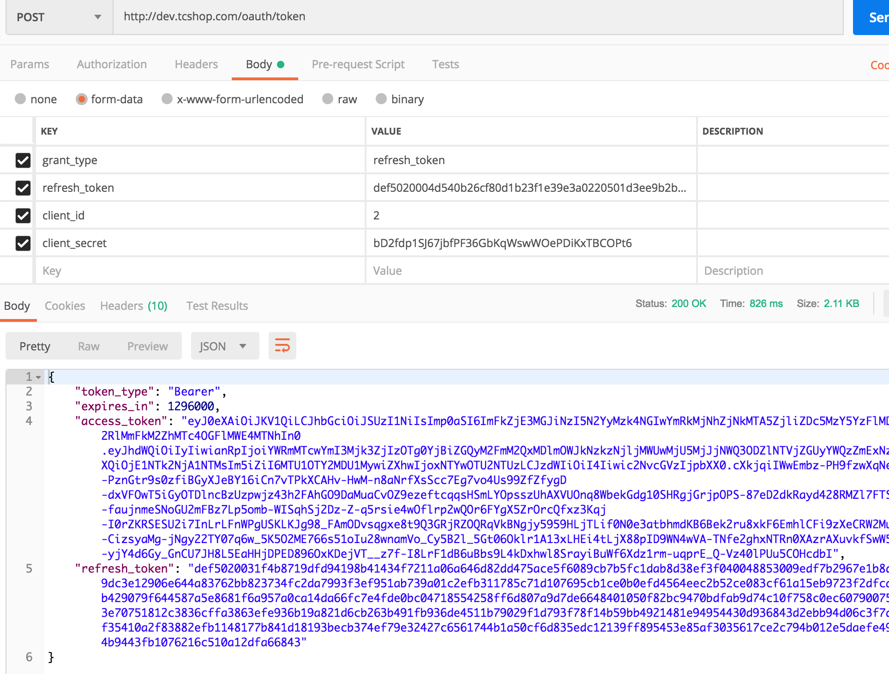

/oauth/token 路由会返回一个包含 access_token 、 refresh_token 和 expires_in 属性的 JSON 响应，同样， expires_in 属性包含访问令牌过期时间（s）


## 多表多字段认证解决方案
[Laravel Passport认证-多表、多字段解决方案](https://blog.csdn.net/woqianduo/article/details/81782799)
[Laravel 的 API 认证系统 Passport 三部曲(二、passport的具体使用)--多表验证](https://www.jianshu.com/p/5c1d6479b407)
