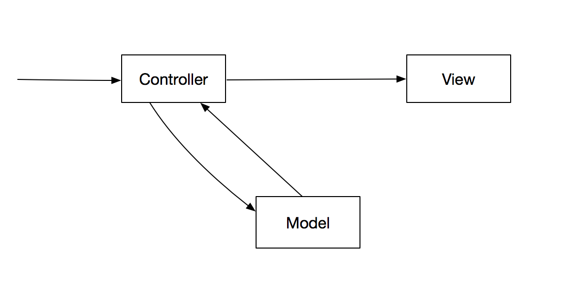
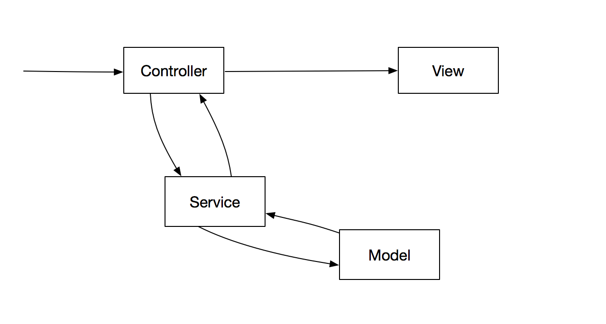
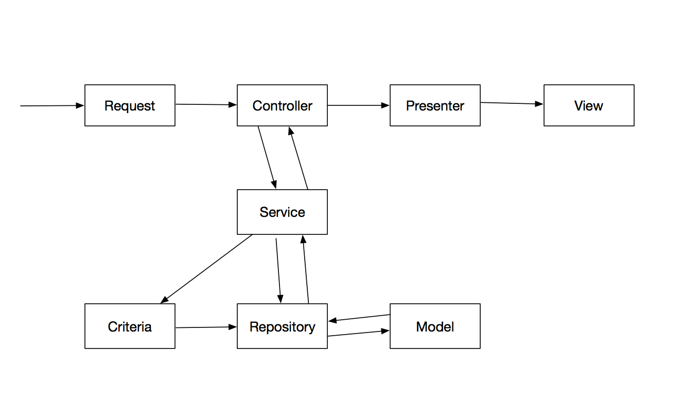

[教程](https://blog.csdn.net/qq_27295403/article/details/82967600)

[andersao/l5-repository实践记录](https://www.jianshu.com/p/d640a61d8631)


## generator生成器，便捷生成一连串的文件
app/config/repository.php

默认配置
```
'generator'  => [
        'basePath'      => app()->path(),
        'rootNamespace' => 'App\\',
        'stubsOverridePath' => app()->path(),
        'paths'         => [
            'models'       => 'Entities',
            'repositories' => 'Repositories',
            'interfaces'   => 'Repositories',
            'transformers' => 'Transformers',
            'presenters'   => 'Presenters',
            'validators'   => 'Validators',
            'controllers'  => 'Http/Controllers',
            'provider'     => 'RepositoryServiceProvider',
            'criteria'     => 'Criteria'
        ]
    ]
```


可调整为

```
'generator'  => [
        'basePath'      => app()->path(),
        'rootNamespace' => 'App\\',
        'stubsOverridePath' => app()->path(),
        'paths'         => [
            'models'       => 'Models',
            'repositories' => 'Repositories\\Eloquent',
            'interfaces'   => 'Repositories\\Interfaces',
            'transformers' => 'Repositories\\Transformers',
            'presenters'   => 'Repositories\\Presenters',
            'validators'   => 'Repositories\\Validators',
            'controllers'  => 'Http/Controllers',
            'provider'     => 'RepositoryServiceProvider',
            'criteria'     => 'Repositories\\Criteria'
        ]
    ]
```

如果上面某学paths进行注释那么命令器将不自动生成对应的目录


### 相关命令
* 生成一切模型

```
php artisan make:entity Post - 有提示，需要生成哪些文件，yes | no

php artisan make:repository "Blog\Post" - 只生成repository，会生成 'model/repository/migration'

php artisan make:transformer Post - 生成 transformers

php artisan make:presenter Post - 生成 presenters

 
// 这2个使用较少

php artisan make:bindings Post - 会生成 'repositoryProviderServer.php'，并绑定一个post相关的服务

php artisan make:criteria My - 生成 MyCriteria

```
* controller 控制器
* Validator 验证器
* Model 模型
* Repository 仓库
* Presenter 呈现器，非必须(用于前端模板格式化输出，对于API就不需要了)
* Transform 转换器，非必须（用于model数据格式化输出）


```


### 结构
* 简单MVC


* 升级


* 使用l5-repository进行扩展



###
