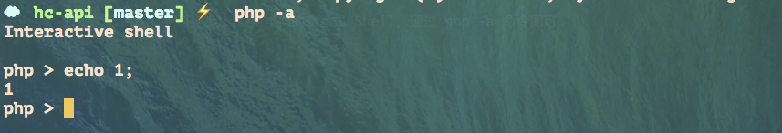
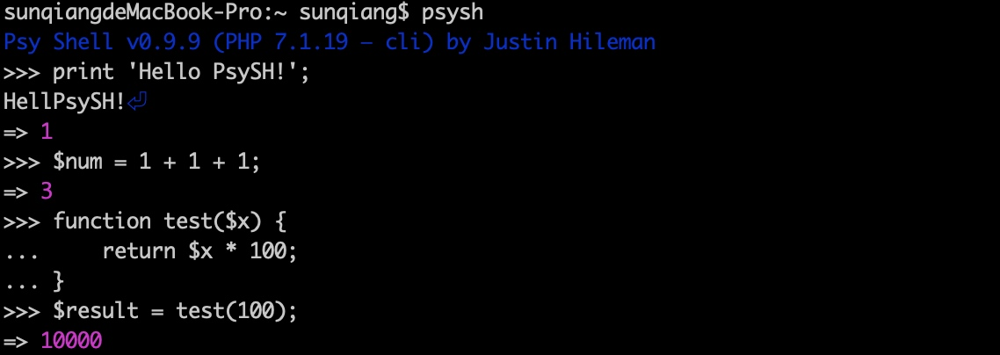

[文章](https://laravelacademy.org/post/9689.html)


# 交互式shell

* 在原生 PHP 中，我们也可以使用类似的交互式 Shell，通过 php -a 命令即可




Laravel 自带了一个功能强大的 REPL —— Tinke

* 此外，还可以通过 [PsySH ](https://github.com/bobthecow/psysh)实现，相较于原生的 php -a，PsySH 拥有更多高级特性，因此功能更加强大。在使用 PsySH 之前，需要通过 Composer 全局安装：
然后就可以在命令行执行 psysh 进入交互式 Shell 了（确保全局 Composer 的 bin 目录在系统路径中），在 PsySH 中我们能编写各种代码，打印语句、计算表达式、编写函数等等：

  

  甚至还支持基于 XDebug 进行代码调试、与系统 Shell 集成等等，更多使用方法可以参考官方文档。

* Laravel Tinker 就是基于 PsySH 实现的，与 Artisan 主要用于编写和执行 Artisan 命令不同，通过 Tinker，我们可以在命令行中实现与 Laravel 应用的各种交互，包括数据库的增删改查。


应用：

1：doc 命令可用于查看某个函数或方法的帮助文档
```
doc config
```

2:查看该函数的代码，通过 show 命令来实现

```
show config
```

3:可以运行一些php artisan 命令


4：测试laravel代码，操作数据库，执行laravel的方法比如增加log,手动触发队列，体验服务和事件
