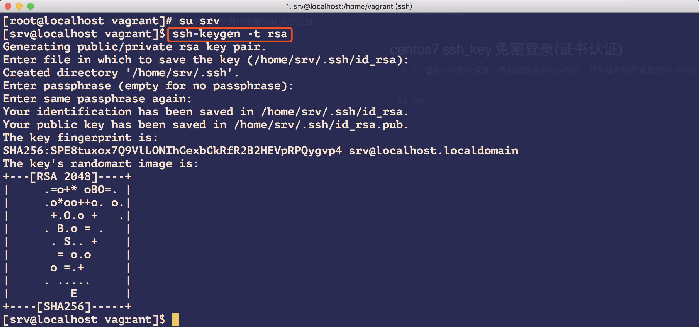
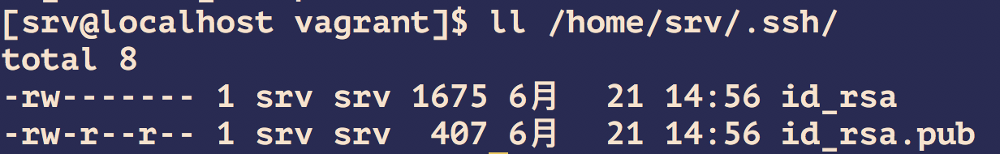
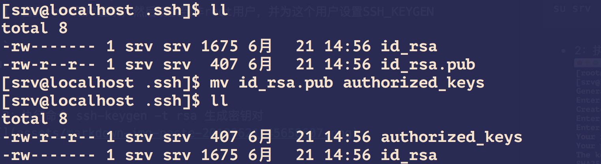
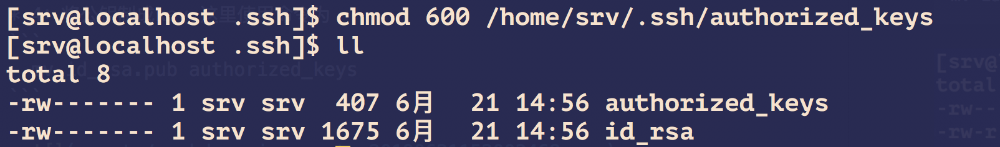
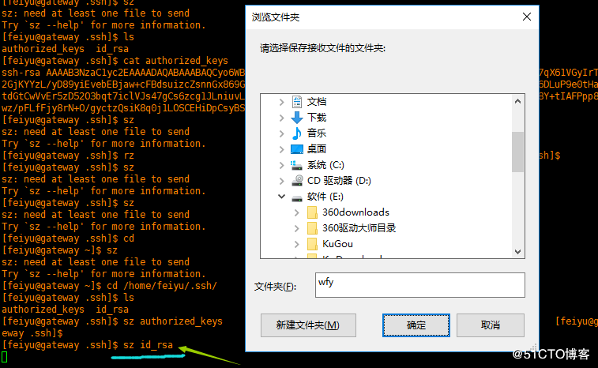
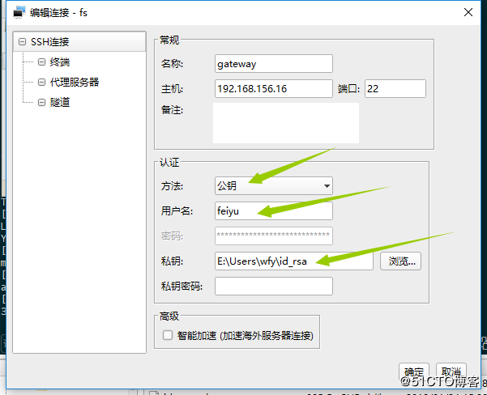
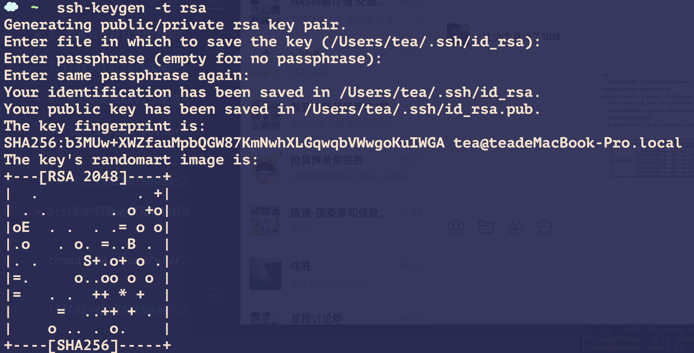

# linux安全

## centos7 ssh_key 免密登录(证书认证)
* 1：首先root用户登录，然后切换到非root用户，并为这个用户设置SSH_KEYGEN

```
su srv
```

* 2：执行命令 ssh-keygen -t rsa 生成密钥对



* 3：查看自己家目录的密钥对 ls /home/srv/.ssh/

  

* 4：将公钥制成key,这里使用命令为
```
  mv id_rsa.pub authorized_keys
```

  

* 5:公钥的权限必须和私钥权限一样为600，执行命令

  ```
  chmod 600 /home/srv/.ssh/authorized_keys
  ```

  


  * 6:下载私钥到本地

  

  * 7:这样再登录的时候就可以使用ssh key登录了，如果设置了passphrase密码。需要在登录的时候输入这个密码，如下图所示

  


## 免密登录


