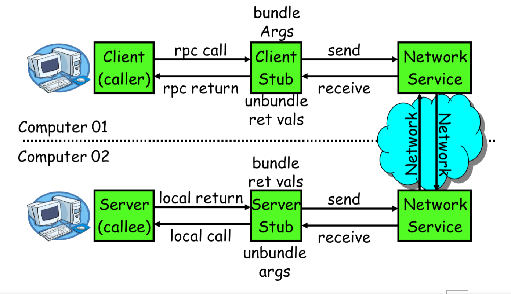
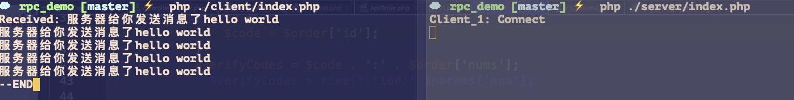
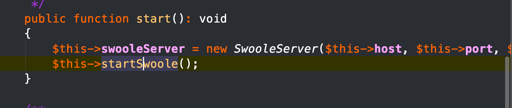
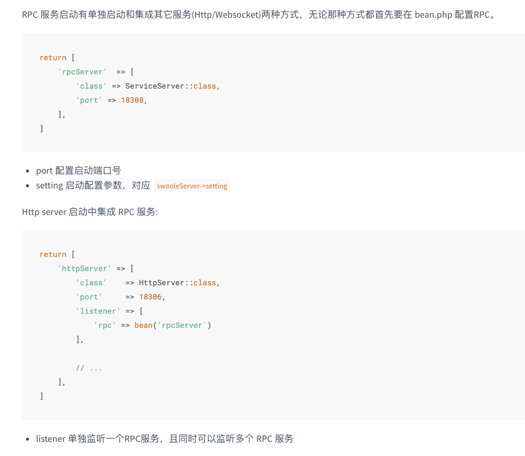
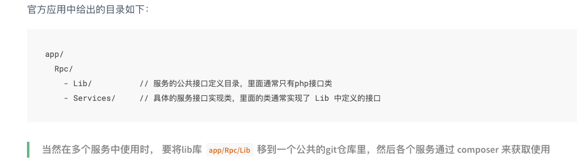
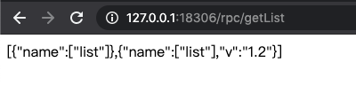

# RPC 通讯调用

## 什么是RPC

RPC，是一种**<big>远程调用方式</big>**(Remote Procedure Call),通过RPC我们可以像调用本地一样调用别的机器的方法，用户将无感知服务器与服务器之间通讯。

RPC最主要的作用就是用于服务调用，调用者和服务之间的通讯。

## 为什么需要RPC

> 单体架构的缺点

  - 部署问题，对于php还好，但是对于java的项目来说，我们需要重新打包整个项目耗费的时间是很长的
  - 代码维护，由于所有的代码都写在一个项目里，要想修改某一个功能那么需要对项目的整体逻辑和设计有较深的理解，否则代码耦合严重，导致维护难
  - 开发效率，随着项目需求的不断变化和新功能的新增，老旧的代码又不敢随便删除，导致整个项目变得笨重，这将增加你的阅读代码的时间
  - 扩展性，在高并发的情况下，我们往往不是整个项目的每一个功能都处于高流量的请求的情况下单，很多时候都是某一个功能模块的使用人数比较多，在单体架构下我们没有办法针对单个功能实现分布式扩展，必须整个项目一起部署。

>微服务

微服务是一种架构设计，并不是说什么框架或者代替什么。微服务做的事情是按照项目颗粒度进行服务的拆分，把模块单独拿出来做成每一个单独的小项目

微服务的主要特点有：每一个功能模块是一个小项目、独立运行在不同进程或者机器上、不同功能可以又不同的人员开发独立开发不松耦合、独立部署不需要依赖整体项目就可以启动单个服务、分布式管理。每一个服务只要做好自己的事情就好了。在设计微服务的时候还需要考虑到数据库的问题，是所有微服务使用共同一个数据库还是每一个服务单个数据库

> 微服务优点：

* 拆分业务，把整体大项目分割成不同小项目运行在不同进程或者机器上实现数据隔离
技术栈，每个服务可以由不同的团队或者开发者进行开发，外部调用人员不需要操心具体怎么实现的，只需要类似调用自己方法一样或者接口一样按照服务提供者给出来的参数传递即可

* 独立部署，每一个服务独立部署，部署一个服务不会影响整体项目，如果部署失败最多是这个服务的功能缺失，并不影响其他功能的使用
* 按需部署，针对不同的需求可以给不同的服务自由扩展服务器，根据服务的规模部署满足需求的实例
* 局部修改，当一个服务有新需求或者其他修改，不需要修改整体项目只要管好自己的服务就好了

>微服务缺点

* 运维，微服务由于把业务拆分得细，有可能部署在不同机器上，因此对于运维人员的管理来说，这部分的成本会加大
* 接口调整，微服务之间通过接口进行通信。如果修改某个微服务的API，可能所有使用了该接口的微服务都需要做调整；
* 重复劳动，很多服务可能都会使用到相同的功能。而这个功能并没有达到分解为一个微服务的程度，这个时候，可能各个服务都会开发这一功能，导致代码重复。
* 分布式，由于会把不同服务部署在不同机器上，那么对于这些服务的调用、容错、网络延迟、分布式事务等等都是一个很大的挑战，当然微服务不一定全部都是部署在不同服务器上


## RPC调用分类

RPC传输协议可基于TCP、UDP或者HTTP实现，但是最推荐选择TCP，但是具体看情况。

下面比较下RPC调用和RESFUL API调用的区别

* TCP 支持长连接，当调用服务的时候不需要每次都进行三次握手才实现。从性能和网络消耗来说都具备了很好的优势。
* RESTful API基于HTTP的，也就是说每次调用都需要进行三次握手才能实现。从性能和网络消耗来说RPC都具备了很好的优势。
* 服务对外的话采用RESful API会比RPC更具有优势，因此看自己的服务商对内还是对外


RPC的编码协议：如基于文本编码的 xml、json，也有二进制编码的 protobuf、binpack 等。

## 如何调用他人的远程服务



下面是tcp协议的调用过程。可以看到TCP通讯的数据包的处理。

* 1）服务消费方（client）调用以本地调用方式调用服务；
* 2） client stub接收到调用后负责将方法、参数等组装（打包）成能够进行网络传输的消息体；
* 3） client stub找到服务地址，并将消息发送到服务端；
* 4）server stub收到消息后进行解码（解包）；
* 5）server stub根据解码结果调用本地的服务；
* 6）本地服务执行并将结果返回给server stub；
* 7）server stub将返回给客户端；
* 8）client stub接收到消息，并进行解码；
* 9）服务消费方得到最终结果。


## RPC的 TCP协议的简单实现

> swoole的TCP通讯
* server端

```
<?php

//创建一个异步的TCP服务端
$ser = new swoole_server('127.0.0.1', 9501, SWOOLE_PROCESS, SWOOLE_SOCK_TCP);

//设置运行的各项参数

$ser->set([
    'open_length_check'=>true, //打开包长检测特性
    'package_length_type'=>'N',//长度值在包头的第几个字节
    'package_length_offset'=>0, //计算总长度
    'package_body_offset'=>4,//包体位置
    'package_max_length'=>1024*1024 //总的请求数据大小字节为单位
]);

//设置事件回调

$ser->on('connect', function ($ser, $fd) {
    echo 'Client_' . $fd . ': Connect'.PHP_EOL;
});


$ser->on('receive', function ($serv, $fd, $from_id, $data) {
    //数据分包
    $len = unpack('N', $data)[1];
    $body = substr($data, -$len);  //去除二进制数据之后，不要包头的数据
    $serv->send($fd, '服务器给你发送消息了' . $body.PHP_EOL);
});


$ser->on('close', function ($serv, $fd) {
    echo "Client_" . $fd . ": Close".PHP_EOL;
});


//启动服务器
$ser->start();
```

* client端

```
<?php

$client = new swoole_client(SWOOLE_SOCK_TCP,SWOOLE_SOCK_ASYNC);

//注册连接成功回调
$client->on("connect", function($cli) {
//数据打包
    $data = 'hello world';
//包 = 包头（length:是包体的长度）+包体
    $packge = pack('N',strlen($data)).$data;

    for ($i=0;$i<5;$i++){
        $cli->send($packge);
    }
});

//注册数据接收回调
$client->on("receive", function($cli, $data){
    echo "Received: ".$data.'--END';;
});

//注册连接失败回调
$client->on("error", function($cli){
    echo "Connect failed".PHP_EOL;
});

//注册连接关闭回调
$client->on("close", function($cli){
    echo "Connection close".PHP_EOL;;
});

//发起连接
$client->connect('127.0.0.1', 9501, 0.5);
```

客户端收到了 服务端 解包后的数据


>简单的实现RPC功能

client的改造
```
<?php
class rpcclient{
    protected  $serviceName;
    public function __call($fname,$args)
    {
        if($fname == 'service'){
            $this->serviceName = $args;
            return $this;
        }

        $data = [
            'serviceName'=>$this->serviceName,
            'method'=>$fname,
            'params'=>$args
        ];

        $data = json_encode($data);
        $packge = pack('N',strlen($data)).$data;

        //同步到tcp客户端，当然也可以异步的
        $client = new swoole_client(SWOOLE_SOCK_TCP);
        if(!$client->connect('127.0.0.1',9501,-1)){
            exit("connect failed");
        }
        $client->send($packge);

        echo $client->recv();
        $client->close();
    }
}

$client = new rpcclient();
$client->service('GoodsService')->getList();
```
服务端代码保持上面的一致

服务端接受的内容返回给了客户端显示出来了。当我们服务端接受到这种数据可以根据服务名称，方法，参数来路由到具体的server


这就简单的实现了RPC的效果，客户端访问一个方法即可$client->service('GoodsService')->getList();


## swoft中的RPC使用

swoft中毒rpc也就是封装swoole的tcp请求

比如rpc服务的启动，就是一个swoole的服务


swoft 的tcp分为服务端和客户端

>swoft的服务端

* 1：RPC 服务启动的配置 ，在 bean.php 配置RPC

两种实现，单独跑tcp或者端口多开配置


* 2：声明服务

定义接口并实现接口，才能提供RPC服务



lib中定义接口

服务接口的实现

> RPC的客户端

服务调用方法，通过使用服务提供方法，提供的lib接口，调用接口实现服务，不需要了解实现细节。

* 配置 定义服务

如下定义了一个user服务

注意每个服务都会有一个连接池。

```
return [
    'user'       => [
        'class'   => ServiceClient::class,
        'host'    => '127.0.0.1',
        'port'    => 18307,
        'setting' => [
            'timeout'         => 0.5,
            'connect_timeout' => 1.0,
            'write_timeout'   => 10.0,
            'read_timeout'    => 0.5,
        ],
        'packet'  => bean('rpcClientPacket')
    ],
    'user.pool'  => [
        'class'  => ServicePool::class,
        'client' => bean('user')
    ],
];
```
* 服务端使用

我们在一个http控制器中

```
/**
 * Class RpcController
 *
 * @since 2.0
 *
 * @Controller()
 */
class RpcController
{
    /**
     * @Reference(pool="user.pool")
     *
     * @var UserInterface
     */
    private $userService;

    /**
     * @Reference(pool="user.pool", version="1.2")
     *
     * @var UserInterface
     */
    private $userService2;

    /**
     * @RequestMapping("getList")
     *
     * @return array
     */
    public function getList(): array
    {
        $result  = $this->userService->getList(12, 'type');
        $result2 = $this->userService2->getList(12, 'type');

        return [$result, $result2];
    }

    /**
     * @RequestMapping("returnBool")
     *
     * @return array
     */
    public function returnBool(): array
    {
        $result = $this->userService->delete(12);

        if (is_bool($result)) {
            return ['bool'];
        }

        return ['notBool'];
    }

    /**
     * @RequestMapping()
     *
     * @return array
     */
    public function bigString(): array
    {
        $string = $this->userService->getBigContent();

        return ['string'];
    }
}
```




也可以在非swoft框架中调用服务

https://www.swoft.org/docs/2.x/zh-CN/rpc-client/usage.html
